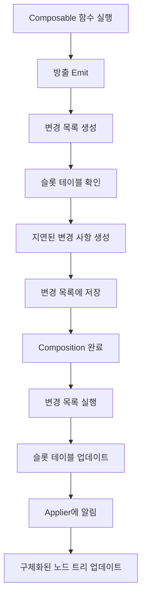
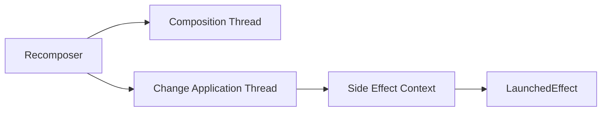

# 변경 목록 (The list of changes)

**Jetpack Compose Runtime**에서 **변경 목록(List of Changes)** 은 **composition**과 **recomposition** 과정에서 중요한 역할을 담당합니다. 이 문서에서는 변경 목록이 언제 생성되고, 무엇을 모델링하며, 어떻게 적용되는지에 대해 상세히 알아보겠습니다.

## 변경 목록의 개념과 역할

앞서 우리는 **슬롯 테이블**에 대해 살펴보았고, Compose Runtime이 어떻게 composition의 현재 상태를 추적하는지 학습했습니다. **변경 목록**은 이러한 상태 추적 시스템에서 다음과 같은 핵심적인 질문들을 해결합니다:

- 변경 목록의 정확한 역할은 무엇인가?
- 언제 생성되는가?
- 무엇을 모델링하는가?
- 변경 사항들은 언제, 어떤 이유로 적용되는가?

## Composition과 방출(Emit) 과정

### 기본 동작 원리

**Composition** 또는 **recomposition**이 발생할 때마다 다음과 같은 과정이 진행됩니다:

1. 소스의 **Composable 함수**들이 실행됩니다
2. 함수들이 **방출(emit)** 됩니다
3. **지연된 변경 사항(pending changes)** 이 생성됩니다
4. 이 변경 사항들이 **변경 목록**에 저장됩니다

### 방출(Emit)의 정의

> **방출(Emit)** 이란 슬롯 테이블을 업데이트하고, 구체화된 트리를 만들기 위해 궁극적으로 **지연 중인 변경 사항**을 생성하는 것을 의미합니다.

이러한 변경 사항들은 **목록의 형태**로 저장되며, 새로운 변경 목록은 **슬롯 테이블에 이미 저장된 값**을 바탕으로 생성됩니다.

### 노드 이동 예제

> 예를 들어, **노드를 이동**하는 경우를 생각해봅시다. 일련의 Composable 함수를 재정렬한다고 가정하면:
> 1. 테이블에서 해당 노드가 이전에 어디에 배치되었는지 확인
> 2. 해당 위치에 작성된 모든 슬롯을 제거
> 3. 새로운 위치에서 다시 작성

## 변경 사항의 생성과 실행 과정

### 지연 실행 메커니즘

변경 목록의 핵심은 **지연 실행(Deferred Execution)** 메커니즘입니다:

| 단계 | 설명 |
|------|------|
| **1단계: 생성** | Composable 함수가 방출될 때마다 슬롯 테이블을 확인 |
| **2단계: 기록** | 현재 사용 가능한 정보에 따라 지연된 변경 사항을 생성 |
| **3단계: 저장** | 해당 변경 사항들을 모두 변경 목록에 추가 |
| **4단계: 실행** | Composition이 끝나면 변경 목록의 내용들이 실제로 실행되어 구체화 |
| **5단계: 업데이트** | 슬롯 테이블이 composition의 가장 최신 정보로 실제 업데이트 |

### 성능 최적화 효과

**지연 실행 방식**은 다음과 같은 성능 이점을 제공합니다:
- **빠른 방출 과정**: 단순히 실행을 기다리는 유예된 작업을 사전에 생성
- **효율적인 배치 처리**: 여러 변경 사항을 한 번에 처리
- **최적화된 메모리 사용**: 필요한 시점에만 실제 업데이트 수행

## 변경 목록과 Applier의 연동

변경 목록이 적용된 직후, **구체화된 노드 트리**를 업데이트하기 위해 **Applier**에게 해당 사실을 알립니다.

## Recomposer의 역할

**Recomposer**는 전체 과정을 조율하며 다음과 같은 중요한 결정을 내립니다:

- **스레드 관리**: 어떤 스레드에서 composition/recomposition을 수행할지 결정
- **변경 사항 적용**: 변경 목록의 변경 사항을 적용할 스레드 선택
- **사이드 이펙트 처리**: `LaunchedEffect`가 사용하는 기본 컨텍스트 제공

### 스레드 관리 전략

## 변경 목록의 중요성

변경 목록을 통해 우리는 다음을 이해할 수 있습니다:

- **변경 사항의 기록 방식**: 어떻게 변경이 추적되고 기록되는가
- **지연 처리**: 왜 즉시 실행하지 않고 지연시키는가
- **실행 메커니즘**: 궁극적으로 어떻게 실행되는가
- **상태 저장**: 모든 상태 정보가 슬롯 테이블에 어떻게 저장되는가

이로써 **Composer**에 대해 살펴볼 좋은 기반을 마련했습니다.

## 요약

- **변경 목록**은 Jetpack Compose Runtime에서 composition과 recomposition 과정을 관리하는 핵심 메커니즘입니다
- **방출(Emit)** 과정에서 지연된 변경 사항이 생성되어 목록에 저장됩니다
- **지연 실행** 방식을 통해 성능을 최적화하고 배치 처리를 가능하게 합니다
- **슬롯 테이블**의 현재 상태를 기반으로 변경 사항이 결정됩니다
- **Applier**와 연동하여 구체화된 노드 트리를 업데이트합니다
- **Recomposer**가 전체 과정을 조율하고 스레드 관리를 담당합니다
- 변경 목록을 통해 Compose의 상태 추적과 UI 업데이트 메커니즘을 이해할 수 있습니다