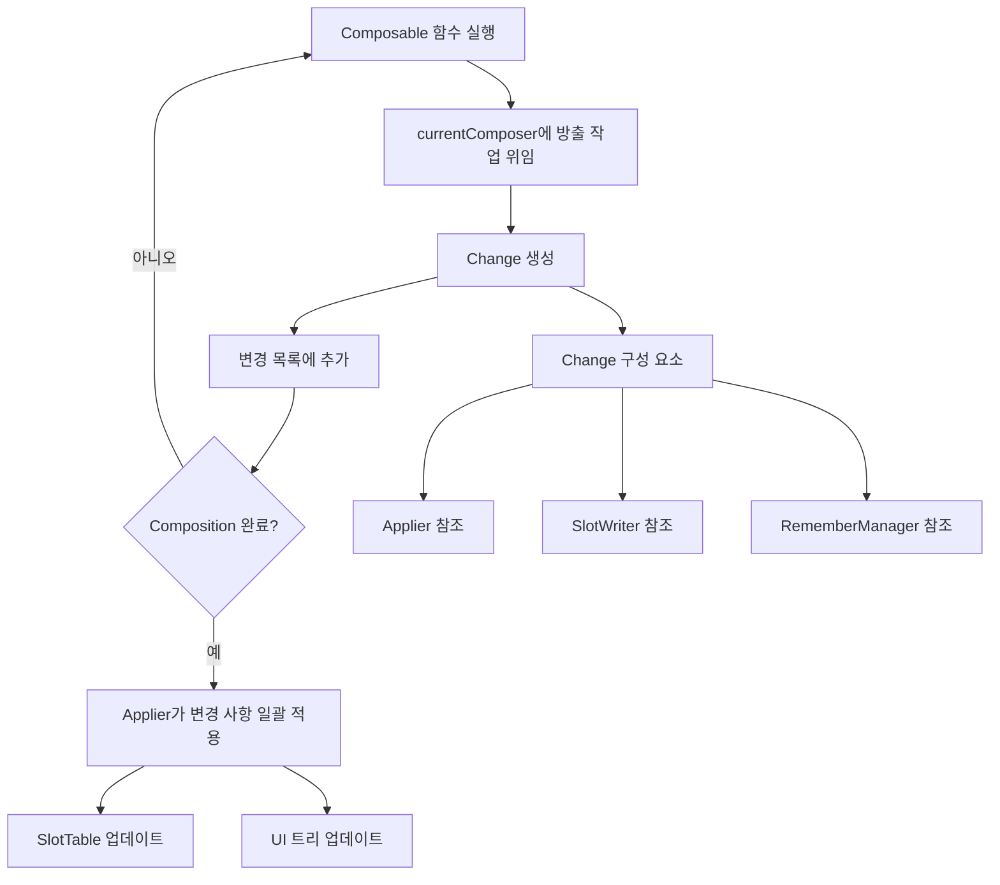

# 변경 사항 모델링 (Modeling the Changes)

이전 섹션에서 설명한 대로 **currentComposer**에 위임된 모든 방출 작업은 `Change`로 모델링되어 내부의 **변경 목록**에 추가됩니다. 

## Change의 정의

`Change`는 현재의 `Applier` 및 `SlotWriter`에 접근할 수 있는 **지연된 함수**입니다. 작성자는 한 번에 한 개만 활성 가능하다는 것을 명심해야 합니다.

```kotlin
// Composer.kt
internal typealias Change = (
  applier: Applier<*>,
  slots: SlotWriter,
  rememberManager: RememberManager
) -> Unit
```


## Change 기록 과정

이러한 변경 사항들은 **변경 목록**에 추가됩니다. 다른 의미로 기록한다고 볼 수 있습니다.

### 방출(Emission)의 의미

**"방출"** 이라는 행위는 본질적으로 이러한 `Change`들을 생성하는 것을 의미하며, 이는 **슬롯 테이블**에서 노드를 처리할 수 있는 지연된 람다식입니다:

- **추가** (Add)
- **제거** (Remove) 
- **교체** (Replace)
- **이동** (Move)

결과적으로 `Applier`에 변경 사항들을 알리게 되며, 궁극적으로 `Applier`를 통해 해당 변경 사항들을 구체화하게 됩니다.

> **참고**: "변경 사항 방출"에 대해 논의할 때 **"변경 사항 기록"** 또는 **"변경 사항 스케줄링"** 이라는 말로 통용되기도 합니다. 모두 같은 의미를 나타냅니다.

## 변경 사항 적용 과정

`Composition`이 끝나면 다음과 같은 과정을 거칩니다:

1. 일련의 **Composable 함수들**이 호출됨
2. 모든 변경 사항이 **기록**(방출)됨
3. `Applier`에 의해 모든 변경 사항들이 **일괄적으로 적용**됨

## Composition 클래스

`Composition` 자체는 **Composition 클래스**로 모델링됩니다. 이에 대해서는 이 챕터의 후반에서 composition 과정에 대한 내용을 다룰 때 자세히 살펴볼 예정입니다.

## 변경 사항 모델링 프로세스

다음 다이어그램은 Change가 어떻게 모델링되고 적용되는지를 보여줍니다:




## 요약

- **Change**는 Compose Runtime에서 변경 사항을 모델링하는 지연된 함수로, `Applier`, `SlotWriter`, `RememberManager`에 접근할 수 있습니다
- **방출(Emission)** 은 본질적으로 Change를 생성하는 과정으로, "변경 사항 기록" 또는 "변경 사항 스케줄링"과 같은 의미입니다
- Change는 슬롯 테이블에서 노드를 **추가, 제거, 교체, 이동**할 수 있는 연산을 담고 있습니다
- **Composition 완료** 후 Applier가 모든 변경 사항을 일괄적으로 적용하여 UI 트리를 업데이트합니다
- 이러한 지연된 실행 방식을 통해 효율적인 배치 처리와 최적화된 UI 업데이트가 가능합니다