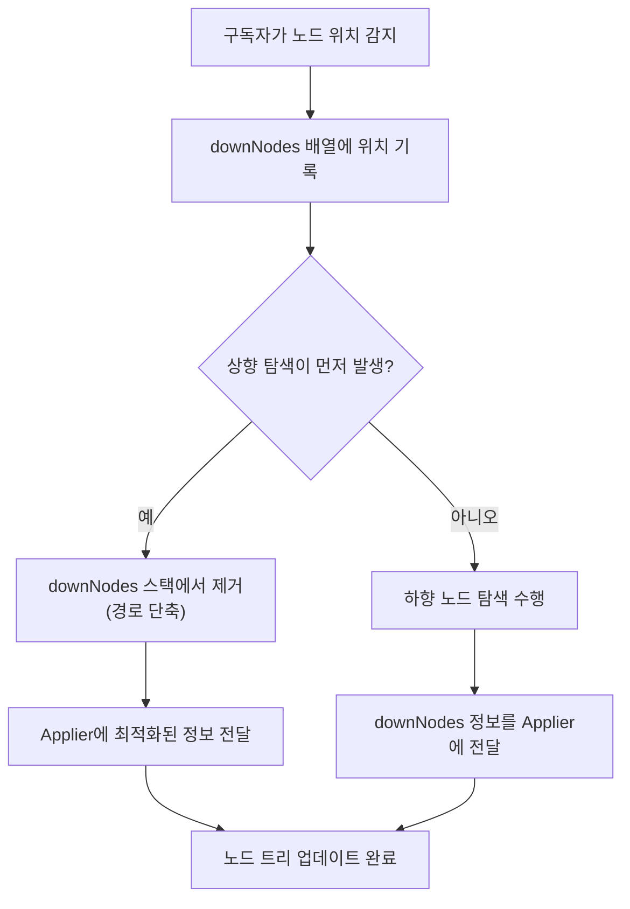

# 노드 탐색 (Navigating the nodes)

> Compose Runtime에서 노드 트리를 효율적으로 탐색하고 관리하는 메커니즘에 대해 알아봅니다.

## 개요

**노드 트리 탐색**은 Compose Runtime의 핵심 메커니즘 중 하나입니다. 이 과정은 `Applier`에 의해 수행되지만, 직접적으로 수행되지는 않습니다.

## 노드 탐색 메커니즘

### 기본 동작 원리

노드 탐색은 다음과 같은 방식으로 동작합니다:

1. **위치 기록**: 구독자(subscriber)에 의해 탐색되는 노드의 모든 위치를 기록
2. **배열 저장**: 기록된 정보를 `downNodes` 배열에 저장
3. **정보 전달**: 노드 탐색이 실현되면 `downNodes`의 모든 **하향 노드 정보**를 `Applier`에 전달

### 탐색 경로 최적화

**상향 노드 탐색**이 하향 노드 탐색보다 먼저 수행되는 경우:
- `downNodes` 스택에서 해당 노드를 제거
- 탐색 경로를 단축하여 성능 최적화

## 핵심 구성 요소

| 구성 요소 | 역할 |
|---------|-----|
| `Applier` | 노드 트리 탐색을 실제로 수행하는 주체 |
| `downNodes` | 하향 노드 정보를 저장하는 배열 |
| 구독자(Subscriber) | 노드 위치를 기록하고 추적하는 역할 |

## 탐색 과정 다이어그램

## 성능 최적화 특징

- **지연 실행**: 노드 탐색은 필요할 때까지 지연되어 성능 향상
- **경로 단축**: 상향 탐색을 통한 불필요한 탐색 경로 제거
- **배치 처리**: `downNodes` 배열을 통한 효율적인 일괄 처리

## 요약

- **노드 탐색**은 `Applier`가 수행하지만 직접적이지 않은 간접적 방식으로 동작합니다.
- **구독자**가 노드 위치를 추적하고 `downNodes` 배열에 기록하는 방식으로 구현됩니다.
- **상향 노드 탐색**이 먼저 발생하면 스택에서 제거하여 탐색 경로를 최적화합니다.
- 이러한 메커니즘을 통해 Compose Runtime은 효율적인 UI 트리 관리를 실현합니다.