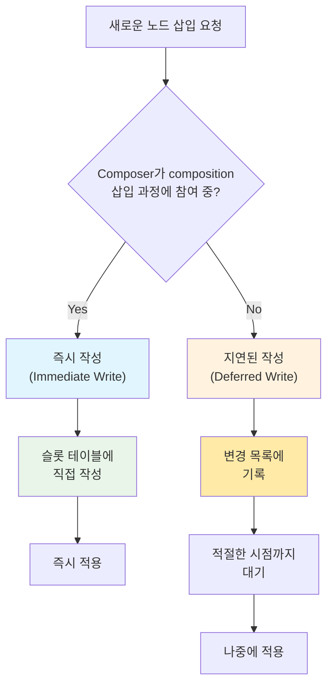

# 작성 시기 최적화 (Optimizing when to write)

`Compose Runtime`에서 **작성 시기 최적화**는 `Composer`가 언제 변경 사항을 처리할지 결정하는 중요한 메커니즘입니다. 이는 성능 향상과 효율적인 리소스 관리를 위한 핵심 전략입니다.

## 개요

새로운 노드를 삽입하는 작업은 `Composer`에게 위임됩니다. `Composer`가 **composition에 새로운 노드를 삽입하는 과정에 적극적으로 참여하고 있을 때**, Compose는 이 사실을 실시간으로 인지하고 있습니다.

## 두 가지 작성 전략

### 1. 즉시 작성 (Immediate Write)

`Composer`가 노드 삽입 과정에 참여하고 있는 경우:

- **변경 사항을 즉시 `슬롯 테이블(Slot Table)`에 작성**
- 변경 목록에 기록하는 단계를 건너뛰어 **성능 최적화**
- 지연 시간 없이 바로 적용

### 2. 지연된 작성 (Deferred Write)

그 외의 경우:

- **변경 사항을 `변경 목록(Change List)`에 기록**
- 나중에 해석하고 적용하기 위해 **일시적으로 지연**
- 적절한 시점이 될 때까지 대기

## 작성 시기 최적화 프로세스



## 핵심 용어

| 용어 | 설명 |
|------|------|
| **슬롯 테이블** | Composition의 노드 구조를 저장하는 데이터 구조 |
| **변경 목록** | 나중에 적용할 변경 사항들을 임시 저장하는 목록 |
| **즉시 작성** | 변경 사항을 슬롯 테이블에 바로 적용하는 방식 |
| **지연된 작성** | 변경 사항을 변경 목록에 기록 후 나중에 적용하는 방식 |

## 최적화의 이점

### 즉시 작성의 장점
- ⚡ **성능 향상**: 중간 단계 생략으로 처리 속도 증가
- 🔄 **실시간 반영**: 변경 사항의 즉시 적용
- 💾 **메모리 효율성**: 변경 목록에 저장하는 오버헤드 제거

### 지연된 작성의 장점  
- 🎯 **적절한 타이밍**: 최적의 시점에 변경 사항 적용
- 🔒 **안전성**: composition 상태가 안정된 후 처리
- 📊 **배치 처리**: 여러 변경 사항을 한 번에 처리 가능

## 실제 동작 예시

```kotlin
// 의사 코드 예시
fun handleNodeInsertion(newNode: Node) {
    if (composer.isActivelyInserting()) {
        // 즉시 작성 - 슬롯 테이블에 직접 작성
        slotTable.insertNode(newNode)
    } else {
        // 지연된 작성 - 변경 목록에 기록
        changeList.addPendingChange(InsertNodeChange(newNode))
    }
}
```

## 요약

- `Composer`는 **두 가지 작성 전략**을 통해 노드 삽입을 최적화합니다
- **즉시 작성**은 활발한 composition 과정에서 성능을 향상시킵니다  
- **지연된 작성**은 안전하고 적절한 타이밍에 변경 사항을 적용합니다
- 이 최적화는 Compose Runtime의 **효율적인 리소스 관리**와 **성능 향상**에 핵심적인 역할을 합니다