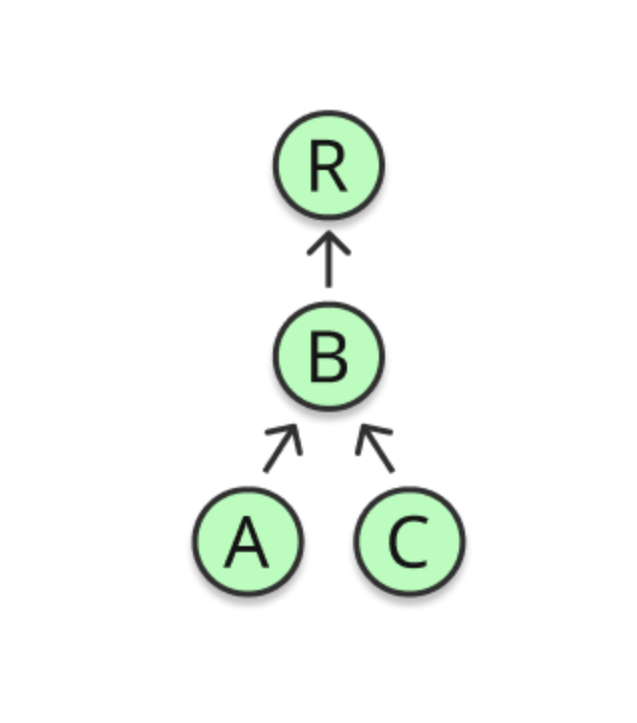
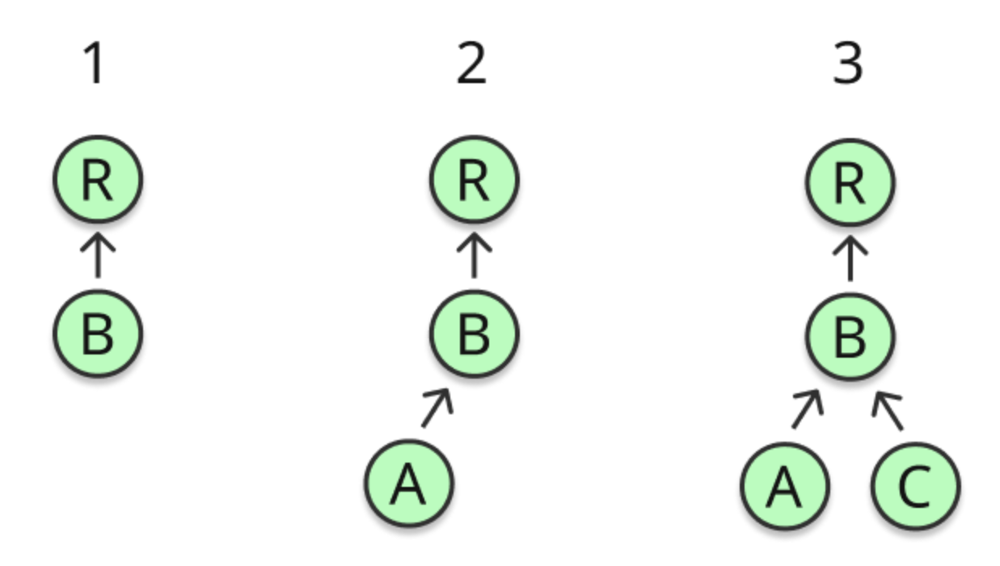
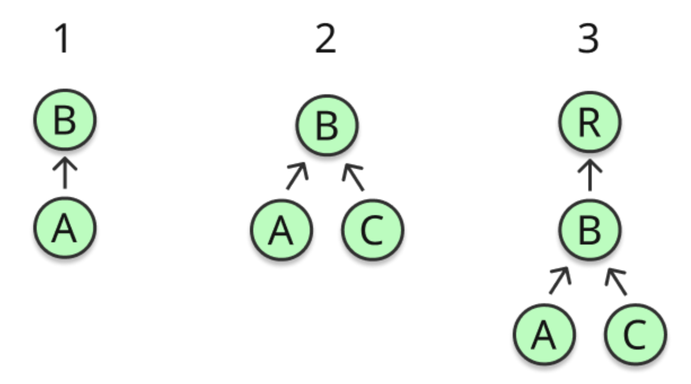

# 노드 트리 구축 시 성능 (Performance when building the node tree)

> `Top-down`과 `Bottom-up` 삽입은 성능 특성이 크게 다릅니다. 차이는 주로 `Applier`가 새 하위 노드 삽입 시 전파해야 하는 **알림 범위**와 **알림 개수 증가 패턴**에서 발생합니다.

## 트리 모델

아래와 같은 트리를 대상으로 삽입 전략을 비교합니다.

## 하향식 삽입 (Inserting top-down)

- **의미**: 상위에서 하위로 순차 삽입합니다.

아래 그림은 하향식 순서를 나타냅니다.

## 상향식 삽입 (Inserting bottom-up)

- **의미**: 하위 노드를 먼저 조립한 뒤, 완성된 부분 트리를 상위에 부착합니다.

아래 그림은 상향식 순서를 나타냅니다.

## 성능 관점 핵심

- `Applier`는 새 하위가 삽입될 때 관련 노드들에게 `알림`을 전파해야 합니다.
- `Top-down`에서는 부모가 이미 트리에 연결되어 있으므로, 삽입 시점마다 변경을 많은 `조상 노드`에게까지 알려야 할 수 있습니다. 트리의 `깊이(depth)`가 늘어날수록 알림 대상이 **기하급수적으로 증가**할 수 있습니다.
- `Bottom-up`에서는 부모가 아직 상위에 연결되기 전 하위들을 먼저 구성하므로, 각 삽입 시점에는 **직속 부모**에게만 알리면 됩니다. 따라서 동일한 구조에서 일반적으로 알림 수가 **더 적게 유지**됩니다.

### 삽입 전략 비교

| 전략 | 알림 전파 범위 | 알림 수 증가 패턴 | 장점 | 주의점 |
| --- | --- | --- | --- | --- |
| `Top-down` | 조상(부모, 조부모 …)까지 전파 가능 | 깊이 증가 시 급격히 증가 | 직관적인 구축 순서 | 깊은 트리에서 비효율 가능 |
| `Bottom-up` | 직속 부모 중심 전파 | 상대적으로 완만 | 알림 수 절감, 비용 예측 용이 | 일부 케이스에서 상·하향 혼용 욕구 발생 |

> 핵심: 표현하려는 트리 특성과 변경 전파 방식에 맞춰 `단일 전략`을 선택하세요. 상·하향을 **섞지 않는 것**이 중요합니다.

## 적용 가이드

- 트리가 깊거나, 삽입 시 조상 전파 비용이 크다면 `Bottom-up`을 우선 고려합니다.
- 변경이 주로 `루트 → 하위`로 전파되어야 하고, 조상 전파 비용이 낮다면 `Top-down`도 단순합니다.
- 어떤 전략이든 일관되게 적용해 `알림 전파 경로`와 `비용`을 예측 가능하게 유지합니다.

## 요약
- `Top-down`과 `Bottom-up`은 `Applier`의 알림 전파 범위가 달라 성능 차이가 큽니다.
- 깊은 트리에서는 `Bottom-up`이 대체로 알림 수를 줄여 효율적입니다.
- 프로젝트에서는 한 가지 전략을 일관되게 사용하세요. 혼용은 예측 불가능성과 비용 증가를 초래합니다.