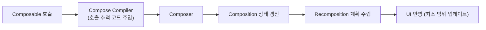

# 3. 컴포즈 런타임 (The Compose Runtime)

> Compose의 `Compiler`와 `Runtime`은 함께 동작하여 `Composable`이 방출한 변경을 `Composition` 상태에 반영하고, 필요한 최소 범위만 다시 그립니다.

- [Compose 아키텍처의 내부 동작과 Compiler-Runtime-UI 간 통신](https://x.com/JorgeCastilloPr/status/1390928660862017539)

위 트위터 스레드는 반드시 이해해야 할 핵심 아이디어를 잘 요약한 입문 자료입니다. 본 챕터는 특히 `Compose Runtime`에 초점을 맞추며, 다양한 컴포즈 구성 요소가 어떻게 통신하고 함께 동작하는지 설명합니다. 자세한 Compiler 동작은 별도 챕터에서 다룹니다.

## 왜 Runtime인가?

- `Runtime`은 메모리에 유지되는 UI 상태인 `Composition`을 관리합니다.
- `Composable`에서 발생한 변경은 컴파일러가 주입한 ```$composer```를 통해 `Composition`에 반영됩니다.
- `Runtime`은 변경 그래프를 기반으로 필요한 요소만 `Recomposition`하여 효율적인 렌더링을 수행합니다.

## 핵심 용어

| 용어 | 설명 |
| --- | --- |
| `Composition` | 런타임이 관리하는 UI 트리의 상태 표현. |
| `Composer` | 컴파일러가 주입한 컨텍스트로, `Composition`을 기록·갱신. |
| `Recomposition` | 변경된 데이터에 따라 필요한 범위만 다시 실행/그리기. |

## 동작 개요

`Composable` 함수는 실행 중에 UI 노드를 생성·갱신하는 지시를 `Composer`에 전달합니다. 이때 컴파일러는 내부적으로 ```$composer```와 관련 플래그를 서명에 주입해 호출을 추적합니다. 아래는 개념을 위한 의사 코드입니다.

```kotlin
  // 개념적 의사코드 (실제 시그니처와 다를 수 있음)
  @Composable
  fun Greeting(name: String) {
    Text(text = "Hello, $name")
  }

  // 컴파일 후 개념적 형태
  fun Greeting(name: String, $composer: Composer, key: Int, changed: Int) {
    $composer.startReplaceableGroup(key)
    Text("Hello, $name", $composer, /* flags ... */)
    $composer.endReplaceableGroup()
  }
```

- ```$composer```는 `Composition`에 변경 사항을 기록하고, 다음 프레임에서 필요한 위치만 `Recomposition`하도록 합니다.

## 데이터 흐름 다이어그램



## 더 읽기

- 원문 스레드: [Jorge Castillo - Compose 내부 동작 스레드](https://x.com/JorgeCastilloPr/status/1390928660862017539)
- 소스 코드 탐색: [Android Open Source - cs.android.com](https://cs.android.com/)

## 요약
- `Runtime`은 `Composition`을 관리하고 변경을 최소 범위로 다시 그립니다.
- 컴파일러가 주입한 ```$composer```가 변경 추적과 상태 기록을 담당합니다.
- `Composable` → Compiler → `Composer` → `Composition` → `Recomposition`의 흐름으로 동작합니다.

## 더 학습하기
- [슬롯 테이블과 변경 목록 (The Slot Table and the List of Changes)](./SlotTableListOfChanges/README.md)
- [슬롯 테이블 심층 분석 (The slot table in depth)](./SlotTableInDepth/README.md)
- [변경 목록 (The list of changes)](./ListOfChanges/README.md)
- [Composer (The Composer)](./Composer/README.md)
- [Composer 키우기 (Feeding the Composer)](./FeedingTheComposer/README.md)
- [변경 사항 모델링 (Modeling the Changes)](./ModelingTheChanges/README.md)
- [작성 시기 최적화 (Optimizing when to write)](./OptimizinWhenToWrite/README.md)
- [쓰기 및 읽기 그룹 (Writing and Reading Groups)](./WritingReadingGroups/README.md)
- [값 기억하기 (Remembering values)](./RememberingValues/README.md)
- [재구성 범위 (Recompose scopes)](./RecomposeScopes/README.md)
- [Composer와 사이드 이펙트 (SideEffects in the Composer)](./SideEffectsInTheComposer/README.md)
- [CompositionLocals 저장 (Storing CompositionLocals)](./StoringCompositionLocals/README.md)
- [소스 정보 저장 (Storing Source Information)](./StoringSourceInformation/README.md)
- [CompositionContext를 이용한 Composition 연결 (Linking Compositions)](./LinkingCompositions/README.md)
- [현재 상태 스냅샷에 접근 (Accessing the current State snapshot)](./AccessingTheCurrentStateSnapshot/README.md)
- [노드 탐색 (Navigating the nodes)](./NavigatingTheNodes/README.md)
- [구독자와 작성자의 동기화 유지 (Keeping reader and writer in sync)](./KeepingReaderWriterInSync/README.md)
- [변경 사항 적용하기 (Applying the changes)](./ApplyingChanges/README.md)
 - [노드 트리 구축 시 성능 (Performance when building the node tree)](./PerformanceBuildingNodeTree/README.md)
