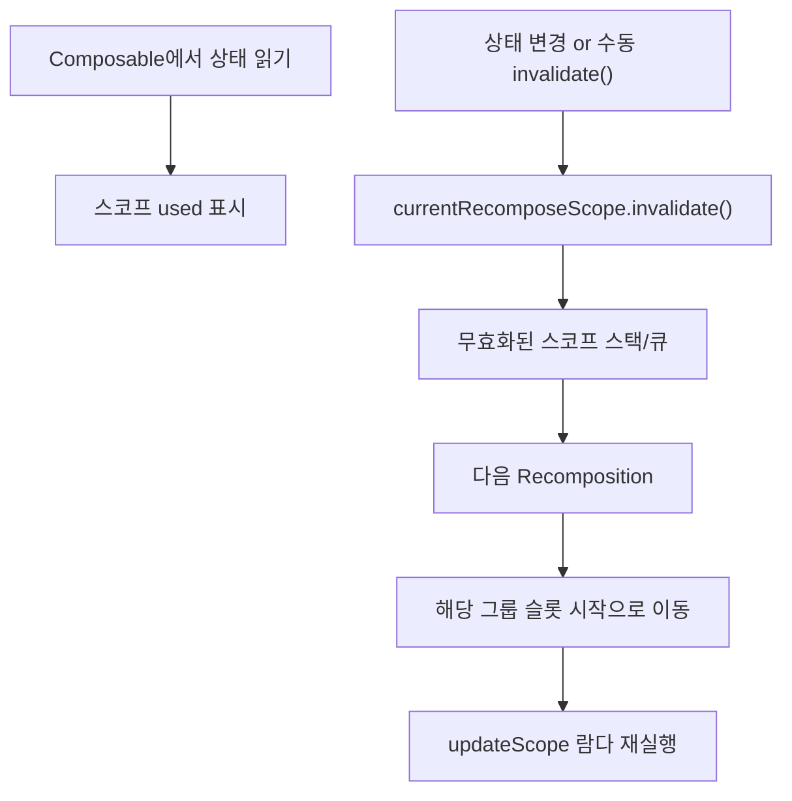

# 재구성 범위 (Recompose scopes)

> `Composer`는 스마트 `Recomposition`을 위해 각 재시작 가능한 그룹에 대해 **`RecomposeScope`** 를 생성하고 관리합니다.

## 개요

- **`RecomposeScope`**: `Composition`의 일부 영역을 나타내며, 나머지와 **독립적으로 재구성**될 수 있는 단위입니다.
- **`currentRecomposeScope`**: 현재 실행 중인 재시작 가능한 그룹의 범위. `Composer`가 유지합니다.
- **수동 무효화(`invalidate`)**: `composer.currentRecomposeScope().invalidate()`로 해당 범위를 다음 프레임에서 재구성 대상으로 표시합니다.

## 왜 중요한가

`RecomposeScope`는 변경 전파를 필요한 최소 범위로 제한해 **불필요한 재실행/그리기 비용을 줄임**으로써, Compose의 성능 목표를 실현합니다.

## 동작 원리

1. 컴파일러는 `@Composable`에 **재시작 가능한 그룹**을 만들고, 이에 대응하는 `RecomposeScope`를 생성합니다.
2. 그룹 종료 시점에 `endRestartGroup()?.updateScope { ... }`를 통해, 이후 프레임에서 같은 그룹만 **선택적으로 재실행**할 수 있도록 람다를 저장합니다.
3. 외부 변경이나 명시적 `invalidate()`가 발생하면, 해당 스코프가 **무효화 큐(스택)** 에 쌓이고 다음 `Recomposition`에서 처리됩니다.

### 컴파일 후 개념적 형태

```kotlin
@Composable
fun A(x: Int, $composer: Composer<*>, $changed: Int) {
  $composer.startRestartGroup(/* key 자동 주입 */)
  // ...
  f(x)
  $composer.endRestartGroup()?.updateScope { next ->
    A(x, next, $changed or 0b1)
  }
}
```

## 언제 스코프가 활성화되나?

`RecomposeScope`는 항상 활성(active) 상태가 아닙니다. 컴파일러와 런타임이 **Composable 내부에서 상태 스냅샷을 읽는 작업**을 감지한 경우에만, `Composer`는 스코프를 `used`로 표시합니다. 이때에만 `endRestartGroup()`이 `null`이 아닌 **재구성 람다**를 반환하여, 이후 프레임에서 해당 범위를 재실행할 수 있습니다.

## 무효화와 재구성 큐

- `Composer`는 **무효화된(RecomposeScope.invalidate)** 모든 스코프의 **스택/큐**를 유지합니다.
- 다음 `Recomposition`에서 이들 스코프를 순회하며, 슬롯 테이블의 해당 그룹 시작으로 이동해 **그룹 단위로 재실행**합니다.
- 상위 그룹은 필요한 경우에만 자식의 재구성을 위임하고, 그렇지 않으면 **슬롯을 스킵**합니다.

### 데이터 흐름 다이어그램



## 실전 팁

- **스코프를 작게 유지**: 큰 범위를 한 번에 무효화하면 불필요한 작업이 증가합니다.
- **상태 읽기 위치를 의식**: 어디에서 상태를 읽느냐가 `used` 표시와 재구성 단위를 좌우합니다.
- **명시적 무효화는 신중히**: `invalidate()`는 강력하지만, 과도하면 성능 저하로 이어질 수 있습니다.

## 요약
- `RecomposeScope`는 특정 그룹만 독립적으로 다시 실행하기 위한 범위입니다.
- 상태 읽기가 감지되어 `used`로 표시된 경우에만 재구성 람다가 활성화됩니다.
- `invalidate()`로 스코프를 큐에 넣고, 다음 프레임에서 해당 그룹만 재실행합니다.