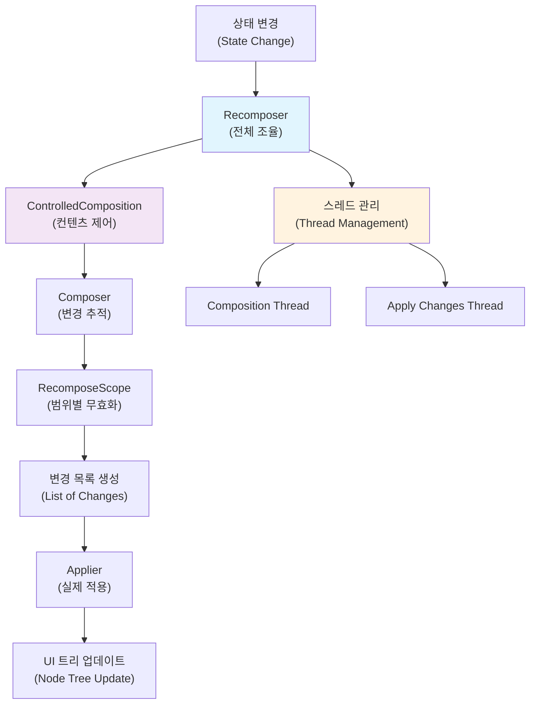
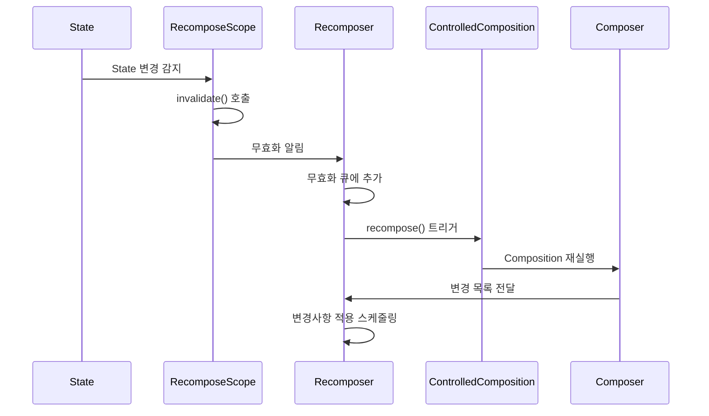

# Recomposer (The Recomposer)

> **핵심 개념**: `Recomposer`는 Compose Runtime의 **오케스트레이터**로서 `ControlledComposition`을 제어하고, 효율적인 **Recomposition**을 위한 스레드 관리와 변경사항 적용을 담당합니다.

우리는 초기 `composition`이 어떻게 이루어지는지 이미 학습했으며, `RecomposeScope` 및 `invalidation`에 대해서도 몇 가지 배웠습니다. 하지만 우리는 **`Recomposer`가 실제로 어떻게 작동하는지**에 대해서는 여전히 거의 다루지 않았습니다. 

## 핵심 질문들

- 어떻게 생성되며 언제 실행되기 시작할까요?
- `Recomposition`을 자동으로 트리거하기 위해 `invalidation` 수신을 어떻게 시작할까요?
- 어떤 스레드에서 작업을 수행할지 어떻게 결정할까요?

## Recomposer의 핵심 역할

`Recomposer`는 **`ControlledComposition`을 제어**하고, 궁극적으로 변경 사항들을 적용하기 위해 필요할 때 **`recomposition`을 트리거**합니다. 또한 `composition`을 시작하거나 `recomposition`할 **스레드** 및 변경 사항을 적용할 때 필요한 **스레드를 결정**합니다.

## Recomposer의 주요 책임

| 책임 영역 | 설명 | 세부 기능 |
|----------|------|-----------|
| **Composition 제어** | `ControlledComposition`의 생성과 관리 | - 초기 composition 수행<br/>- 외부 제어 인터페이스 제공 |
| **Recomposition 트리거** | 변경사항 감지 시 재구성 시작 | - `invalidation` 감지<br/>- `RecomposeScope` 무효화 처리 |
| **스레드 관리** | 작업 수행 스레드 결정 | - Composition 스레드 선택<br/>- 변경사항 적용 스레드 선택 |
| **변경사항 조율** | 전체 변경 과정 관리 | - 변경 목록 생성 감독<br/>- `Applier`와의 협력 |

## Recomposer와 다른 컴포넌트들의 협력

### 전체 시스템에서의 위치



### 협력 관계 세부사항

#### 1. ControlledComposition과의 관계

```kotlin
// 개념적 동작
class Recomposer {
    fun controlComposition(composition: ControlledComposition) {
        // 1. Composition 컨텐츠 구성
        composition.composeContent(content)
        
        // 2. 필요시 재구성 수행
        if (hasInvalidations()) {
            composition.recompose()
        }
    }
}
```

#### 2. 스레드 결정 프로세스

`Recomposer`는 다음과 같은 **스레드 관리 전략**을 사용합니다:

| 작업 유형 | 스레드 선택 기준 | 고려사항 |
|----------|-----------------|----------|
| **Initial Composition** | UI 스레드 우선 | 초기 구성의 안전성 보장 |
| **Recomposition** | 백그라운드 가능 | 성능 최적화를 위한 병렬 처리 |
| **Change Application** | UI 스레드 필수 | 실제 UI 업데이트는 메인 스레드 |

### 3. Invalidation 처리 과정



## Recomposer의 생명주기

### 1. 생성과 초기화
- **생성 시점**: `setContent` 호출 시 또는 명시적 `Composition` 생성 시
- **초기 설정**: 스레드 정책, `ControlledComposition` 연결

### 2. 활성 상태
- **Invalidation 모니터링**: `RecomposeScope` 변경사항 감지
- **Recomposition 스케줄링**: 효율적인 배치 처리
- **스레드 조율**: 적절한 스레드에서 작업 실행

### 3. 정리 과정
- **리소스 해제**: 관련 `Composition` 정리
- **스레드 정리**: 백그라운드 작업 종료

## 성능 최적화 전략

### 1. 배치 처리 (Batching)
- **여러 invalidation을 한 번에 처리**: 불필요한 중복 작업 방지
- **프레임 단위 그룹화**: 60fps 성능 목표 달성

### 2. 스마트 스케줄링
- **우선순위 기반 처리**: 중요한 변경사항 우선 적용
- **유휴 시간 활용**: CPU 부하가 낮을 때 백그라운드 작업 수행

### 3. 메모리 효율성
- **변경 목록 재활용**: GC 압박 최소화
- **슬롯 테이블 최적화**: 메모리 사용량 관리

## 실전 활용 팁

### 1. 개발자 관점
```kotlin
// Recomposer 상태 확인 (디버깅 목적)
@Composable
fun DebugComposition() {
    val recomposer = currentRecomposeScope
    
    // 현재 recomposition 상태 확인
    LaunchedEffect(Unit) {
        // 디버깅 로직
        println("Current recompose scope: $recomposer")
    }
}
```

### 2. 성능 모니터링
- **Recomposition 횟수 추적**: 과도한 재구성 방지
- **스레드 사용량 모니터링**: 병목 지점 파악
- **메모리 사용 패턴 분석**: 리소스 누수 방지

### 3. 최적화 가이드라인
- ✅ **상태 변경 최소화**: 불필요한 invalidation 방지
- ✅ **스코프 세분화**: 큰 범위 재구성 방지  
- ✅ **안정적인 데이터 사용**: 객체 동등성 최적화

## 디버깅과 트러블슈팅

### 일반적인 문제들

| 문제 | 원인 | 해결 방법 |
|------|------|-----------|
| **과도한 Recomposition** | 불안정한 상태 관리 | `remember`, `mutableStateOf` 적절 사용 |
| **UI 지연** | 메인 스레드 블로킹 | 백그라운드 작업 분리 |
| **메모리 누수** | Composition 정리 미흡 | 적절한 생명주기 관리 |

## 관련 컴포넌트와의 연결

- **[Composer (The Composer)](../Composer/README.md)**: 변경사항 추적과 기록
- **[재구성 범위 (Recompose scopes)](../RecomposeScopes/README.md)**: 무효화 범위 관리  
- **[변경 목록 (The list of changes)](../ListOfChanges/README.md)**: 실제 변경사항 적용
- **[Composition](../Composition/README.md)**: `ControlledComposition`과의 관계

## 요약

- **`Recomposer`는 Compose Runtime의 중앙 조율자**로서 전체 recomposition 과정을 관리합니다
- **`ControlledComposition` 제어**를 통해 composition과 recomposition을 효율적으로 수행합니다
- **스레드 관리**를 통해 성능 최적화와 안전한 UI 업데이트를 보장합니다
- **Invalidation 처리**를 통해 필요한 최소 범위만 재구성하여 성능을 최적화합니다
- **배치 처리와 스마트 스케줄링**으로 60fps 성능 목표를 달성합니다
- **다른 컴포넌트들과의 협력**을 통해 전체 Compose 시스템의 효율성을 보장합니다

