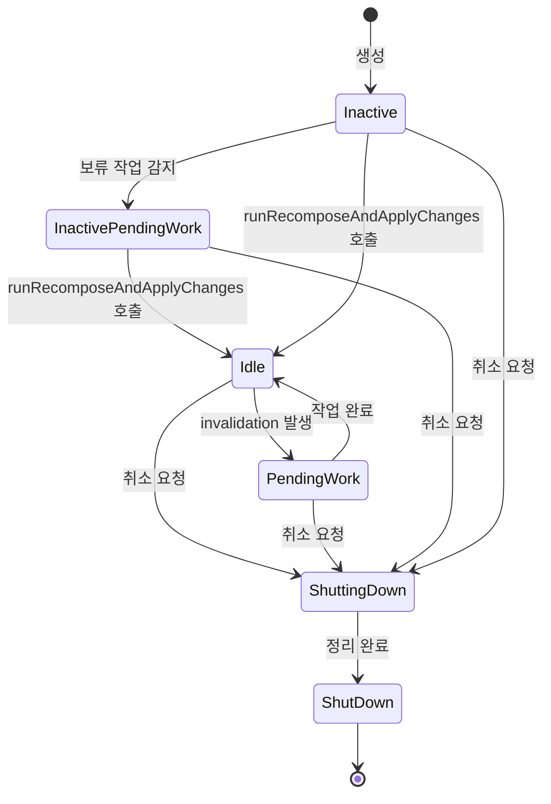

# Recomposer의 상태 (Recomposer states)

`Recomposer`는 수명 주기를 나타내는 일련의 **상태(State)**를 가지며, 이를 통해 Composition의 활성화 및 종료를 관리합니다.

## Recomposer 상태 정의

`Recomposer`는 다음과 같은 6가지 상태를 가집니다:

```kotlin
enum class State {
  ShutDown,
  ShuttingDown,
  Inactive,
  InactivePendingWork,
  Idle,
  PendingWork
}
```

## 상태별 설명

아래는 각 상태의 의미와 역할을 정리한 표입니다:

| 상태 | 설명 |
|------|------|
| **ShutDown** | `Recomposer`가 취소되고 정리 작업이 완료된 상태입니다. 더 이상 사용할 수 없습니다. |
| **ShuttingDown** | `Recomposer`가 취소되었지만 여전히 정리 작업 중인 상태입니다. 더 이상 사용할 수 없습니다. |
| **Inactive** | `Recomposer`는 `Composer`의 invalidation을 무시하고, 이에 따라 recomposition을 트리거하지 않습니다. Recomposition 관찰을 시작하려면 `runRecomposeAndApplyChanges`를 호출해야 합니다. 이는 생성 후 `Recomposer`의 **초기 상태**입니다. |
| **InactivePendingWork** | `Recomposer`가 비활성 상태이지만 이미 프레임을 기다리는 보류 중인 이펙트가 있을 가능성이 있습니다. 프레임은 `Recomposer`가 실행을 시작하자마자 생성됩니다. |
| **Idle** | `Recomposer`가 composition 및 스냅샷 invalidation을 추적하고 있지만 현재 수행할 작업이 없는 대기 상태입니다. |
| **PendingWork** | `Recomposer`가 보류 중인 작업에 대해 알림을 받았으며, 이미 작업을 수행 중이거나 수행할 기회를 기다리고 있습니다. |

## 상태 전환 다이어그램

`Recomposer`의 상태 전환은 다음과 같은 흐름을 따릅니다:



## 주요 개념

### 보류 중인 작업 (Pending Work)

**보류 중인 작업**이란 `Recomposer`가 처리해야 할 recomposition 또는 이펙트 실행을 의미합니다. 이는 다음과 같은 경우에 발생합니다:

- `State`가 변경되어 invalidation이 발생한 경우
- `LaunchedEffect`, `DisposableEffect` 등의 사이드 이펙트가 실행 대기 중인 경우
- 스냅샷 변경으로 인해 recomposition이 필요한 경우

### 활성화 과정

`Recomposer`는 생성 직후 `Inactive` 상태에서 시작하며, `runRecomposeAndApplyChanges`를 호출해야 활성화됩니다:

```kotlin
// Recomposer 활성화 예시
recomposer.runRecomposeAndApplyChanges()
```

이 메서드를 호출하면 `Recomposer`가 `Idle` 또는 `PendingWork` 상태로 전환되어 composition 변경을 추적하고 처리하기 시작합니다.

### 종료 과정

`Recomposer`가 취소되면 `ShuttingDown` 상태로 전환되며, 모든 정리 작업이 완료되면 `ShutDown` 상태가 됩니다. 이 상태에서는 더 이상 어떤 작업도 수행할 수 없습니다.

## 요약

- `Recomposer`는 6가지 상태(`ShutDown`, `ShuttingDown`, `Inactive`, `InactivePendingWork`, `Idle`, `PendingWork`)를 통해 수명 주기를 관리합니다.
- 생성 직후 `Inactive` 상태에서 시작하며, `runRecomposeAndApplyChanges`를 호출해야 활성화됩니다.
- `Idle` 상태는 작업이 없는 대기 상태이며, `PendingWork` 상태는 recomposition이 필요한 상태입니다.
- 취소 시 `ShuttingDown`을 거쳐 `ShutDown` 상태로 전환되며, 이후에는 재사용할 수 없습니다.
- 상태 전환을 통해 `Recomposer`는 효율적으로 composition 변경을 추적하고 처리합니다.