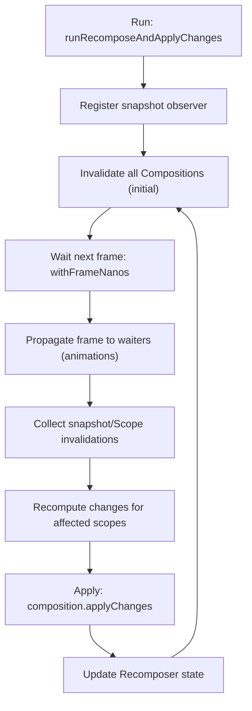

# Recomposition 프로세스 (Recomposition process)

> `Recomposer.runRecomposeAndApplyChanges()`가 호출되면 상태 `invalidation`을 대기하다가, 유입 시 자동으로 필요한 범위만 `Recomposition`을 수행하고 변경을 적용합니다.

## 개요
- **트리거**: 상태 변경이 스냅샷 관찰을 통해 포착되면 `invalidation`이 기록됩니다.
- **계획**: 영향을 받은 `RecomposeScope`와 `Composition` 지점만 다시 실행하도록 계획합니다.
- **적용**: 계산된 변경을 `composition.applyChanges()`로 UI 트리에 반영합니다.

## 단계별 동작

### 1) 스냅샷 변경 전파 관찰자 등록
- 스냅샷 상태는 로컬에서 수정된 뒤 나중에 `snapshot.apply()`로 전역 상태에 동기화됩니다.
- `Recomposer.runRecomposeAndApplyChanges()` 호출 시, 먼저 스냅샷 변경 전파 과정에 관찰자를 등록하여 모든 변경을 스냅샷 `invalidation` 목록에 추가하고, 알려진 모든 `Composer`에게 전파합니다.
- 이를 통해 어떤 `Composition` 부분이 `Recomposition`되어야 하는지 기록됩니다. 이 관찰자는 상태 변경 시 자동으로 `Recomposition`을 트리거하는 핵심 고리입니다.

### 2) 초기 invalidation 수행 (변경 가정)
- 관찰자 등록 직후 `Recomposer`는 모든 `Composition`에 대해 일괄 `invalidation`을 수행하며, 이전에 발생했으나 추적되지 않은 변경을 보정하기 위해 “모든 것이 변경되었다”고 가정합니다.
- 이후 작업은 준비될 때까지 지연됩니다. 작업 준비란 보류 중 스냅샷 `invalidation` 또는 `RecomposeScope`에서 유입된 `Composition` `invalidation`이 확보된 시점을 의미합니다.

### 3) 프레임 동기화 대기 (`MonotonicFrameClock`)
- `Recomposer` 생성 시 제공된 모노토닉 프레임 클록을 사용해 다음 프레임을 대기합니다:
  ```kotlin
  parentFrameClock.withFrameNanos { frameTimeNanos ->
    // 이후 작업은 해당 프레임 시각 이후에만 처리
  }
  ```
- 목적은 동일 프레임 내 변경을 모아서 적용해 불필요한 중복 작업을 줄이는 것입니다.

### 4) 프레임 전달 및 추가 invalidation 유도
- 위 블록 내부에서 잠재적 대기자(예: 애니메이션)에게 프레임 시각을 전달합니다. 이 과정에서 새로운 추적이 필요해져 추가 `invalidation`이 발생할 수 있습니다.

### 5) 스냅샷 invalidation 적용 및 변경 수집
- 마지막 `Recomposition` 이후 수정된 모든 상태 값을 기준으로, 각 `Composer`의 변경을 보류 중 `Recomposition`으로 기록합니다.

### 6) Composition/Scope 기반 invalidation 처리
- 상태가 `Composable` 람다에서 만들어졌고 명시적으로 `composition.invalidate()`가 호출된 경우도 있습니다.
- 각 항목에 대해 `Recomposition`을 수행하고, 결과 변경을 보류 중 `Composition` 목록에 추가합니다.

### 7) Recomposition의 의미
- `Recomposition`은 `Composition` 상태(슬롯 테이블)와 구체화된 트리(`Applier`)에 필요한 모든 `Change`를 다시 계산하는 과정입니다.
- 초기 Composition에서 사용한 로직을 재사용하므로, 동일한 검증·기록·계산 단계가 반복됩니다.

### 8) 변경 적용 및 상태 갱신
- 변경이 있는 모든 `Composition`에 대해 `composition.applyChanges()`를 호출하여 UI에 반영합니다.
- 이후 `Recomposer`의 내부 상태를 갱신하고, 다음 사이클을 대기합니다.

## 핵심 API 요약

| API/키워드 | 역할 |
| --- | --- |
| `Recomposer.runRecomposeAndApplyChanges()` | 전체 사이클 진입점. invalidation 대기·처리 후 변경 적용 |
| `snapshot.apply()` | 로컬 스냅샷 변경을 전역 상태로 전파 |
| `Composer` | 변경을 기록·재생성하여 `Composition`에 반영 |
| `RecomposeScope.invalidate()` / `composition.invalidate()` | 특정 범위/Composition에 대한 재구성 요청 |
| `parentFrameClock.withFrameNanos {}` | 모노토닉 프레임 동기화로 동일 프레임 내 변경을 통합 |
| `composition.applyChanges()` | 계산된 변경을 실제 노드 트리에 적용 |

## Recomposition 흐름 다이어그램



## 참고 코드/키워드

```kotlin
  // 프레임 동기화
  parentFrameClock.withFrameNanos { frameTimeNanos ->
    // ...
  }

  // 범위/Composition invalidation
  composition.invalidate()

  // 변경 적용
  composition.applyChanges()
```

## 요약
- 스냅샷 관찰자를 통해 상태 변경을 `invalidation`으로 기록하고 전파합니다.
- 다음 프레임을 기준으로 변경을 묶어 `Recomposition` 범위를 최소화합니다.
- 계산된 변경은 `composition.applyChanges()`로 적용되고, `Recomposer` 상태가 갱신됩니다.


