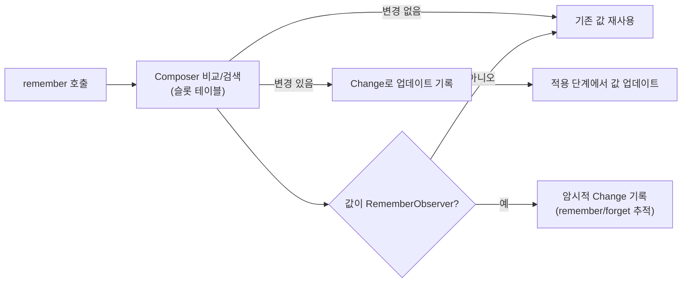

# 값 기억하기 (Remembering values)

> `Composer`는 `remember`로 생성된 값을 `Composition`의 슬롯 테이블에 **기억**하고, 값이 바뀌면 그 변경을 **최소 범위**로 적용합니다. 비교는 `remember` 호출 시점에 즉시 수행되며, 필요 시 변경은 `Change`로 기록되어 적용 단계에서 반영됩니다.

## 개요
- **값 저장**: `remember`로 생성된 값은 슬롯 테이블에 저장되어 재구성(`Recomposition`) 이후에도 재사용됩니다.
- **즉시 비교**: `remember`가 호출되면 직전에 기록된 슬롯의 값과 즉시 비교합니다.
- **지연 업데이트**: `Composer`가 값을 삽입 중이 아니라면, 변경은 즉시 적용하지 않고 `Change`로 기록해 이후 일괄 적용합니다.
- **관찰자 처리**: 값이 `RememberObserver`라면, 기억/망각을 추적하기 위해 **암시적 Change**도 함께 기록합니다.

## 핵심 개념
| 용어 | 설명 |
| --- | --- |
| `remember` | 재구성 사이에 값을 저장·재사용하는 API. |
| `Composer` | 슬롯 테이블에 값을 기록하고 변경을 추적·적용하는 런타임 구성요소. |
| `Composition` | 런타임이 관리하는 UI 상태 트리. |
| `Change` | 즉시 적용하지 않는 변경을 표현하는 항목으로, 적용 단계에서 일괄 실행됨. |
| `RememberObserver` | onRemembered/onForgotten/onAbandoned 콜백을 제공하는 관찰자 인터페이스. |

## 동작 흐름


## 코드 예시
```kotlin
  @Composable
  fun Counter() {
    val count = remember { mutableStateOf(0) }
    Button(onClick = { count.value++ }) {
      Text(text = "Count = ${count.value}")
    }
  }
```

```kotlin
  // RememberObserver가 기억/망각 이벤트를 받는 형태 (개념 예시)
  class LoggingObserver : RememberObserver {
    override fun onRemembered() { /* log("remembered") */ }
    override fun onForgotten() { /* log("forgotten") */ }
    override fun onAbandoned() { /* log("abandoned") */ }
  }

  @Composable
  fun Sample() {
    // 값이 RememberObserver이면 Composer가 암시적 Change도 기록하여 수명 주기를 추적
    remember { LoggingObserver() }
  }
```

## 구현 관점에서의 포인트
- **비교 시점**: `remember` 호출 즉시 직전 슬롯의 값과 비교합니다.
- **업데이트 기록**: 삽입 중이 아니라면 변경을 `Change`로 기록하고, 적용 단계에서 일괄 처리합니다.
- **관찰자 수명주기**: `RememberObserver`는 기억/망각을 추적하기 위해 암시적 `Change`가 함께 기록됩니다.
- **키 안정성**: `remember(key1, key2, ...)`의 키가 변하면 새 값으로 대체됩니다. 키의 **안정성**을 유지해 의도치 않은 초기화를 방지하세요.

## 주의사항
- **Stable/Immutable**한 값을 유지하면 불필요한 재구성을 줄일 수 있습니다.
- `remember`는 **UI 트리의 위치**에 종속됩니다. 컴포저블 구조가 바뀌면 슬롯 정렬이 달라질 수 있으니, 위치 변화가 예상되면 `key(...)` 또는 명시적 키를 고려하세요.
- 부수효과는 `remember`가 아닌 `SideEffect`, `DisposableEffect` 등 **효과 API**로 처리하세요.

## 요약
- `remember`는 값을 슬롯 테이블에 **기억**하여 재구성 간 **재사용**합니다.
- 비교는 호출 시점에 즉시, 적용은 필요 시 `Change`로 **지연 처리**됩니다.
- 값이 `RememberObserver`이면 암시적 `Change`로 **기억/망각** 수명주기를 관리합니다.