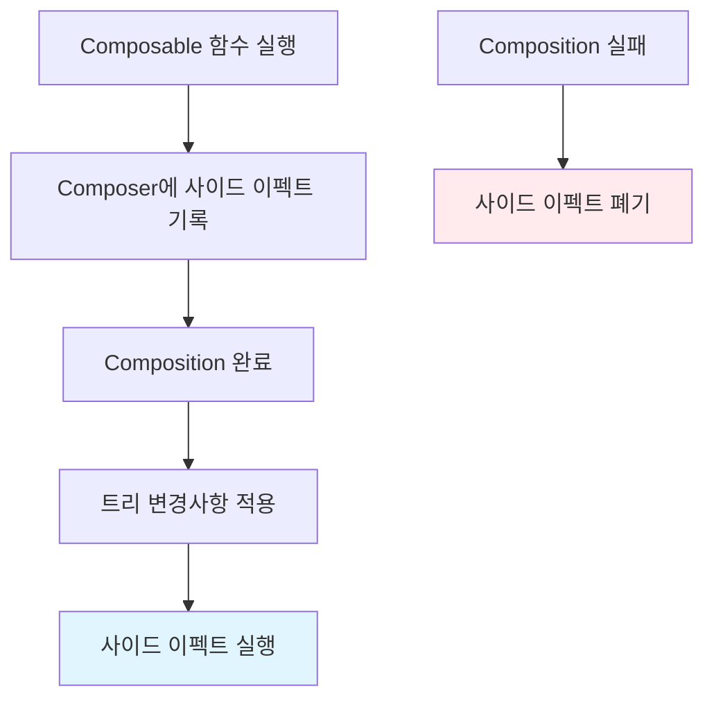

# Composer와 사이드 이펙트 (SideEffects in the Composer)

`Composer`는 **사이드 이펙트(SideEffects)** 도 기록할 수 있습니다. 이는 Compose Runtime의 중요한 기능 중 하나로, `Composable` 함수의 실행과는 별도로 처리되는 효과들을 관리합니다.

## 사이드 이펙트의 특징

### 실행 시점
- 사이드 이펙트는 **항상 `Composition` 이후에 실행**됩니다
- 트리에 대한 변경 사항 적용이 완료된 시점에 호출 가능한 함수 형태로 기록됩니다

### 라이프사이클과의 관계  
- `Composable` 함수의 **외부에서 발생하는 이펙트**를 나타냅니다
- 이런 유형의 이펙트는 **`Composable`의 라이프사이클과는 완전히 무관**합니다

## 제한사항

사이드 이펙트는 다음과 같은 자동화된 기능을 제공하지 **않습니다**:

- `Composition`을 떠날 때 실행 중인 작업의 자동 취소
- `Recomposition`에서 이펙트의 자동 재시도

> 이는 사이드 이펙트가 **슬롯 테이블에 저장되지 않기** 때문입니다. 따라서 `Composition`이 실패하면 간단히 **폐기**됩니다.

## 실행 흐름 다이어그램

## 관련 학습

사이드 이펙트의 보다 고급 활용과 **이펙트 핸들러**에 대한 자세한 내용은 "이펙트와 이펙트 핸들러" 챕터에서 다룹니다.

## 요약

- `Composer`는 사이드 이펙트를 기록하여 `Composition` 완료 후 실행할 수 있습니다
- 사이드 이펙트는 `Composable` 라이프사이클과 독립적으로 동작합니다  
- 슬롯 테이블에 저장되지 않으므로 `Composition` 실패 시 자동으로 폐기됩니다
- 자동 취소나 재시도 기능은 제공하지 않으며, 이는 별도의 이펙트 핸들러에서 다룹니다