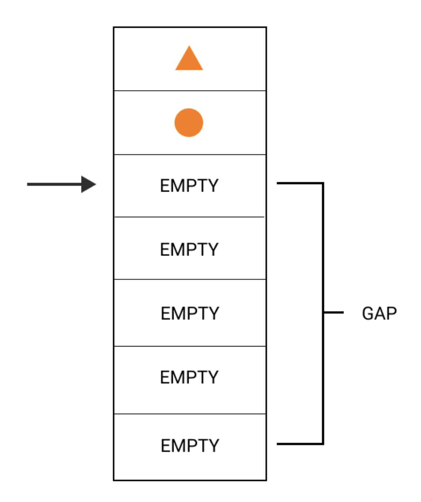
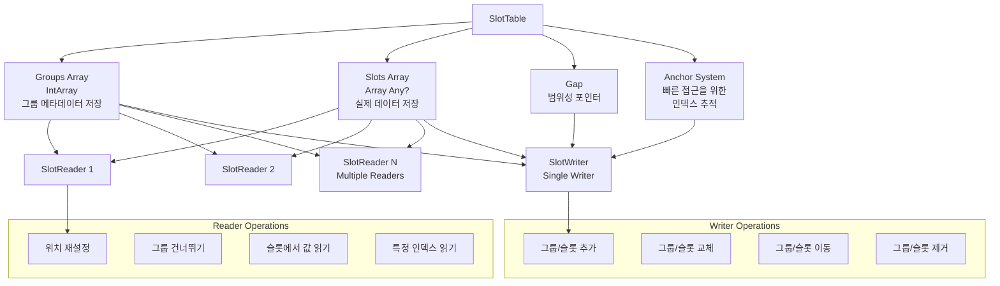

# 슬롯 테이블 심층 분석 (The slot table in depth)

**Composition**의 상태가 어떻게 저장되는지 살펴보도록 하겠습니다. **슬롯 테이블**은 빠른 선형적인 접근에 최적화된 데이터 구조입니다. 이는 텍스트 편집기에서 흔히 사용되는 `갭 버퍼(gap buffer)` 개념을 바탕으로 합니다. 이러한 이유로 데이터를 두 개의 선형 배열에 저장합니다. 해당 배열 중 하나는 composition에서 사용 가능한 `그룹(group)`에 대한 정보를 유지하고, 다른 배열은 각 그룹에 속한 `슬롯(slot)`을 저장합니다.

## 슬롯 테이블의 기본 구조

```kotlin
var groups = IntArray(0)
  private set
  
var slots = Array<Any?>(0) { null }
  private set
```

> 2장에서 우리는 컴파일러가 **Composable 함수**의 본문을 그룹으로 감싸고, 해당 그룹을 대신 방출하도록 만드는 방법을 배웠습니다. 이러한 그룹은 나중에 식별할 수 있도록 메모리(고유 키)에 저장되면 Composable 함수에 고유한 ID를 부여합니다. 그룹은 Composable 함수 호출 및 해당 하위 요소에 대한 모든 관련 정보를 감싸고 Composable 함수를 그룹으로 처리하는 방법에 대한 정보를 제공합니다. 그룹은 Composable 함수의 본문 내부에 있는 컨트롤 플로우 패턴에 따라 **재시작 가능한 그룹(restartable groups)**, **움직일 수 있는 그룹(movable groups)**, **교체 가능한 그룹(replaceable groups)**, **재사용 가능한 그룹(reusable groups)** 등 다양한 유형을 가질 수 있습니다.

## 그룹 배열 (Groups Array)

**그룹 배열**은 `그룹 필드(group fields)`만 저장할 것이기 때문에 `Int` 값을 사용합니다. 이는 그룹에 대한 메타데이터를 나타냅니다. 부모 그룹과 자식 그룹은 그룹 필드의 형태로 저장됩니다. 선형 데이터 구조이기 때문에 부모 그룹의 그룹 필드가 항상 먼저 나오고, 그 자식들의 그룹 필드가 이어집니다. 이러한 형태는 그룹 트리를 선형적으로 모델링하는 방법이며, 자식들의 선형 탐색을 용이하게 합니다. 

`그룹 앵커(group anchor)`를 사용하지 않는다면 랜덤한 접근 방식은 비용이 많이 듭니다. 따라서, **앵커(anchor)** 는 그룹 접근에서 비용을 줄이기 위해 존재하는 일종의 포인터 역할을 합니다.

## 슬롯 배열 (Slots Array)

반면에, **슬롯 배열**은 해당 그룹들과 관련한 데이터를 저장합니다. 어떠한 타입의 값(`Any?`)도 저장할 수 있는데, 이는 모든 타입의 정보를 저장하기 위함입니다. 이러한 슬롯 배열은 **실제 composition 데이터가 저장되는 장소**입니다. 그룹 배열에 저장된 각 그룹은 슬롯 배열에서 그 슬롯을 찾고 해석하는 방법을 서술하는데, 그 이유는 그룹은 항상 슬롯의 범위와 연결되어 있기 때문입니다.

## 갭(Gap) 개념

**슬롯 테이블**은 `갭(gap)`을 사용하여 데이터를 읽고 씁니다. 갭은 테이블에서 일종의 **범위성 포인터**로 생각하시면 됩니다. 갭은 주변을 움직이며 데이터가 배열에서 읽히고 쓰여질 때 위치를 결정합니다. 갭에는 쓰기 시작할 위치를 가리키는 포인터가 있으며, 시작 및 종료 위치를 이동시킬 수 있어 테이블의 데이터도 덮어쓸 수 있습니다.



## SlotTable 구조 다이어그램



### 조건부 로직 예제

아래와 같은 조건부 로직을 떠올려 보시길 바랍니다.

```kotlin
@Composable
@NonRestartableComposable
fun ConditionalText() {
  if (a) {
    Text(a)
  } else {
    Text(b)
  }
}
```

위의 **Composable 함수**는 `재시작 불가능(non-restartable)`으로 표시되어 있기 때문에, 재시작 가능한 그룹 대신에 **교체 가능한 그룹**이 삽입될 것입니다. 그룹은 테이블에 현재 "활성화된" 자식에 대한 데이터를 저장합니다. `a`가 `true`인 경우 `Text(a)`가 됩니다. If문의 조건이 전환되면, **갭**은 그룹의 시작 위치로 되돌아가서 해당 위치에서 다시 쓰기 시작하여, `Text(b)`에 대한 데이터로 기존의 슬롯들을 모두 덮어씁니다.

## SlotReader와 SlotWriter

테이블에 데이터를 읽고 쓰기 위한 `SlotReader`와 `SlotWriter`가 있습니다. **슬롯 테이블**에는 데이터를 읽어 들이는 여러 활성된 구독자(`reader`)가 있을 수 있지만, **활성화된 작성자(`active writer`)는 단 하나만 가질 수 있습니다**. 각 읽기 또는 쓰기 작업 후에 해당 구독자 또는 작성자는 역할을 다했으므로 종료됩니다. 

여러 개의 구독자가 구독을 시작할 수 있지만, 테이블은 작성자가 쓰는 작업을 하지 않을 때만 읽을 수 있도록 하여 **동기화 안전성**을 보장합니다. `SlotTable`은 활성된 작성자가 종료될 때까지 유효하지 않는데, 그 이유는 작성자는 그룹과 슬롯을 직접적으로 수정할 것이고, 동시에 쓰고 읽으려고 하면 **경쟁 상태(race conditions)** 가 발생할 수 있기 때문입니다.

### SlotReader의 역할

**구독자(SlotReader)** 는 `방문자(visitor)`로서 작용합니다. 구독자는 다음과 같은 정보들을 추적합니다:

- 현재 그룹 배열에서 읽혀지고 있는 그룹
- 그룹의 시작과 끝 위치
- 바로 앞에 저장된 부모
- 현재 읽혀지고 있는 그룹의 슬롯
- 그룹이 가지고 있는 슬롯의 양

구독자는 위치를 재설정하고, 그룹을 건너뛰고, 현재 슬롯에서 값을 읽고, 특정 인덱스에서 값을 읽는 등 다양한 작업을 할 수 있습니다. 다시 말해, **구독자는 배열에서 그룹과 그 슬롯에 대한 정보를 읽는 데 사용됩니다**.

### SlotWriter의 역할

반면에, **작성자(SlotWriter)** 는 배열에 그룹과 슬롯을 쓰는 데 사용됩니다. 위에서 설명한 바와 같이, 작성자는 모든 타입에 대해 기본형인 `Any?` 타입의 데이터를 테이블에 쓸 수 있습니다. `SlotWriter`는 위에서 언급한 그룹과 슬롯의 **갭**에 의존하므로, 배열 내에서 어디에 쓸지 위치를 결정하기 위해 이를 사용합니다.

## 갭의 동작 방식

갭을 **선형 배열에 대한 이동이 가능하고 크기 조절이 가능한 범위성 포인터**로 생각해보세요. 작성자는 각 갭의 시작과 끝 위치와 길이를 추적합니다. 시작과 끝 위치를 업데이트함으로써 갭을 주변으로 이동시킬 수 있습니다.

작성자는 그룹과 슬롯을 **추가, 교체, 이동, 제거**할 수 있습니다. 예를 들어:
- 트리에 새로운 Composable 노드를 추가
- 조건이 전환될 때마다 교체될 수 있는 조건부 논리에 속한 Composable 함수들

작성자는 그룹과 슬롯을 건너뛰거나, 주어진 양만큼 진행하거나, 앵커(`anchor`)에 의해 결정된 위치로 이동하는 등 많은 유사한 작업을 할 수 있습니다.

## 앵커(Anchor) 시스템

**작성자**는 테이블을 통한 빠른 접근을 위해 특정 인덱스를 가리키는 **앵커들**에 대한 목록을 추적합니다. 테이블에서 각 그룹의 위치(그룹 인덱스) 또한 앵커를 통해 추적됩니다. 앵커는 앵커가 가리키는 위치보다 전에 있는 그룹들이 이동, 교체, 삽입, 또는 제거될 때마다 업데이트됩니다.

## 디버깅 및 검사 도구

**슬롯 테이블**은 composition 그룹을 반복하는 역할도 담당하므로, 그룹에 대한 정보를 다양한 내부 툴에 제공하여 **composition의 세부 정보를 검사하고 표시**할 수 있습니다.

이제 변경 목록에 대해 학습해 보도록 하겠습니다.

> 슬롯 테이블에 대한 자세한 내용은 Jetpack Compose 팀의 [Leland Richardson이 작성한 포스트](https://medium.com/androiddevelopers/under-the-hood-of-jetpack-compose-part-2-of-2-37b2c20c6cdd)를 읽어보시는 것을 권장 드립니다.

## 요약

- **슬롯 테이블**은 Jetpack Compose에서 Composition의 상태를 저장하는 핵심 데이터 구조로, 갭 버퍼 개념을 기반으로 빠른 선형 접근에 최적화되어 있습니다.
- **두 개의 배열**로 구성됩니다: 그룹 메타데이터를 저장하는 `Groups Array(IntArray)`와 실제 데이터를 저장하는 `Slots Array(Array<Any?>)`
- **갭(Gap)** 은 범위성 포인터 역할을 하여 데이터의 읽기/쓰기 위치를 결정하며, 시작과 끝 위치를 이동시켜 데이터를 효율적으로 관리합니다.
- **SlotReader**는 여러 개가 동시에 활성화될 수 있으며 데이터를 읽기 위한 방문자 역할을 수행합니다.
- **SlotWriter**는 단 하나만 활성화될 수 있으며 그룹과 슬롯을 추가, 교체, 이동, 제거하는 쓰기 작업을 담당합니다.
- **앵커(Anchor) 시스템**을 통해 특정 인덱스에 대한 빠른 접근을 제공하며, 그룹들이 변경될 때마다 자동으로 업데이트됩니다.
- 조건부 로직에서 갭은 그룹의 시작 위치로 되돌아가서 기존 슬롯을 새로운 데이터로 덮어쓸 수 있습니다.
- **동기화 안전성**을 보장하기 위해 작성자가 활성화된 동안에는 읽기 작업이 제한되어 경쟁 상태를 방지합니다.