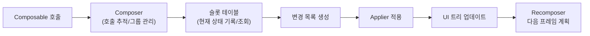

# 슬롯 테이블과 변경 목록 (The Slot Table and the List of Changes)

> Jetpack Compose 내부에서 `슬롯 테이블`은 상태를 기록하고, `변경 목록`은 실제 UI 트리 변경을 적용합니다. 두 구조의 역할을 명확히 이해하면 `Recomposition`의 작동 원리를 쉽게 파악할 수 있습니다.

## 개요

Compose 내부 자료가 상대적으로 부족해 두 데이터 구조의 차이에 혼란을 겪는 경우가 많습니다. 이 문서는 두 구조의 역할, 상호작용, 실행 흐름을 간결하고 체계적으로 정리합니다.

## 핵심 개념

- **`슬롯 테이블 (Slot Table)`**: 런타임이 `Composition`의 현재 상태를 저장하는 최적화된 인메모리 구조입니다. 최초 `Composition` 시 채워지고, 이후 `Recomposition`마다 갱신됩니다. 소스 위치, 매개변수, `remember`된 값, `CompositionLocal` 등 모든 `Composable` 호출의 메타데이터를 추적합니다.
- **`변경 목록 (List of Changes)`**: 특정 프레임에서 실제로 UI 트리에 적용해야 하는 변경 작업들의 집합입니다. 패치 목록처럼 이해할 수 있으며, 한 번 적용되면 트리가 업데이트됩니다.

## 두 구조의 역할 비교

| 항목 | 슬롯 테이블 | 변경 목록 |
| --- | --- | --- |
| 책임 | `Composition`의 현재 상태 저장 | UI 노드 트리에 적용할 작업 기록 |
| 시점 | Composition/Recomposition 중 읽기·쓰기 | 프레임 커밋 직전 생성·적용 |
| 수명 | 메모리에 상주, 지속적으로 갱신 | 일회성(적용 후 소모) |
| 사용 주체 | `Composer`가 읽고 씀 | `Applier`가 적용 |
| 예시 | 호출 위치, 키, remember 값 | 삽입/이동/속성 변경/삭제 |

## 동작 흐름



## 실행 예시(개념적 의사 코드)

> 실제 시그니처와는 다를 수 있으나, 흐름 이해를 위한 예시입니다.

```kotlin
  @Composable
  fun Greeting(name: String) {
    Text(text = "Hello, $name")
  }

  // 컴파일 후 개념적 형태
  fun Greeting(name: String, $composer: Composer, key: Int, changed: Int) {
    $composer.startReplaceableGroup(key)
    Text("Hello, $name", $composer /* flags... */)
    $composer.endReplaceableGroup()
  }
```

- `Composer`는 그룹 시작/종료와 함께 슬롯 테이블에 호출 정보를 기록합니다.
- 이후 프레임에서 변경 감지가 되면, 필요한 위치만 골라 `변경 목록`을 생성합니다.
- 생성된 `변경 목록`은 `Applier`에 의해 실제 노드 트리에 적용됩니다.

## 흔한 오해와 주의점

- **슬롯 테이블 = 변경 이력**이 아닙니다. 슬롯 테이블은 현재 상태 저장소이며, 변경 목록은 적용할 작업의 스냅샷입니다.
- **변경 목록은 누적 저장**되지 않습니다. 각 프레임마다 생성·적용되고 소모됩니다.
- **정확한 키 관리**가 중요합니다. 잘못된 키는 그룹 매칭 실패로 불필요한 재생성과 흔들림을 야기합니다.

## 관련 구성요소 간 관계

- **`Composer`**: 슬롯 테이블을 읽고 쓰며, 다음에 적용할 `변경 목록`을 만듭니다.
- **`Applier`**: 변경 목록을 실제 UI 트리에 적용하는 추상화 계층입니다.
- **`Recomposer`**: 언제, 어떤 스레드에서 `Recomposition`을 수행하고 변경을 적용할지 스케줄링합니다.

## 요약
- 슬롯 테이블은 `Composition`의 현재 상태 저장소이고, 변경 목록은 적용할 작업 집합입니다.
- `Composer`가 슬롯 테이블을 기반으로 변경 목록을 만들고, `Applier`가 이를 적용합니다.
- `Recomposer`는 변경 시점을 조율하여 필요한 최소 범위만 다시 그리도록 합니다.