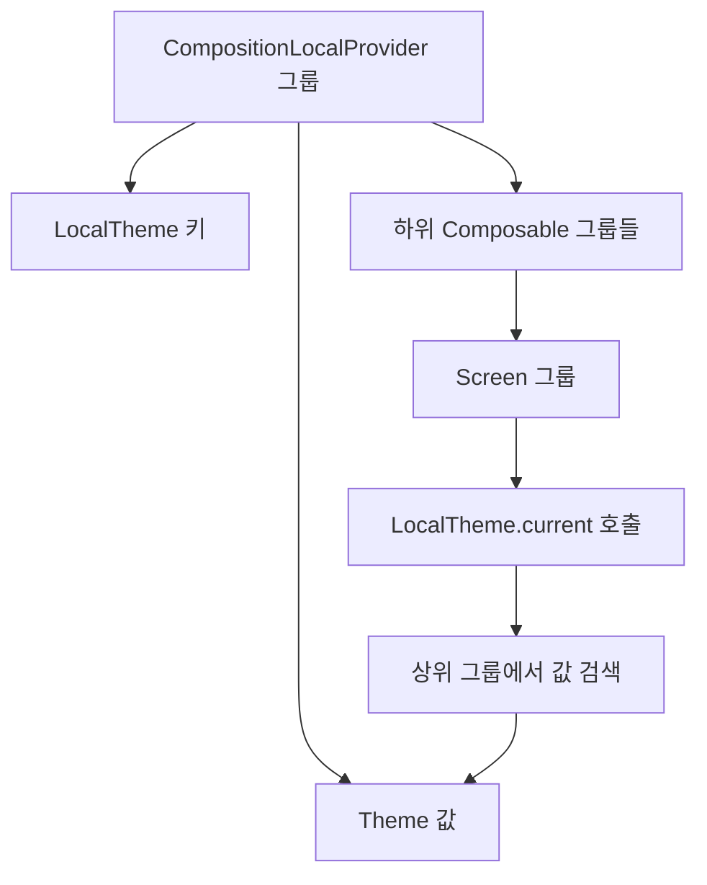

# CompositionLocals 저장 (Storing CompositionLocals)

> **CompositionLocal**은 Compose에서 **암묵적으로 데이터를 전달**하는 메커니즘으로, `Provider`를 통해 값을 제공하고 `current` 속성으로 값을 소비합니다.

## 개요

**Composer**는 `CompositionLocal`을 **등록**하고 **키**를 통해 해당 값을 **획득**하는 방법을 제공합니다. `CompositionLocal.current` 호출은 이러한 메커니즘에 의존하며, 모든 `CompositionLocal`의 **Provider(공급자)** 와 **공급되는 값**은 **슬롯 테이블**에 **그룹**의 형태로 저장됩니다.

## CompositionLocal의 작동 원리

### 기본 구조

```kotlin
// CompositionLocal 정의
val LocalTheme = compositionLocalOf<Theme> { error("No theme provided") }

// Provider를 통한 값 제공
@Composable
fun App() {
    val theme = DarkTheme()
    CompositionLocalProvider(LocalTheme provides theme) {
        Screen() // 하위 Composable에서 LocalTheme.current로 접근 가능
    }
}

// 값 소비
@Composable
fun Screen() {
    val theme = LocalTheme.current // Composer가 슬롯 테이블에서 값을 검색
    // theme를 사용한 UI 구성
}
```

### 저장 메커니즘

| 구성 요소 | 설명 | 저장 위치 |
|-----------|------|-----------|
| **Provider** | `CompositionLocalProvider` 또는 `provides` 연산자 | 슬롯 테이블의 그룹 |
| **키(Key)** | `CompositionLocal` 인스턴스 자체 | 그룹 메타데이터 |
| **값(Value)** | 제공되는 실제 데이터 | 그룹 슬롯 |

## Composer에서의 처리 과정

### 1. 값 등록 (Registration)

```kotlin
// 컴파일러가 생성하는 의사 코드
fun CompositionLocalProvider(
    values: Array<ProvidedValue<*>>,
    content: @Composable () -> Unit,
    $composer: Composer
) {
    $composer.startProviders(values) // 슬롯 테이블에 그룹 시작
    content($composer)
    $composer.endProviders() // 그룹 종료
}
```

### 2. 값 조회 (Lookup)

```kotlin
// CompositionLocal.current의 내부 동작
@Composable
fun <T> CompositionLocal<T>.getCurrent(): T {
    return composer.consume(this) // 슬롯 테이블에서 키를 통해 값 검색
}
```

## 슬롯 테이블에서의 저장 구조



### 그룹 계층 구조

- **상위 그룹**: `CompositionLocalProvider`가 생성하는 그룹
  - **키**: `CompositionLocal` 인스턴스
  - **값**: `provides`로 전달된 실제 값
- **하위 그룹**: Provider 내부의 Composable들
  - **조회**: 상위 그룹으로 올라가며 키에 해당하는 값 검색

## 성능 최적화

### 효율적인 검색

```kotlin
// Composer 내부의 최적화된 검색 로직
class Composer {
    private val providedValues = mutableMapOf<CompositionLocal<*>, Any?>()
    
    fun <T> consume(local: CompositionLocal<T>): T {
        // 1. 현재 그룹에서 검색
        var current = currentGroup
        while (current != null) {
            val value = current.find(local)
            if (value != null) return value as T
            current = current.parent // 2. 상위 그룹으로 이동
        }
        return local.defaultFactory() // 3. 기본값 반환
    }
}
```

### 캐싱 전략

- **그룹별 캐싱**: 각 그룹에서 제공하는 값들을 맵으로 관리
- **지연 평가**: 실제로 `current` 속성에 접근할 때만 값을 검색
- **범위 제한**: Provider의 범위 내에서만 값이 유효

## 실제 사용 사례

### 테마 시스템

```kotlin
val LocalColors = compositionLocalOf<Colors> { error("No colors provided") }
val LocalTypography = compositionLocalOf<Typography> { error("No typography provided") }

@Composable
fun MaterialTheme(
    colors: Colors = lightColors(),
    typography: Typography = Typography(),
    content: @Composable () -> Unit
) {
    CompositionLocalProvider(
        LocalColors provides colors,
        LocalTypography provides typography
    ) {
        content()
    }
}
```

### 다국어 지원

```kotlin
val LocalLanguage = compositionLocalOf<Language> { Language.English }

@Composable
fun LocalizedApp(language: Language) {
    CompositionLocalProvider(LocalLanguage provides language) {
        AppContent()
    }
}

@Composable
fun AppContent() {
    val language = LocalLanguage.current
    Text(text = language.getString("welcome_message"))
}
```

## 주의사항

### 과도한 사용 방지

- `CompositionLocal`은 **암묵적 의존성**을 생성하므로 과도한 사용은 코드의 **가독성**을 해칠 수 있습니다
- **명시적 파라미터 전달**이 더 적합한 경우가 많습니다

### 기본값 제공

```kotlin
// ✅ 좋은 예: 합리적인 기본값
val LocalContentAlpha = compositionLocalOf { ContentAlpha.high }

// ❌ 나쁜 예: 오류를 던지는 기본값 (불가피한 경우에만)
val LocalDatabase = compositionLocalOf<Database> { 
    error("No database provided") 
}
```

### 타입 안전성

```kotlin
// CompositionLocal은 타입 안전성을 보장
val LocalUserId = compositionLocalOf<Int> { -1 }
val userId: Int = LocalUserId.current // 컴파일 타임에 타입 검증
```

## 요약

- `CompositionLocal`은 **Composer**가 **슬롯 테이블**에 **그룹 형태**로 저장하여 관리합니다
- **Provider**를 통해 값을 등록하고, **키**를 통해 **효율적으로 검색**합니다
- **계층적 구조**를 통해 상위 그룹에서 하위 그룹으로 값이 **암묵적으로 전달**됩니다
- **테마, 다국어, 설정** 등 **광범위한 데이터 공유**에 적합합니다
- **과도한 사용**을 피하고 **명시적 파라미터 전달**과의 **균형**을 맞춰야 합니다