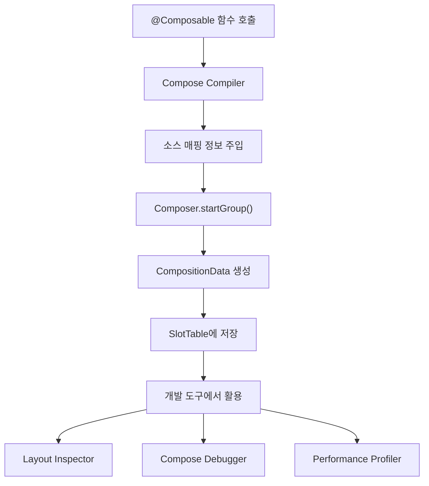
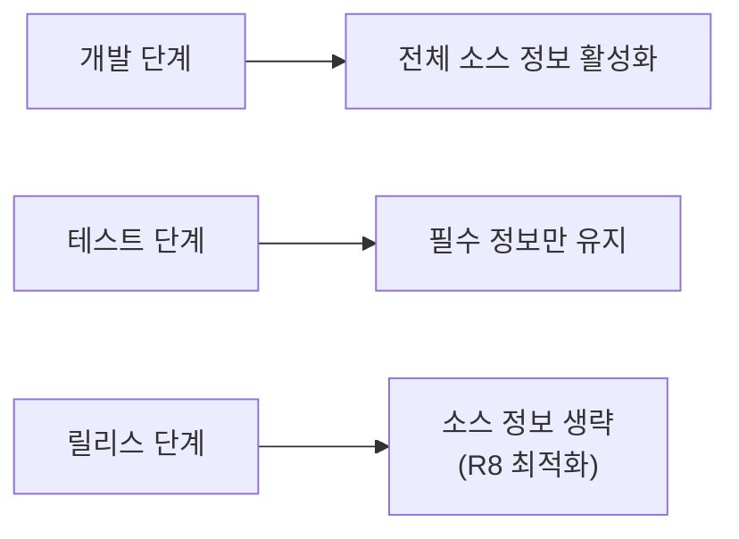

# 소스 정보 저장 (Storing Source Information)

> **Compose Runtime**에서 **Composer**가 디버깅 및 개발 도구 지원을 위해 소스 정보를 저장하는 메커니즘에 대해 알아봅니다.

## 개요

**Composer**는 `Composition` 과정에서 수집된 정보를 `CompositionData` 형태로 저장하여, 다양한 **Compose 개발 도구**들이 활용할 수 있도록 **소스 정보**를 제공합니다.

## 소스 정보란?

**소스 정보(Source Information)** 는 다음과 같은 정보들을 포함합니다:

- **`Composable` 함수의 위치 정보** (파일명, 라인 번호)
- **UI 구조와 소스 코드 간의 매핑**
- **재구성(Recomposition) 발생 위치 추적을 위한 메타데이터**
- **디버깅 도구에서 사용하는 식별자**

## CompositionData 저장 구조

```kotlin
// 개념적 구조 (실제 구현과 다를 수 있음)
data class CompositionData(
    val sourceLocation: SourceLocation,
    val composableName: String,
    val parameters: Map<String, Any>,
    val metadata: ComposeMetadata
)
```

### 주요 구성 요소

| 구성 요소 | 설명 | 활용 도구 |
|----------|------|----------|
| `SourceLocation` | 소스 코드의 정확한 위치 정보 | **Layout Inspector**, **Compose Debugger** |
| `ComposableName` | `Composable` 함수의 이름 | **Performance 도구**, **디버깅 도구** |
| `Parameters` | 함수 매개변수 정보 | **상태 추적 도구** |
| `Metadata` | 재구성 및 최적화 관련 메타데이터 | **성능 분석 도구** |

## 소스 정보 저장 과정



## 컴파일러 플래그와 소스 정보

### 개발 모드 vs 릴리스 모드

**개발 모드 (Debug Build)**:
- 모든 소스 정보가 포함됨
- **Layout Inspector**에서 정확한 소스 매핑 제공
- 디버깅 및 개발 편의성 최대화

**릴리스 모드 (Release Build)**:
- **R8 최적화**를 통해 소스 정보 생략 가능
- APK 크기 최소화 우선
- 성능 최적화를 위한 메타데이터만 유지

### 컴파일러 플래그 설정

```kotlin
android {
    compileOptions {
        // 소스 정보 포함 여부 설정
        freeCompilerArgs += [
            "-P", "plugin:androidx.compose.compiler.plugins.kotlin:sourceInformation=true"
        ]
    }
}
```

## 활용 도구들

### 1. **Layout Inspector**
- **Composable** 계층 구조와 소스 코드 연결
- UI 요소 선택 시 해당 소스 코드로 바로 이동
- 속성 값과 상태 정보 실시간 확인

### 2. **Compose Debugger**
- **Recomposition** 발생 위치 추적
- 상태 변경에 따른 UI 업데이트 경로 시각화
- 성능 병목 지점 식별

### 3. **Performance Profiler**
- **재구성 빈도** 분석
- **불필요한 Recomposition** 감지
- 메모리 사용량 최적화 가이드

## 성능 고려사항

### 장점
- **개발 생산성 향상**: 빠른 디버깅과 문제 해결
- **UI-코드 매핑**: 복잡한 UI 구조에서 소스 추적 용이
- **성능 분석**: 정확한 성능 병목 지점 파악

### 단점
- **메모리 오버헤드**: 추가적인 메타데이터 저장
- **APK 크기 증가**: 디버그 정보로 인한 크기 증가
- **컴파일 시간**: 소스 정보 처리로 인한 빌드 시간 증가

## 최적화 전략



## 요약

- **Composer**는 `CompositionData` 형태로 소스 정보를 저장하여 개발 도구들의 활용을 지원합니다
- **Layout Inspector**, **Compose Debugger**, **Performance Profiler** 등 다양한 도구에서 이 정보를 활용합니다
- **컴파일러 플래그**를 통해 소스 정보 포함 여부를 제어할 수 있습니다
- **개발 모드**에서는 디버깅 편의성을, **릴리스 모드**에서는 성능과 APK 크기 최적화를 우선시합니다
- **R8 최적화**를 통해 릴리스 빌드에서 소스 정보를 생략하여 성능을 향상시킬 수 있습니다