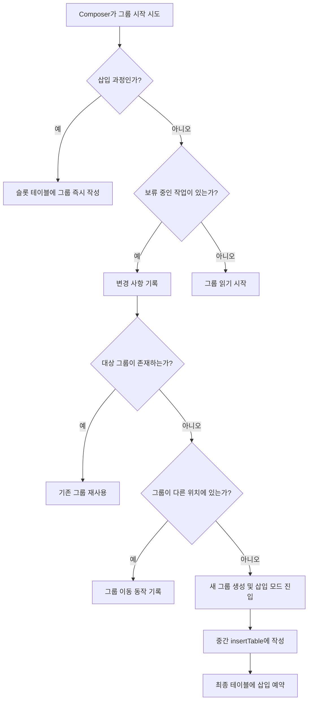

# 쓰기 및 읽기 그룹 (Writing and Reading Groups)

**`Composition`이 완료되면**, 마침내 ```composition.applyChanges()```가 호출되어 트리를 구체화하고 변경 사항이 **슬롯 테이블**에 기록됩니다. **`Composer`는 데이터, 노드, 또는 그룹 등 다양한 유형의 정보를 작성**할 수 있습니다. 즉, 단순화를 위해 궁극적으로 **모든 항목은 그룹 형태로 저장**됩니다. 그룹들은 차별화를 위해 서로 다른 그룹 필드를 가지고 있을 뿐입니다.

## 그룹 시작과 종료

**`Composer`는 모든 그룹을 "시작"하고 "종료"**할 수 있습니다. 이는 취하는 행동에 따라 다른 의미를 갖습니다:

| 상황 | 그룹 시작 | 그룹 종료 |
|------|----------|----------|
| **쓰기 작업** | 슬롯 테이블에서 "그룹 생성" | 슬롯 테이블에서 "그룹 제거" |
| **읽기 작업** | `SlotReader`가 읽기 포인터를 그룹 내부로 이동 | `SlotReader`가 읽기 포인터를 그룹 외부로 이동 |

## 그룹 작업 유형

**`Composable` 트리의 노드**(슬롯 테이블에 작성되는 그룹)는 다음과 같은 작업이 가능합니다:

- **삽입 (Insert)**
- **제거 (Remove)**
- **이동 (Move)**

### 그룹 제거 과정

**그룹을 제거**한다는 것은 그룹과 그에 해당하는 **모든 슬롯을 테이블에서 제거**하는 것을 의미합니다. 이를 위해 `Composer`는:

1. **`SlotReader`를 적절하게 재배치**
2. 해당 그룹을 건너뛰게 함 (더 이상 존재하지 않으므로)
3. 해당 그룹의 **모든 노드를 `Applier`에서 제거**

> 모든 수정 작업은 **일괄적으로 적용되기 위해 예약(기록)**되어야 합니다. 이는 **모든 변경 사항이 동시에 반영되어야 의미 있기 때문**입니다.

`Composer`는 더 이상 아무 데이터도 방출하지 않을 제거된 그룹에 대한 **모든 보류 중인 invalidation을 폐기**할 것입니다.

> **중요**: 모든 그룹이 재시작 가능하거나, 교체 가능하거나, 이동 가능하거나, 재사용 가능한 형태로 분류되는 것은 아닙니다. 
> 
> 예를 들어, 디폴트 값을 둘러싸는 블록을 사례로 들 수 있습니다. 이 블록은 **디폴트 매개변수를 생성하는 데 필요한 `Composable` 호출 값을 기억하기** 위해 ```model: Model = remember { DefaultModel() }```와 같은 형태로 둘러싸고 있습니다. 이것 또한 매우 특정한 그룹으로 분류됩니다.

## Composer의 그룹 시작 과정

**`Composer`가 그룹을 시작하려고 할 때** 다음과 같은 흐름으로 처리됩니다:



### 세부 동작 과정

1. **`Composer`가 값들을 삽입하는 과정에 있다면**
   - 기다릴 이유가 없으므로 **슬롯 테이블에 그룹들을 즉시 작성**

2. **보류 중인 작업이 있는 경우**
   - 변경 사항을 적용할 때 **해당 변경 사항을 모두 기록**
   - 테이블에 이미 대상 그룹이 존재하는 경우 `Composer`는 **해당 그룹을 재사용**

3. **그룹이 이미 저장되었지만 다른 위치에 있는 경우** (이동됨)
   - **해당 그룹의 모든 슬롯을 이동하는 동작이 기록**됩니다

4. **그룹이 새 그룹이라면** (테이블에서 찾을 수 없는 경우)
   - **삽입 모드로 이동**
   - 그룹이 모두 완성될 때까지 그룹과 모든 하위 항목을 **중간 `insertTable`**(다른 `SlotTable`)에 작성
   - 최종적인 테이블에 삽입될 그룹이 예약

5. **마지막으로**, `Composer`가 값들을 삽입하지 않고 보류 중인 작성 작업이 없는 경우
   - **그룹을 읽기 시작**

## 그룹 재사용과 노드 업데이트

**그룹을 재사용하는 것은 흔합니다.** 때로는 새 노드를 만들 필요가 없고, 이미 존재하는 경우 그것을 재사용할 수 있습니다. (`ReusableComposeNode` 참조)

이는 `Applier`에 의해 노드로 이동하는 작업을 발행(기록)하지만, 그것을 **생성하고 초기화하는 작업은 생략**합니다.

**노드의 속성에 업데이트가 필요한 경우**, 그 업데이트에 대한 동작 또한 **`Change`로 기록**됩니다.

## 요약

- **모든 항목은 그룹 형태로 저장**되며, 그룹은 "시작"과 "종료" 개념을 가집니다
- 그룹은 **삽입, 제거, 이동** 작업이 가능하며, 모든 변경 사항은 **일괄적으로 적용**됩니다
- **`Composer`의 그룹 시작 과정**은 삽입 모드, 보류 중인 작업, 그룹 위치에 따라 다르게 처리됩니다
- **그룹 재사용**을 통해 불필요한 노드 생성을 피하고 효율성을 높입니다
- 모든 수정 작업은 **`Change`로 기록**되어 나중에 일괄 적용됩니다