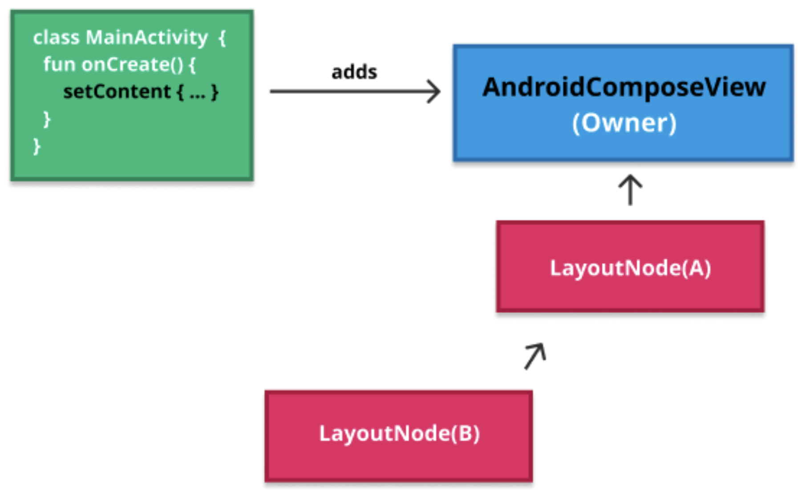
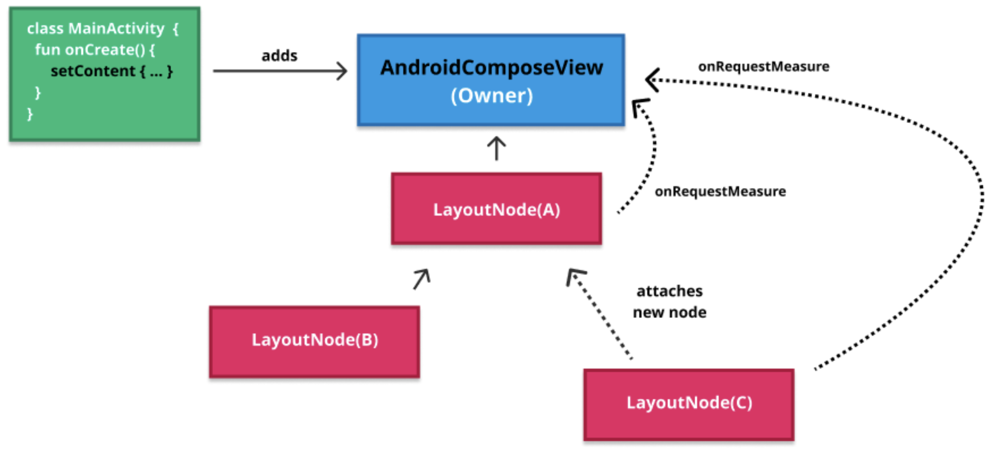
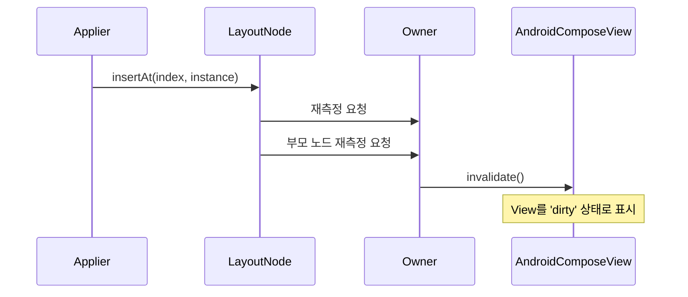
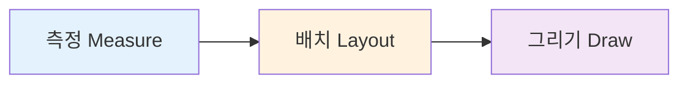
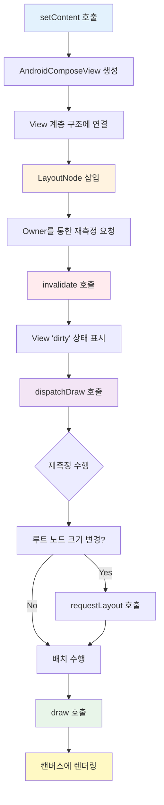

# 전체 과정의 마무리 (Closing the circle)

## 개요

최종적으로, **Owner**는 `Activity`, `Fragment`, `ComposeView`에서 `setContent`가 호출되는 순간 **View 계층 구조**에 연결됩니다. 이 과정에 대한 설명이 유일하게 누락되었으므로, 이번 섹션에서 전체 과정을 완성하겠습니다.

## 전체 과정 예시

### 초기 상태 설정

`Activity#setContent`가 호출되어 **AndroidComposeView**가 생성되고 View 계층 구조에 연결되는 상황을 상상해 봅시다. 이미 몇 개의 **LayoutNode**가 존재하는데, 하나는 루트 노드(`LayoutNode(A)`)이고 다른 하나는 자식 노드(`LayoutNode(B)`)입니다.

### 새 노드 삽입 과정

이제 **Applier**가 새 노드 `LayoutNode(C)`를 삽입(구체화)하기 위해 `current.insertAt(index, instance)`를 호출한다고 가정해 봅시다. 

이 과정은 다음과 같이 진행됩니다:

1. 새 노드를 연결
2. **Owner**를 통해 자신과 새로운 부모 노드에 대한 **재측정(remeasure)** 요청

## 무효화(Invalidation)와 재측정

### 무효화 메커니즘

이러한 상황이 발생하면, 대부분의 경우 `AndroidComposeView#invalidate`가 호출됩니다. 

> **중요**: 현재 노드와 부모 노드가 동시에 같은 View(Owner)를 무효화하더라도 문제가 되지 않습니다. 

**무효화의 특징:**
- 무효화는 View를 **'dirty' 상태**로 표시하는 것과 같습니다
- 두 프레임 사이에 여러 번 무효화를 할 수 있습니다
- 언제나 View는 다음 그리기 단계에서 **한 번만** 다시 그려집니다

### 재측정과 배치 실행

무효화 이후, `AndroidComposeView#dispatchDraw`가 호출되며, **Compose UI**는 여기에서 실제로 모든 요청된 노드의 **재측정과 배치**를 수행합니다.

**재측정 과정:**
1. 루트 노드의 크기가 변경되면 `AndroidComposeView#requestLayout()` 호출
2. `onMeasure`를 다시 트리거
3. 모든 형제 View들의 크기에 영향을 끼치도록 함

## 렌더링 파이프라인

### 측정, 배치, 그리기 순서

`dispatchDraw` 함수 내에서 측정과 배치를 마치고, 루트 `LayoutNode`의 `draw` 함수를 호출하게 됩니다:

- 루트 노드는 자신을 **캔버스**에 그리는 방법을 알고 있습니다
- 모든 자식의 그리기(draw)를 요청합니다

> **핵심 규칙**: 노드는 항상 먼저 **측정**되고, 그 다음 **배치**되며, 마지막에 **그려지는** 순서를 따릅니다.

### 재측정 요청 최적화

**재측정 요청 최적화 규칙:**
- 노드가 이미 **측정 중인 상태**에서 해당 노드의 재측정이 요청되면, 이는 **무시**됩니다
- 노드에 이미 **재측정이 예정**되어 있으면 동일하게 **무시**됩니다

이러한 최적화를 통해 불필요한 재측정을 방지하고 성능을 향상시킵니다.

## 전체 프로세스 다이어그램

## 요약

- **Owner**는 `Activity`, `Fragment`, `ComposeView`에서 `setContent` 호출 시 View 계층 구조에 연결되며, 이를 통해 Compose UI와 Android View 시스템이 통합됩니다
- **Applier**가 `insertAt()` 메서드로 새 `LayoutNode`를 삽입하면, Owner를 통해 해당 노드와 부모 노드의 재측정이 요청됩니다
- `invalidate()` 호출은 View를 'dirty' 상태로 표시하며, 여러 번 호출되더라도 다음 그리기 단계에서 한 번만 렌더링되는 최적화가 적용됩니다
- 실제 재측정과 배치는 `dispatchDraw()` 내에서 수행되며, 루트 노드 크기 변경 시 `requestLayout()`을 통해 전체 View 계층에 영향을 줍니다
- 노드 렌더링은 항상 **측정 → 배치 → 그리기** 순서를 따르며, 중복된 재측정 요청은 자동으로 무시되어 성능이 최적화됩니다
- 이 과정을 통해 새로운 노드의 변경 사항이 효율적으로 사용자에게 전달됩니다
