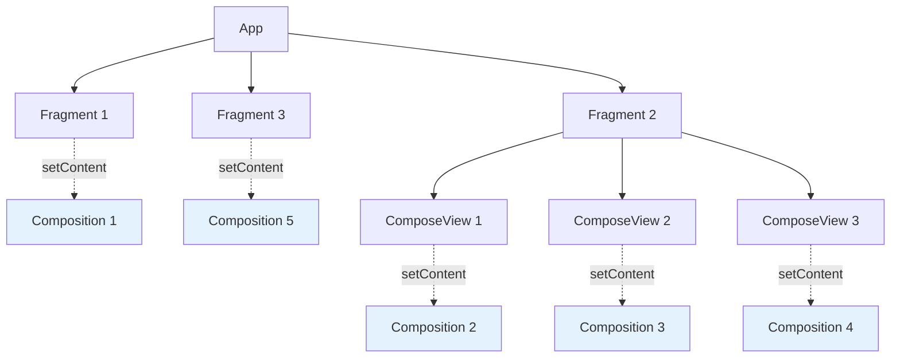
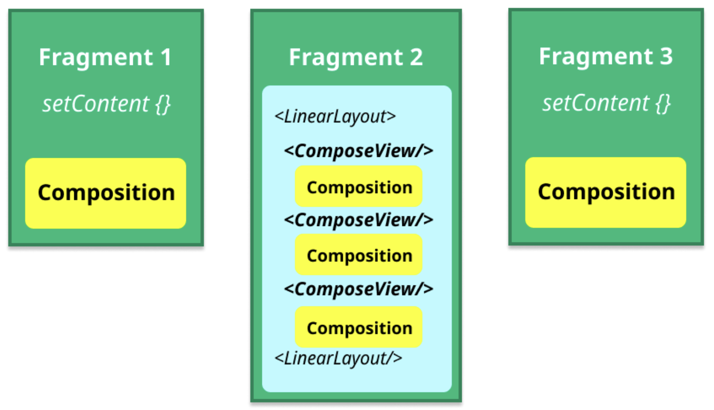

# Compose UI 관점에서의 Composition (Composition from the point of view of Compose UI)

## 개요

**Compose UI 라이브러리**에서 **런타임**으로의 가장 빈번한 진입점은 화면에서 `setContent`를 호출할 때 발생합니다. 안드로이드 통합을 예로 들어 살펴보겠습니다.

## setContent를 통한 Composition 생성

### Activity에서의 setContent 호출

**MainActivity.kt**

```kotlin
class MainActivity : ComponentActivity() {
  override fun onCreate(savedInstanceState: Bundle?) {
    super.onCreate(savedInstanceState)
    setContent {
      MaterialTheme {
        Text("Hello Compose!")
      }
    }
  }
}
```

### ComposeView에서의 setContent 호출

화면(`Activity`/`Fragment`)만이 `setContent`를 호출하는 유일한 곳은 아닙니다. `setContent`는 **View 계층의 중간 부분**에서도 호출될 수 있습니다. 이는 **View와 Compose를 혼용하는 앱**에서 흔히 볼 수 있습니다.

**ComposeView.setContent**

```kotlin
ComposeView(requireContext()).apply {
  setContent {
    MaterialTheme {
      Text("Hello Compose!")
    }
  }
}
```

> 💡 이 예시에서는 View를 직접 생성했지만, XML을 통해 정의된 레이아웃 계층 구조의 일부일 수도 있습니다.

## 루트 Composition의 개념

### 루트 Composition이란?

`setContent` 함수는 **새로운 루트 Composition을 생성**하고, 가능한 한 재사용합니다. 

**루트 Composition의 특징:**
- 각각 **독립적인 Composable 트리**를 호스팅
- 서로 **연결되어 있지 않음**
- UI가 표현하는 만큼 간단하거나 복잡할 수 있음

### 여러 개의 루트 Composition

앱에는 **여러 개의 노드 트리**가 있으며, 각자 다른 Composition에 연결될 수 있습니다. 아래 예시를 통해 이를 이해해 봅시다.

#### 예시: 3개의 Fragment를 가진 앱



- **Fragment 1과 3**: `setContent`를 호출하여 Composable 트리 연결
- **Fragment 2**: 레이아웃에 여러 개의 `ComposeView`를 선언하고 각 View에서 `setContent` 호출
- **결과**: 서로 완전히 독립적인 **5개의 루트 Composition** 생성



## Composition 과정과 변경 사항 방출

### Composer의 역할

레이아웃 계층을 생성하기 위해 연관된 **Composer**가 composition 과정을 실행합니다.

**과정:**
1. `setContent` 안에 있는 모든 **Composable 함수들이 실행**
2. **변경 사항(Changes)이 방출**
3. UI 노드들을 **삽입**, **이동**, **교체**

### UI 요소와 LayoutNode

일반적인 UI 요소들(`Box`, `Column`, `LazyColumn` 등)은 서로 다른 라이브러리(`foundation`, `material`)에 속하지만, 결국 모두 **`Layout`**(compose-ui)으로 정의되므로 **같은 노드 타입인 `LayoutNode`를 방출**합니다.

## LayoutNode와 ReusableComposeNode

### LayoutNode의 역할

**`LayoutNode`** 는 **Compose UI에서 UI 요소를 나타내는 노드 타입**입니다.

**특징:**
- 루트 Composition에 자주 사용됨
- 모든 `Layout` Composable은 Composition으로 `LayoutNode` 타입의 노드를 방출
- `ReusableComposeNode`를 통해 방출됨

> 📝 **참고**: `ComposeUiNode`는 `LayoutNode`의 구현입니다.

### Layout Composable의 구현

**Layout.kt**

```kotlin
@Composable inline fun Layout(
  content: @Composable () -> Unit,
  modifier: Modifier = Modifier,
  measurePolicy: MeasurePolicy
) {
  val density = LocalDensity.current
  val layoutDirection = LocalLayoutDirection.current
  val viewConfiguration = LocalViewConfiguration.current
  
  // Emits a LayoutNode!
  ReusableComposeNode<ComposeUiNode, Applier<Any>>(
    factory = { LayoutNode() },
    update = {
      set(measurePolicy, { this.measurePolicy = it })
      set(density, { this.density = it })
      set(layoutDirection, { this.layoutDirection = it })
      set(viewConfiguration, { this.viewConfiguration = it })
    },
    skippableUpdate = materializerOf(modifier),
    content = content
  )
}
```

모든 `Layout` Composable은 Composition 내 **재사용 가능한 노드들을 삽입하거나 업데이트**하기 위한 변경 사항을 방출합니다.

## 재사용 가능 노드(Reusable Node)

### 재사용 가능 노드란?

> **재사용 가능 노드**는 **Compose Runtime의 최적화 기능**입니다.

**동작 방식:**
- 노드의 `key`가 변경될 때 노드의 내용을 **버리고 새로 만드는 대신**
- `Composer`로 하여금 **recompose**(recomposition 과정에서 업데이트)하도록 함
- Composition은 **새로운 내용을 생성하듯이 작동**하지만, 실제로는 recompose될 때와 같이 **슬롯 테이블을 탐색**

### 적용 조건

이 최적화는 **숨겨진 내부 상태 없이** `set` 및 `update` 동작만으로 완전히 설명될 수 있는 노드에 대해서만 가능합니다.

| 적용 가능 | 적용 불가능 |
|---------|-----------|
| `LayoutNode` | `AndroidView` |

> ⚠️ **AndroidView**는 재사용 가능한 노드가 아닌 표준 `ComposeNode`를 사용합니다.

## ReusableComposeNode의 동작

### 노드 생성 및 초기화

**ReusableComposeNode**는 다음과 같은 작업을 수행합니다:


1. **factory 함수**를 사용하여 노드 생성
2. **update 람다**를 사용하여 노드 초기화
3. 모든 내용을 감싸는 **교체 가능 그룹** 생성
4. 그룹에 **고유한 키**를 할당하여 나중에 식별 가능하도록 함
5. 교체 가능 그룹 내의 `content` 람다를 호출하여 발생한 모든 노드는 **이 노드의 자식**이 됨

### set 호출의 최적화

`update` 블록 내의 `set` 호출은 다음 조건일 때만 람다를 실행합니다:
- 해당 노드가 **처음 생성**되거나
- 마지막으로 기억된 이후에 해당 속성의 값이 **변경된 경우**

## Composition의 다양성

`LayoutNode`들이 우리 애플리케이션이 가질 수 있는 여러 Composition에 추가되는 방식을 살펴봤습니다. 

> 💡 모든 Composition이 `LayoutNode`만 포함하고 있다고 생각할 수도 있지만, **그렇지 않습니다!**

**Compose UI**에서 런타임에 내용을 추가하는 방법을 배울 때 고려해야 할 **다른 Composition과 노드들**이 있습니다.

## 요약

- **`setContent`** 는 Compose UI 라이브러리에서 런타임으로의 가장 빈번한 진입점이며, Activity나 ComposeView 등 다양한 위치에서 호출될 수 있습니다
- **루트 Composition**은 독립적인 Composable 트리를 호스팅하며, 앱은 여러 개의 루트 Composition을 가질 수 있습니다
- 모든 Layout Composable은 **`LayoutNode`** 타입의 노드를 방출하며, 이는 Compose UI에서 UI 요소를 나타내는 핵심 노드 타입입니다
- **재사용 가능 노드**는 Compose Runtime의 최적화 기능으로, key 변경 시 노드를 새로 만드는 대신 recompose를 통해 업데이트합니다
- **`ReusableComposeNode`** 는 factory 함수로 노드를 생성하고, update 람다로 초기화하며, 교체 가능 그룹을 생성하여 효율적인 업데이트를 가능하게 합니다
- Composition은 LayoutNode만 포함하는 것이 아니라, 다양한 종류의 노드와 Composition을 포함할 수 있습니다