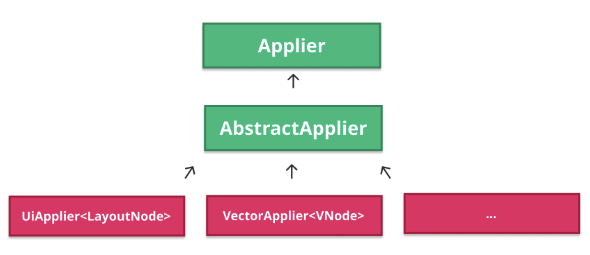

# 다양한 타입의 Applier들 (Different types of Appliers)

앞부분에서 **Applier**를 런타임이 트리의 변경 사항을 구체화하기 위해 의존하는 추상화로 설명했습니다. **Applier**는 라이브러리가 사용되는 플랫폼에 대해 런타임이 완전히 알지 못하도록 **의존성을 반전**시킵니다. 이 추상화 계층은 **Compose UI**와 같은 클라이언트 라이브러리가 자체적인 Applier 구현을 연결할 수 있게 합니다. 그리고 이를 통해 플랫폼과의 통합에 사용될 자신의 **노드 타입**을 선택합니다. 아래는 이를 보여주는 간단한 다이어그램입니다.



> 위의 두 박스(`Applier`와 `AbstractApplier`)는 **Compose Runtime**의 일부입니다. 아래 나열된 것들은 **Compose UI**에서 제공되는 몇 가지 Applier의 구현입니다.

## AbstractApplier의 역할

`AbstractApplier`는 **Compose Runtime**에서 다양한 Applier 간의 공통 로직을 공유하기 위해 제공되는 기본 구현입니다. `AbstractApplier`는 방문한 노드를 **스택(Stack)** 에 저장하며 현재 방문 중인 노드에 대한 참조를 유지합니다. 그래서 어떤 노드에 동작을 수행해야 하는지 알 수 있습니다.

### 동작 방식

- 트리의 아래쪽으로 새로운 노드가 방문될 때마다 **Composer**는 `applier#down(node: N)`를 호출하여 Applier에게 알립니다
- 이는 노드를 스택에 푸시하고, Applier는 노드에 필요한 모든 동작을 수행할 수 있습니다
- 하위 노드 탐색을 마치고 노드의 부모로 다시 돌아가야 할 때 Composer는 `applier#up()`을 호출하며, 마지막으로 방문한 노드를 스택에서 팝합니다

### AbstractApplier 동작 예시

이해를 돕기 위한 간단한 예시로 아래와 같은 Composable 트리를 구체화한다고 가정해 봅시다.

```kotlin
Column {
  Row {
    Text("Some text")
    if (condition) {
      Text("Some conditional text")
    }
  }
  if (condition) {
    Text("Some more conditional text")
  }
}
```

`condition`이 바뀌면 Applier는 아래와 같이 동작합니다:

1. **Column**에 대한 `down` 호출을 받습니다
2. 그 다음 **Row**로 들어가기 위한 또 다른 `down` 호출을 받습니다
3. 그 후 선택적 자식 **Text**에 대한 삭제(또는 삽입, `condition`에 따라 다름) 작업을 수행합니다
4. 그 다음 부모(**Column**)로 돌아가기 위해 `up` 호출을 받습니다
5. 마지막으로 두 번째 조건부 텍스트에 대한 삭제(또는 삽입) 작업을 수행합니다

### AbstractApplier의 장점

`AbstractApplier`에 스택과 `down` 및 `up` 작업이 포함되어 있어, 자식 Applier들이 **노드 타입과 관계없이 동일한 탐색 로직을 공유**할 수 있습니다. 이는 노드 간에 부모와 자식 관계를 제공하여, 트리를 탐색하기 위한 관계를 유지하는 데 기술적으로 특정 노드 타입이 필요하지 않도록 해줍니다. 그럼에도, 노드에서 클라이언트 라이브러리와 관련하여 구체적인 이유로 부모-자식 관계가 필요하다면 자체적으로 구현할 수도 있습니다.

> **참고**: 실제로 `LayoutNode`의 경우, 모든 작업이 composition 중에 수행되는 것은 아닙니다. 예를 들어, 어떤 이유로든 노드를 다시 그려야 하는 경우 Compose UI는 부모들을 탐색하여 노드가 그릴 레이어를 생성한 노드를 찾아서 무효화(invalidate)를 호출합니다. 이 모든 것은 composition 외부에서 발생하므로, Compose UI는 트리를 자유롭게 상하로 탐색할 수단이 필요합니다.

## Compose UI의 Applier 구현

Applier가 노드 트리를 **하향식** 또는 **상향식**으로 구축할 수 있다는 것을 돌이켜볼 수 있는 흥미로운 순간입니다. 또한, 각 접근 방식이 **성능**에 미치는 영향과 새 노드가 삽입될 때마다 알림을 받아야 하는 노드 수에 따라 이러한 영향이 어떻게 달라지는지 설명했습니다. 

> 💡 **Tip**: 지금 조금 혼란스러워도 걱정하지 마세요. 잠시 3장의 "노드 트리 구축 시 성능" 섹션으로 돌아가서 빠르게 다시 읽어보는 것을 추천합니다.

이 부분을 다시 정리해 보려고 한 이유는, **Compose UI**에서 노드 트리를 구성하는 두 가지 전략의 실제 예시가 있기 때문입니다. 이러한 전략은 라이브러리에서 사용되는 **두 가지 유형의 Applier**에 의해 사용됩니다.

**Compose UI**는 **Jetpack Compose Runtime**과 안드로이드 플랫폼을 통합하기 위해 `AbstractApplier`의 두 가지 구현을 제공합니다:

| Applier 타입 | 노드 타입 | 용도 | 설명 |
|------------|---------|------|------|
| **UiApplier** | `LayoutNode` | 안드로이드 UI 렌더링 | 대부분의 안드로이드 UI를 렌더링하는 데 사용되며, 트리의 모든 Layout을 구체화합니다 |
| **VectorApplier** | `VNode` | 벡터 그래픽 렌더링 | 벡터 그래픽을 표현하고 구체화합니다 |

현재 안드로이드용으로 제공되는 구현은 이 두 가지뿐이지만, 플랫폼에 대해 사용 가능한 구현의 수는 필요에 따라 늘어날 수 있습니다. 특히, 현재 존재하는 것과 다른 노드 트리를 표현할 필요가 있을 때 Compose UI에 더 많은 구현이 추가될 수 있습니다.

> **참고**: 방문하는 노드의 유형에 따라 다른 Applier 구현이 사용됩니다. 예를 들어, `LayoutNode`로 구성된 루트 Composition과 `VNode`로 구성된 Subcomposition을 가지고 있다면, 전체 UI 트리를 구체화하기 위해 두 Applier가 모두 사용될 것입니다.

## 트리 구축 전략

이제 두 Applier가 트리를 구축하기 위해 사용하는 전략을 빠르게 살펴보겠습니다.

### UiApplier: 상향식(Bottom-up) 전략

**UiApplier**는 **상향식**으로 노드를 삽입합니다. 이는 새 노드가 트리에 들어올 때 **중복 알림을 피하기 위한 것**입니다. 상향식 삽입 전략에 대한 다이어그램을 참고하면 더 명확하게 이해하실 수 있습니다.


상향식 트리 구축은 **B에 A와 C를 삽입**한 다음 **R에 B 트리를 삽입**하여 트리를 완성하는 방식으로 이루어집니다. 이는 새 노드가 삽입될 때마다 **오직 직접적인 부모에게만 알림을 보내는 것**을 의미합니다. 

이는 특히 안드로이드 UI(즉, `UiApplier`)에 흥미로운 접근 방식인데, 일반적으로 많은 중첩(Compose UI에서는 오버드로우가 문제가 되지 않습니다)이 있어 알림을 보낼 조상이 많기 때문입니다.

### VectorApplier: 하향식(Top-down) 전략

반면에, **VectorApplier**는 트리를 **하향식**으로 구축하는 예시입니다. 위의 예시 트리를 하향식 전략을 사용하여 구축하려면, 먼저 **R에 B를 삽입**한 다음 **B에 A를 삽입**하고, 마지막으로 **B에 C를 삽입**합니다.


이 전략에서는 새 노드를 삽입할 때마다 **트리의 모든 조상에게 알림을 보내야** 합니다. 하지만 벡터 그래픽의 맥락에서는 어떤 노드에도 알림을 전파할 필요가 없으므로, 하향식과 상향식 전략 모두 동등하게 성능이 좋고 따라서 완전히 타당합니다. 하향식을 상향식보다 선택할 강한 이유는 없습니다. 새로운 자식이 `VNode`에 삽입될 때마다 해당 노드의 리스너에게만 알림이 가고, 자식이나 부모에게는 영향을 주지 않습니다.

## 다음 단계

**Compose UI** 라이브러리가 사용하는 두 가지 다른 Applier 구현에 대해 이미 잘 이해했으므로, 이제 두 가지 모두가 어떻게 UI에서 변경을 구체화하는지 이해할 때입니다.

## 요약

- **Applier**는 런타임이 트리의 변경 사항을 구체화하기 위해 사용하는 추상화로, 플랫폼에 대한 의존성을 반전시켜 클라이언트 라이브러리가 자체 노드 타입을 선택할 수 있게 합니다
- **AbstractApplier**는 Compose Runtime에서 제공하는 기본 구현으로, 스택을 사용하여 노드를 추적하고 `down()`과 `up()` 메서드를 통해 트리를 탐색합니다
- Compose UI는 두 가지 주요 Applier 구현을 제공합니다: 안드로이드 UI 렌더링을 위한 **UiApplier**(`LayoutNode` 사용)와 벡터 그래픽 렌더링을 위한 **VectorApplier**(`VNode` 사용)
- **UiApplier**는 중복 알림을 피하기 위해 **상향식(bottom-up)** 전략으로 노드를 삽입하며, 이는 안드로이드 UI의 중첩이 많은 특성에 효율적입니다
- **VectorApplier**는 **하향식(top-down)** 전략을 사용하며, 벡터 그래픽의 경우 알림 전파가 필요 없어 두 전략 모두 성능상 차이가 없습니다
- 노드 타입에 따라 적절한 Applier가 선택되며, 하나의 UI 트리에서 여러 Applier가 동시에 사용될 수 있습니다