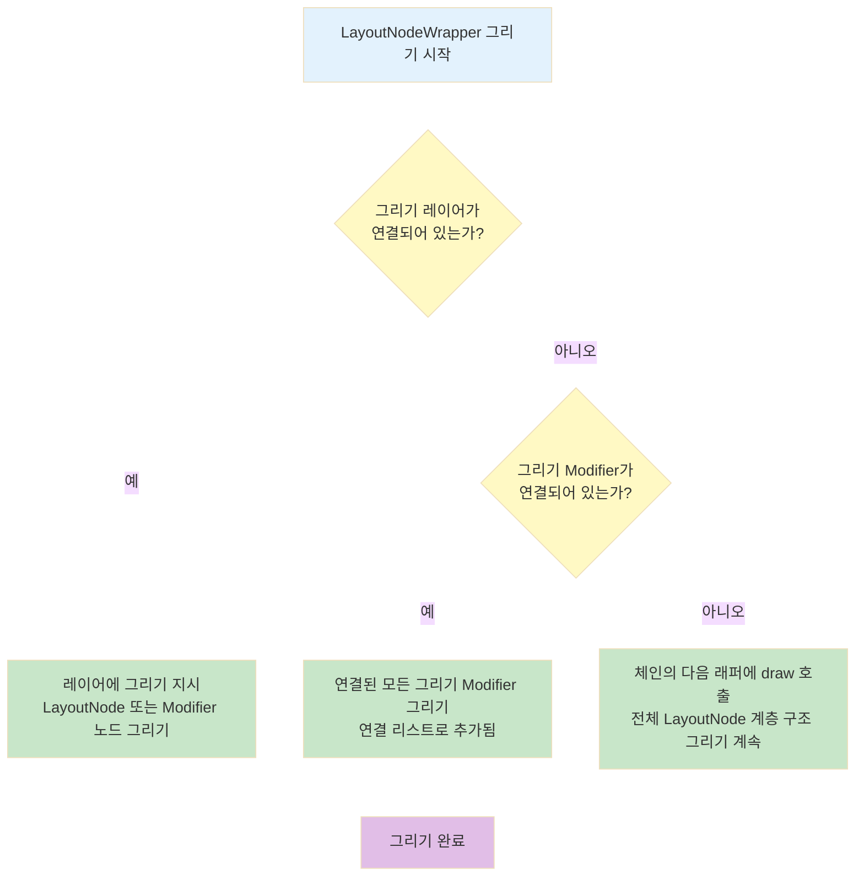
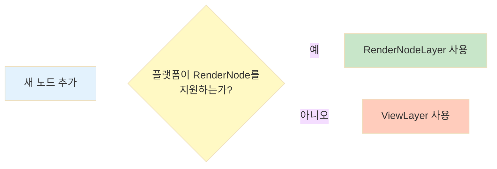
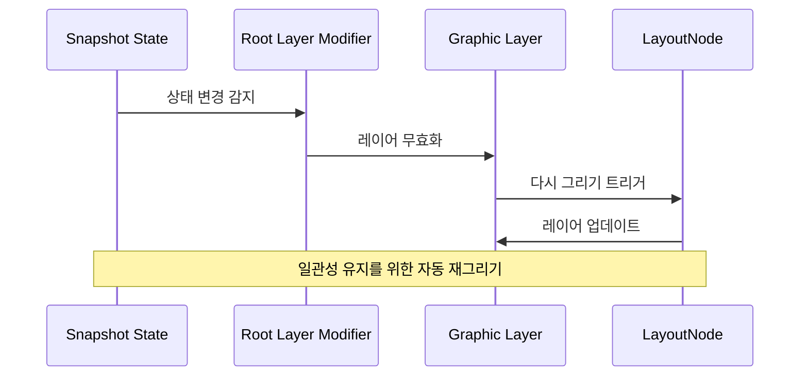

# 노드 트리 그리기 (Drawing the node tree)

## 개요

우리는 **측정(Measuring)** 과 **배치(Layout)** 에 대해서는 많이 이야기했지만, **그리기(Drawing)** 에 대해서는 조금만 다뤘습니다. 그리기 과정에서도 `LayoutNodeWrapper` 체인을 따라 현재 노드가 먼저 그려지고, 그 다음에는 modifier들(순서대로), 마지막으로 자식들이 그려집니다. 이 과정은 전체 노드 계층 구조가 그려질 때까지 각 자식에 대해 반복됩니다.

## 안드로이드 시스템의 그리기 프로세스

안드로이드 시스템에서 그리기는 **측정**과 **배치** 단계 이후에 이루어집니다. 모든 그리기 틱(tick)에서, 시스템은 `View`나 `ViewGroup`에 `draw`를 호출하고 그리기를 수행합니다.

### Compose에서의 그리기

Compose에서도 이는 다르지 않습니다:

1. `LayoutNode`가 재측정을 요청하면, 그것은 **dirty**로 표시됩니다
2. 다음 그리기 단계에서 `Owner`(예: `AndroidComposeView`와 같은 `ViewGroup`)는 dirty로 표시된 노드들을 모두 재측정하고 재배치합니다
3. 그리기는 `dispatchDraw` 함수에서 이루어지는데, 이는 안드로이드 `ViewGroup`이 자식들을 그리는 함수입니다

## AndroidComposeView의 그리기 레이어 무효화

`AndroidComposeView`를 `Owner`의 예시로 들어보겠습니다. `AndroidComposeView`는 그리기 전 계층 구조의 모든 `LayoutNode`의 **그리기 레이어를 무효화**합니다. 즉, `LayoutNode`들이 다시 그려져야 한다고 표시합니다.

> **참고**: 이것은 그리기에도 사용될 수 있는 모든 modifier 래퍼들을 포함합니다. 노드의 그리기 레이어가 무효화되어야 할 필요가 있을 때는 그것이 이미 그리는 중이 아닌지 먼저 확인합니다.

## 루트 노드에서 시작하는 그리기

그리기 과정은 **루트 LayoutNode**에서 시작됩니다. 이는 `root.draw(canvas)`를 통해 이루어지며, 노드의 `outerLayoutNodeWrapper`에 위임됩니다.

### Compose Canvas 추상화

> **Compose UI가 사용하는 Canvas는 추상화된 것**인데, 그 이유는 Compose UI가 **멀티플랫폼 라이브러리**이기 때문입니다.
> 
> - 안드로이드의 경우, 모든 그리기를 네이티브 `Canvas`에 위임합니다
> - Compose `Canvas`는 네이티브보다 더 사용자 친화적인 API를 제공합니다
> 
> **주요 차이점**: Compose `Canvas`가 제공하는 함수에서 더 이상 `Paint` 객체를 받지 않습니다. 안드로이드에서 `Paint` 인스턴스를 할당하는 것은 비용이 많이 들고, 특히 `draw` 호출 동안 할당하는 것은 권장되지 않기 때문입니다. 그 대신, 함수가 암시적으로 동일한 `Paint`를 생성하고 재사용하도록 API를 재작업했습니다.

## LayoutNodeWrapper의 그리기 레이어

각 `LayoutNodeWrapper`는 자체적인 **그리기 레이어**를 가지고 있는데, 외부 래퍼도 예외는 아닙니다. `root.draw(canvas)`를 통해 루트 노드에 그리기가 시작되었을 때, 외부 래퍼의 그리기 레이어는 작업을 수행합니다.

### 그리기 시나리오

고려해야 할 다양한 시나리오가 있습니다:



#### 시나리오 1: 그리기 레이어가 연결된 경우

래퍼에 **연결된 그리기 레이어**가 있으면, 해당 레이어에 그리기를 지시합니다. 이는 `LayoutNode` 또는 modifier 등의 노드를 그리게 됩니다.

#### 시나리오 2: 그리기 Modifier가 연결된 경우

이 래퍼에 그리기 레이어가 연결되어 있지 않다면, **연결된 그리기 modifier**가 있다면 모두 그립니다.

> **참고**: 그리기 modifier는 **연결 리스트**로 래퍼에 추가됩니다. 다른 modifier들처럼 별도의 래퍼로 래핑되지 않습니다.

#### 시나리오 3: 둘 다 없는 경우

래퍼에 그리기 레이어도, 그리기 modifier도 연결되어 있지 않다면, **체인의 다음 래퍼에 draw를 호출**하여 전체 `LayoutNode` 계층 구조의 그리기 과정을 계속합니다.

## 그리기 레이어의 두 가지 유형

위의 **시나리오 1**은 노드의 그리기가 이루어지는 곳입니다. 이를 위해 Compose UI는 `LayoutNode`에 대해 **두 가지 유형의 그리기 레이어**를 제공합니다.

### 1. RenderNodeLayer

**RenderNode를 그리기 위한 레이어**입니다.

| 특징 | 설명 |
|-----|------|
| 기본 방법 | Jetpack Compose UI 노드를 렌더링하는 기본 방법 |
| 효율성 | 더 효율적인 하드웨어 주도 그리기 제공 |
| 재사용성 | 먼저 한 번 그려진 다음 매우 효율적으로 여러 번 다시 그릴 수 있음 |
| 하드웨어 가속 | 지원 |

### 2. ViewLayer

**View 기반 구현**입니다.

| 특징 | 설명 |
|-----|------|
| 사용 시점 | RenderNode를 직접 사용할 수 없을 때만 대체 수단으로 사용 |
| 복잡성 | RenderNodeLayer보다 더 복잡함(hacky) |
| 구현 방식 | View를 RenderNode로 취급하기 위한 일련의 연결 과정 필요 |
| 기능 | 실제로 View는 RenderNode보다 훨씬 더 많은 기능 보유 |
| 하드웨어 가속 | 간접적으로 지원 (View를 통해) |

### 하드웨어 가속

두 구현 모두 **직접적으로든, 간접적으로든 RenderNode에 의존**하기 때문에 하드웨어 가속이 적용됩니다. 예를 들어, 두 구현 모두 `Modifier.graphicsLayer`에 대한 적합한 구현으로 사용될 수 있습니다.

## 그리기 레이어 생성 및 선택

새 노드가 추가될 때마다 그리기 레이어가 생성되며, **어떤 유형의 레이어를 사용할지 결정하는 것은 Owner에 달려 있습니다**.

### AndroidComposeView의 레이어 선택 전략

`AndroidComposeView`의 경우:
1. 플랫폼 버전에 따라 지원된다면 항상 **RenderNodeLayer를 우선시**
2. 지원되지 않으면 **ViewLayer로 대체**



## RenderNodeLayer의 구현

각 안드로이드 버전은 `RenderNode`에 대해 다른 API를 제공하므로, `RenderNodeLayer`는 **Compose UI가 제공하는 추상화에 의존**하여 실행 시점의 RenderNode 시스템 구현에 그리기를 위임합니다.

## ViewLayer의 구현

반면에, `ViewLayer`는 그리기를 위해 **View에 의존**합니다.

### ViewLayer의 작동 방식

1. 모든 `ViewLayer`에는 그리기를 트리거할 때 사용되는 **컨테이너 View**가 연결되어 있습니다
2. 이 컨테이너는 보통 `Owner`, 즉 `ViewGroup`입니다
3. `ViewLayer`가 생성될 때, 그것은 **자신을 컨테이너의 자식으로 할당**합니다
   - 이것은 `ViewLayer`가 실제로 `View`로 구현되었기 때문에 가능
4. 레이어가 그려져야 할 때, 컨테이너의 `ViewGroup#drawChild` 함수를 호출
5. 자식(레이어)의 그리기는 그냥 **View의 그리기 메커니즘을 재사용**합니다

> **참고**: 앞서 언급했듯이, 이는 View를 통해 작동하기 때문에, 직접적으로 RenderNode를 사용하는 것보다 더 복잡한(hacky) 방법입니다.

### Elevation Mode

그리기 전에, `ViewLayer`는 `elevation`이 할당된 경우 **"elevation mode"를 활성화**할 기회가 있습니다.

- **Elevation mode**는 안드로이드 `Canvas`에 의해 지원됩니다
- 그림자를 렌더링하고 그에 따라 다른 elevation을 가진 레이어를 재배열할 수 있게 합니다
- Elevation mode가 활성화되면, 레이어는 그리기를 진행할 수 있으며, 그 후에는 비활성화됩니다

## 표시 목록 업데이트

체인의 모든 래퍼가 그려지면, `AndroidComposeView#dispatchDraw`는 **dirty 플래그가 지정된 모든 레이어**에 대해 그들의 **표시 목록(Display List)** 을 업데이트하도록 알립니다.

### 표시 목록 업데이트 프로세스

1. 현재 캔버스에 대해 그려진 것을 업데이트합니다
2. 레이어는 무효화될 때 dirty로 표시됩니다
3. `dispatchDraw` 함수의 시작 부분에서 모든 레이어를 무효화했기 때문에, 이는 계층 구조의 모든 노드의 모든 레이어를 업데이트하도록 강제합니다

> **주의**: 표시 목록을 업데이트하는 작업은 **동일한 레이어의 무효화를 초래**할 수 있습니다. 그럴 때, 그 레이어들은 이 시점에서 dirty로 표시되어 다음 단계에서 업데이트될 수 있습니다.

## 스냅샷 상태 변경 관찰

때때로 우리는 `LayoutNode`를 레이어로 그릴 때 **스냅샷 상태(Snapshot State)** 를 읽습니다. 이 상태가 변경될 때마다, 우리는 일관성을 위해 노드를 다시 그릴 필요가 있을 것입니다.

### 루트의 레이어 Modifier

루트에는 모든 자식 노드의 상태 변경을 관찰하여 그에 따라 그들의 그리기 레이어를 무효화하는 **레이어 modifier**가 있습니다. 이것은 루트 노드에 설정된 **측정 정책의 일부**입니다.

```kotlin
// AndroidComposeView.android.kt
override val root = LayoutNode().also {
  it.measurePolicy = RootMeasurePolicy
  it.modifier = Modifier
    .then(semanticsModifier)
    .then(_focusManager.modifier)
    .then(keyInputModifier)
  it.density = density
}
```

### RootMeasurePolicy의 역할

이 `RootMeasurePolicy`는 루트 노드에 추가된 자식을 측정하고 배치합니다.

**작동 방식**:
1. `placeable.placeRelativeWithLayer(0, 0)`를 호출
2. 측정된 자식을 좌표 `(0, 0)`에 배치하고 그래픽 레이어를 도입
3. 이 그래픽 레이어는 **어떠한 스냅샷 상태 변경에도 자동으로 관찰하고 반응**하도록 구성됩니다



## 요약

- **그리기 프로세스**는 측정과 배치 이후에 `LayoutNodeWrapper` 체인을 따라 진행되며, 노드 → modifier → 자식 순서로 그려집니다
- **AndroidComposeView**는 Owner로서 dirty로 표시된 모든 노드를 재측정, 재배치한 후 `dispatchDraw` 함수에서 그리기를 수행합니다
- **Compose Canvas**는 멀티플랫폼을 위한 추상화로, Paint 객체 할당 비용을 줄이기 위해 암시적으로 재사용 가능한 API를 제공합니다
- **그리기 레이어**는 두 가지 타입이 있으며, 하드웨어 가속을 지원하는 `RenderNodeLayer`가 우선시되고, 불가능한 경우 `ViewLayer`로 대체됩니다
- **RootMeasurePolicy**는 `placeRelativeWithLayer`를 통해 그래픽 레이어를 도입하고, 스냅샷 상태 변경을 자동으로 관찰하여 레이어를 무효화하고 재그리기를 트리거합니다
