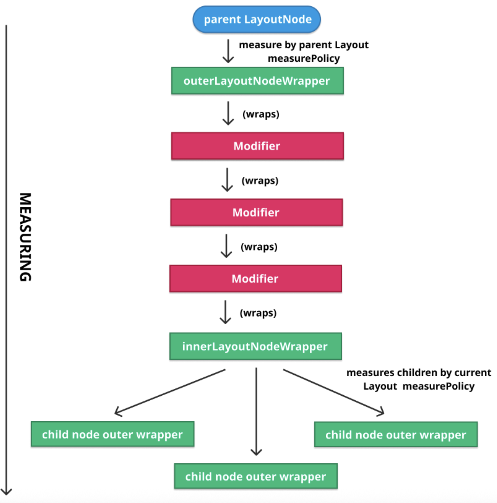
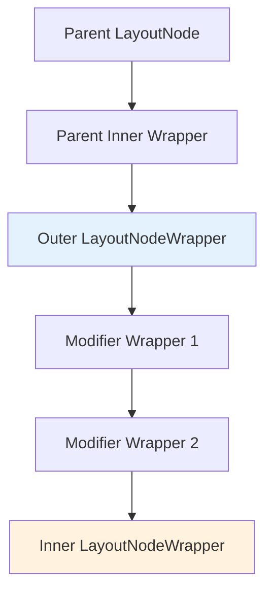
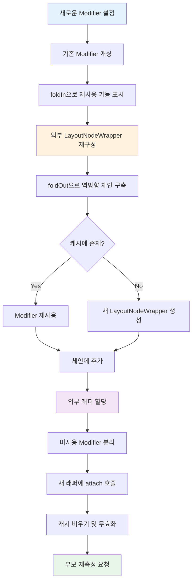

# LayoutNode가 새로운 modifier를 받아 들이는 방법 (How LayoutNode ingests new modifiers)

`LayoutNode`에 **Modifier**(또는 Modifier 체인)가 설정될 때마다, 현재 노드에 이미 설정되어 있는 모든 Modifier들은 **캐시**에 저장됩니다. 이 캐시는 새로 설정되는 Modifier 체인에서 **재사용 가능한 Modifier**를 찾는 데 사용됩니다. 설정될 Modifier 인스턴스와 일치하는 경우에는 Modifier가 재사용됩니다.

## 1단계: Modifier 캐싱 및 전처리

캐시된 모든 Modifier는 초기에 **재사용 불가능**한 상태로 초기화됩니다. 그런 다음, 노드는 새로운 Modifier 체인의 **머리**(linked list의 head)부터 시작하여 Modifier 체인을 fold하기 위해 `Modifier#foldIn` 함수를 사용합니다.

### foldIn 동작 과정

```kotlin
// Modifier#foldIn을 사용한 체인 순회
modifierChain.foldIn(initial) { acc, modifier ->
  // 각 modifier에 대해 캐시 확인 및 재사용 가능 여부 표시
}
```

각 Modifier에 대해 다음 작업을 수행합니다:

1. **캐시 확인**: 상응하는 캐시에 Modifier가 포함되어 있는지 확인
2. **재사용 가능 표시**: 캐시에 있다면 재사용 가능으로 표시
3. **계층 구조 탐색**: 캐시된 Modifier에 부모가 있는 경우, 해당 Modifier와 모든 조상을 재사용 가능으로 표시

이 과정을 통해 캐시된 Modifier의 초기 전처리를 완료하고 다음 단계로 넘어갑니다.

## 2단계: 외부 LayoutNodeWrapper 재구성

다음으로 `LayoutNode`는 자신의 **외부 LayoutNodeWrapper**를 재구성합니다. 외부 래퍼는 체인의 첫 번째 Modifier를 래핑하고, 첫 번째 Modifier는 두 번째 Modifier를 래핑하는 식으로 진행됩니다. 

> 💡 **핵심**: 새로운 Modifier 체인을 설정하려면 외부 래퍼를 **재구축(rebuilt)** 해야 합니다.



## 3단계: foldOut을 통한 역방향 Fold

외부 래퍼를 재구축하기 위해, 새로운 Modifier 체인을 다시 fold하는데, 이번에는 **반대 방향**(꼬리에서 머리로)으로 진행합니다. 이 작업은 `Modifier#foldOut` 함수를 통해 이루어집니다.

### foldOut 동작 과정

```kotlin
// Modifier#foldOut을 사용한 역방향 순회
modifierChain.foldOut(innerLayoutNodeWrapper) { modifier, acc ->
  // 새로운 LayoutNodeWrapper 체인 구축
}
```

**초깃값**: `innerLayoutNodeWrapper` (다이어그램의 가장 아래)

꼬리에서 시작하기 때문에, fold 연산의 초깃값은 `innerLayoutNodeWrapper`가 됩니다. 그런 다음 래퍼들을 하나씩 거슬러 올라가며 이 `LayoutNode`에 설정된 모든 Modifier를 살펴봅니다.

## 4단계: Modifier 재사용 또는 새로운 Wrapper 생성

각 Modifier에 대해 다음 작업을 수행합니다:

| 단계 | 작업 | 설명 |
|-----|------|------|
| 1 | **캐시 확인** | 재사용 가능한 Modifier인지 확인 |
| 2 | **재사용** | 재사용 가능하면 체인에 추가하고 캐시에서 제거 |
| 3 | **새로운 래퍼 생성** | 재사용 불가능하면 해당 Modifier 유형에 적합한 `LayoutNodeWrapper` 타입으로 감싸기 |
| 4 | **체인 추가** | 생성된 래퍼를 체인에 추가 |

> 📝 **참고**: 여러 가지 래퍼 유형이 있으며, 각각 Modifier의 성격에 따라 고유한 기능을 가지고 있습니다.

## 5단계: 외부 래퍼 할당

fold 연산 중 Modifier 체인의 **머리**(즉, `outerLayoutNodeWrapper`)에 도달하면, 외부 래퍼는 다이어그램의 가장 위에 있는 것처럼 **parent 노드의 내부 래퍼**로 할당됩니다.



이로써 새로운 래퍼 체인을 구축하는 과정이 완료됩니다.

## 6단계: 캐시 정리 및 무효화

다음 단계들이 순차적으로 실행됩니다:

1. **캐시 분리**: 캐시에 남아 있는 모든 Modifier를 분리 (재사용되지 않을 것이기 때문)
2. **Attach 호출**: 모든 새로운 래퍼에 `attach()` 호출
3. **캐시 비우기**: 캐시를 완전히 비움
4. **무효화**: 모든 Modifier들을 다시 그리기 위해 무효화

```kotlin
// 캐시 정리 및 무효화 과정
unusedModifiers.forEach { it.detach() }
newWrappers.forEach { it.attach() }
cache.clear()
invalidate()
```

## 7단계: 부모 재측정 요청

마지막 단계는 필요한 경우 **부모의 재측정**을 요청하는 것입니다.

```kotlin
if (needsRemeasure) {
  parent?.requestRemeasure()
}
```

## 전체 프로세스 다이어그램



## 요약

- **LayoutNode**는 새로운 Modifier를 설정할 때 기존 Modifier를 캐시에 저장하여 재사용 가능한 것들을 찾아 성능을 최적화합니다
- `Modifier#foldIn` 함수를 사용하여 Modifier 체인의 머리부터 순회하며 재사용 가능한 Modifier를 표시합니다
- 외부 `LayoutNodeWrapper`를 재구성하기 위해 `Modifier#foldOut` 함수로 역방향(꼬리→머리) fold를 수행합니다
- 각 Modifier는 캐시에서 재사용 가능하면 재사용하고, 그렇지 않으면 적절한 `LayoutNodeWrapper` 타입으로 새로 감싸집니다
- fold 연산이 완료되면 외부 래퍼를 부모 노드의 내부 래퍼로 할당하고, 미사용 Modifier를 정리한 후 무효화합니다
- 마지막으로 필요한 경우 부모에게 재측정을 요청하여 UI 업데이트를 완료합니다
- 이 프로세스는 Compose UI의 효율적인 렌더링과 성능 최적화를 위한 핵심 메커니즘입니다