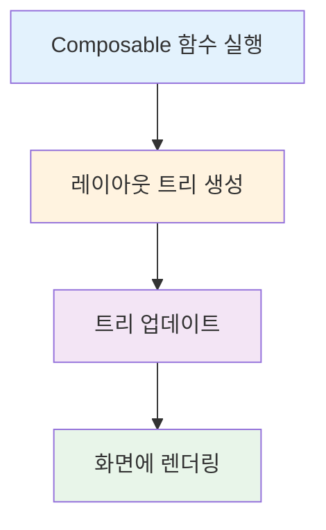
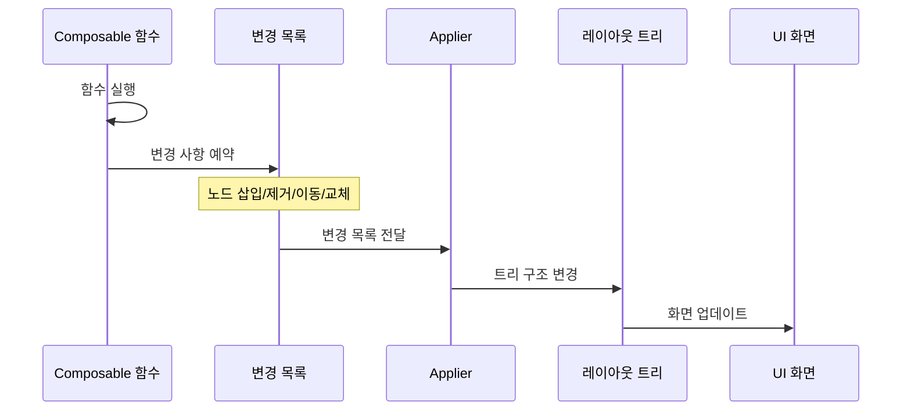

# Compose UI와 런타임의 통합 (Integrating UI with the Compose runtime)

## 개요

**Compose UI**는 [Kotlin 멀티플랫폼](https://www.jetbrains.com/ko-kr/kotlin-multiplatform/) 프레임워크로, Composable 함수를 통해 UI를 방출(emit)하는 구현을 제공합니다. 이 라이브러리는 Android와 데스크탑 통합 레이어를 제공하는 [Android 및 Desktop 소스셋](https://cs.android.com/androidx/platform/frameworks/support/+/androidx-main:compose/ui/ui/src/)을 포함하고 있습니다.

> **참고**: 
> - **JetBrains**는 Desktop 소스셋을 유지 관리
> - **Google**은 Android 및 공통(common) 소스셋을 유지 관리
> - Android와 Desktop 소스셋 모두 공통 소스셋에 의존
> - **Compose for Web**은 [DOM](https://developer.mozilla.org/en-US/docs/Web/API/Document_Object_Model)을 사용하여 만들어져 지금까지 Compose UI에 포함되지 않음

## Compose Runtime과 UI 통합의 목표

### 레이아웃 트리 구축

Compose Runtime과 UI를 통합할 때의 **핵심 목표**는 사용자가 마주할 **화면의 레이아웃 트리를 구축**하는 것입니다.

### 노드 타입과 책임 분리

| 구성 요소 | 역할 | 노드 타입 인지 여부 |
|---------|------|------------------|
| **Compose UI** | 노드 타입 정의 및 관리 | ✅ 알고 있음 |
| **Compose Runtime** | 노드 조작 로직 위임 | ❌ 알지 못함 |

#### 주요 특징

- **트리의 노드 타입**은 Compose UI에서만 알려져 있으며, 런타임은 이에 대해 알지 못합니다
- Compose UI는 **Kotlin 멀티플랫폼** 프레임워크이지만, 노드 타입은 현재 **Android와 Desktop**에서만 사용됩니다
- **Compose for Web**과 같은 다른 라이브러리는 다른 노드 타입을 사용합니다
- 클라이언트 라이브러리에서 생성하는 노드 타입은 **해당 라이브러리에서만 알려져야** 합니다
- 런타임은 트리에서 노드를 **삽입, 제거, 이동, 교체**하는 작업을 **클라이언트 라이브러리에 위임**합니다

## Composition 과정

### Initial Composition과 Recomposition

### 동작 과정

1. **Composable 함수 실행**
   - 초기 composition 또는 recomposition 수행

2. **변경 사항 예약**
   - 트리에서 노드를 삽입, 제거, 이동 또는 교체하는 변경 사항 예약
   - 변경 목록(change list) 생성

3. **Applier를 통한 적용**
   - Applier가 트리 구조에 영향을 주는 변경 사항을 감지
   - 실제 트리의 변경사항으로 대응
   - 사용자에게 화면 업데이트로 나타남

### Initial Composition vs Recomposition

| 단계 | 목적 | 변경 내용 |
|-----|------|----------|
| **Initial Composition** | 레이아웃 트리 구축 | 모든 노드를 삽입하여 트리 생성 |
| **Recomposition** | 레이아웃 트리 업데이트 | 변경된 부분만 트리 업데이트 |

#### Recomposition 발생 조건

**Recomposition**은 다음과 같은 경우에 발생합니다:
- Composable 함수의 **입력 데이터**가 변경될 때
  - 매개변수(parameters) 변경
  - 읽은 변경 가능한 상태(mutable state) 변경

## 핵심 개념 정리

### Compose Runtime의 역할

- 노드 타입에 대해 알지 못함 (타입 독립적)
- 노드 조작을 클라이언트 라이브러리에 **위임**
- 변경 목록 관리 및 실행

### Compose UI의 역할

- 노드 타입 정의 및 관리
- 플랫폼별 통합 레이어 제공 (Android, Desktop)
- Applier를 통한 트리 변경 적용

### 변경 목록(Change List)

- Composable 함수 실행 중 생성됨
- 노드 삽입, 제거, 이동, 교체 작업 포함
- Applier에 의해 실제 트리에 적용됨

### Applier

- 변경 목록을 받아 실제 트리 구조를 변경
- 클라이언트 라이브러리(Compose UI)에서 구현
- 플랫폼별 최적화 가능

## 요약

- **Compose UI**는 Kotlin 멀티플랫폼 프레임워크로, Composable 함수를 통해 UI를 방출하며 Android와 Desktop 통합 레이어를 제공합니다
- Compose Runtime과 UI 통합의 핵심 목표는 **화면의 레이아웃 트리를 구축하고 업데이트**하는 것입니다
- **노드 타입**은 Compose UI에서만 알려져 있으며, Compose Runtime은 노드 조작을 클라이언트 라이브러리에 **위임**합니다
- **Initial Composition**은 모든 노드를 삽입하여 레이아웃 트리를 구축하고, **Recomposition**은 입력 데이터 변경 시 트리를 업데이트합니다
- **변경 목록**은 Composable 함수 실행 중 생성되며, **Applier**가 이를 받아 실제 트리에 적용하여 화면을 업데이트합니다
- 이러한 설계를 통해 런타임과 UI가 명확하게 분리되고, 다양한 플랫폼을 위한 클라이언트 라이브러리 구현이 가능합니다
