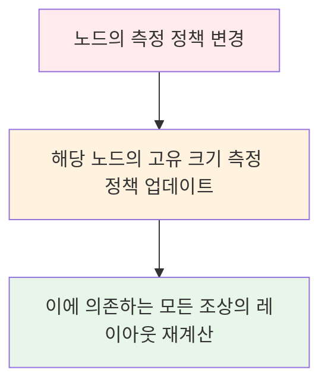

# 고유 크기 측정 (Intrinsic Measurements)

## 개요

`MeasurePolicy`에는 **레이아웃의 고유 크기를 계산하는 몇 가지 메서드**가 포함되어 있습니다. **고유 크기(Intrinsic Size)** 란, **제약 조건이 없을 때 레이아웃의 추정 크기**를 의미합니다.

## 고유 크기 측정이 필요한 이유

### 문제 상황

고유 크기 측정은 **측정(measure) 단계 이전에 자식의 추정 크기를 알아야 할 때** 유용합니다. 

예를 들어, 다음과 같은 상황을 생각해볼 수 있습니다:
- 자식의 높이를 **가장 키가 큰 형제의 높이와 일치**시키고 싶은 경우
- 측정 단계에서 형제들이 아직 측정되지 않았다면 어떻게 해야 할까요?

### 해결 방법 검토

여러 가지 해결 방법을 고려할 수 있지만, 각각 한계가 있습니다:

| 방법 | 설명 | 문제점 |
|------|------|--------|
| **Subcomposition** | 서브 컴포지션을 사용 | 때로는 과도한 방법일 수 있음 |
| **두 번 측정** | 측정을 두 번 수행 | ❌ **불가능** - Compose는 성능상의 이유로 단 한 번의 측정을 강제하며, 두 번 측정 시도 시 예외 발생 |
| **고유 크기 측정** | Intrinsic Measurements 사용 | ✅ **좋은 타협책** |

### 고유 크기 측정의 작동 방식

모든 `LayoutNode`에는 두 가지 정책이 할당됩니다:
1. **측정 정책(Measure Policy)**
2. **고유 크기 측정 정책(Intrinsic Size Measurement Policy)** - 이전 정책에 의존

이러한 의존 관계는 다음과 같은 효과를 가져옵니다:



## 고유 크기 측정 메서드

`LayoutNode`에 할당된 고유 크기 정책은 다음 값들을 계산할 수 있는 메서드를 제공합니다:

### 제공되는 메서드

| 메서드 | 입력 | 출력 | 설명 |
|--------|------|------|------|
| `minIntrinsicWidth` | 높이 | 최소 너비 | 레이아웃 콘텐츠를 올바르게 그릴 수 있는, 특정 높이에 대한 **최소 너비** |
| `minIntrinsicHeight` | 너비 | 최소 높이 | 레이아웃 콘텐츠를 올바르게 그릴 수 있는, 특정 너비에 대한 **최소 높이** |
| `maxIntrinsicWidth` | 높이 | 최대 너비 | 이를 더 늘려도 최소 고유 높이가 감소하지 않는 **최소 너비** |
| `maxIntrinsicHeight` | 너비 | 최대 높이 | 이를 더 늘려도 최소 고유 너비가 감소하지 않는 **최소 높이** |

> **💡 핵심 개념**: 필요한 치수를 계산하기 위해 **반대 치수를 제공**해야 합니다. 제약 조건이 없기 때문에 레이아웃 콘텐츠를 올바르게 그릴 수 있는 적절한 크기를 계산할 수 있는 유일한 단서는 치수 중 하나입니다.

### 함수별 상세 설명

각 함수의 공식 KDocs를 통해 더 명확하게 이해할 수 있습니다:

- **`minIntrinsicWidth`**: 레이아웃 콘텐츠를 올바르게 그릴 수 있는, 특정 높이에 대해 레이아웃이 가질 수 있는 **최소 너비** 제공
- **`minIntrinsicHeight`**: 레이아웃 콘텐츠가 올바르게 그려질 수 있는, 특정 너비에 대해 이 레이아웃이 가질 수 있는 **최소 높이** 제공
- **`maxIntrinsicWidth`**: 이를 더 늘려도 최소 고유 높이가 감소하지 않는 **최소 너비** 제공
- **`maxIntrinsicHeight`**: 이를 더 늘려도 최소 고유 너비가 감소하지 않는 **최소 높이** 제공

## 실제 구현 예시

### Modifier.width(IntrinsicSize) 구현

고유 측정에 대해 이해하는 좋은 예로 `Modifier.width(intrinsicSize: IntrinsicSize)` (또는 그에 상응하는 `height` 버전)를 들 수 있습니다.

- **일반 Modifier.width**: 노드에 대해 정확한 선호 너비를 선언
- **Modifier.width(IntrinsicSize)**: 노드 자체의 최소 또는 최대 고유 너비와 일치하는 선호 너비를 선언

```kotlin
// Intrinsic.kt
@Stable
fun Modifier.width(intrinsicSize: IntrinsicSize) = when (intrinsicSize) {
  IntrinsicSize.Min -> this.then(MinIntrinsicWidthModifier)
  IntrinsicSize.Max -> this.then(MaxIntrinsicWidthModifier)
}
```

### MaxIntrinsicWidthModifier 상세 구현

`Modifier.width(IntrinsicSize.Max)`와 같이 호출할 경우:
- `MaxIntrinsicWidthModifier`를 선택
- 최소 고유 너비를 최대 고유 너비와 일치시키기 위해 덮어씀 (즉, **정확하게** 만듦)
- 들어오는 `maxHeight` 제약 조건에 대해 가능한 최대 고유 너비와 일치하도록 콘텐츠 제약 조건을 고정

```kotlin
// Intrinsic.kt
private object MaxIntrinsicWidthModifier : IntrinsicSizeModifier {
  override fun MeasureScope.calculateContentConstraints(
    measurable: Measurable,
    constraints: Constraints
  ): Constraints {
    val width = measurable.maxIntrinsicWidth(constraints.maxHeight)
    return Constraints.fixedWidth(width)
  }
  
  override fun IntrinsicMeasureScope.minIntrinsicWidth(
    measurable: IntrinsicMeasurable,
    height: Int
  ) = measurable.maxIntrinsicWidth(height)
}
```

## 실제 사용 사례

### DropdownMenu 예제

최종 사용자 관점에서 궁극적인 효과를 이해하는 것이 중요합니다. 이 Modifier를 사용할 때 UI는 어떻게 보일까요?

`DropdownMenu` Composable은 `Column` 내에서 메뉴 항목을 표시하기 위해 `DropdownMenuContent`를 사용합니다:

```kotlin
// DropDownMenuContent composable
@Composable
fun DropdownMenuContent(...) {
  ...
  Column(
    modifier = modifier
      .padding(vertical = DropdownMenuVerticalPadding)
      .width(IntrinsicSize.Max)
      .verticalScroll(rememberScrollState()),
    content = content
  )
  ...
}
```

#### 동작 방식

이 코드는 `Column`의 너비를 **모든 자식(메뉴 항목)의 최대 고유 너비와 일치**하도록 설정합니다. 

결과적으로:
- 드롭다운 메뉴가 **가장 넓은 자식의 너비와 일치**하도록 강제됩니다
- 모든 메뉴 항목이 동일한 너비를 갖게 됩니다


### 더 많은 예제

안드로이드 UI에서 실제 사용 사례에 고유 크기 측정이 어떻게 사용되는지에 대한 더 많은 예를 보려면 [공식 고유 크기 측정 문서](https://developer.android.com/develop/ui/compose/layouts/intrinsic-measurements)를 참조하세요.

## 요약

- **고유 크기 측정(Intrinsic Measurements)** 은 제약 조건이 없을 때 레이아웃의 추정 크기를 계산하는 메커니즘으로, 측정 단계 이전에 자식의 크기 정보가 필요할 때 유용합니다
- Compose는 성능상의 이유로 단 한 번의 측정만 허용하므로, 두 번 측정 대신 고유 크기 측정을 사용하여 문제를 해결할 수 있습니다
- 모든 `LayoutNode`는 측정 정책과 고유 크기 측정 정책을 가지며, 측정 정책 변경 시 의존하는 모든 조상의 레이아웃이 재계산됩니다
- 고유 크기 측정은 `minIntrinsicWidth`, `minIntrinsicHeight`, `maxIntrinsicWidth`, `maxIntrinsicHeight` 네 가지 메서드를 제공하며, 반대 치수를 입력받아 필요한 치수를 계산합니다
- `Modifier.width(IntrinsicSize.Max)`와 같은 Modifier를 사용하여 노드의 크기를 고유 크기에 맞출 수 있으며, 대표적인 사용 예로 `DropdownMenu`에서 가장 넓은 자식의 너비에 맞춰 모든 메뉴 항목의 너비를 통일하는 경우가 있습니다