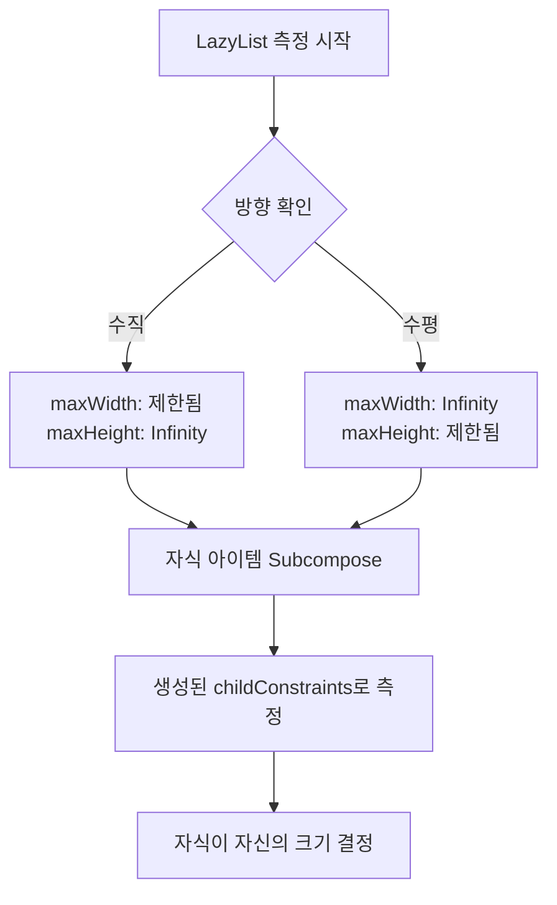
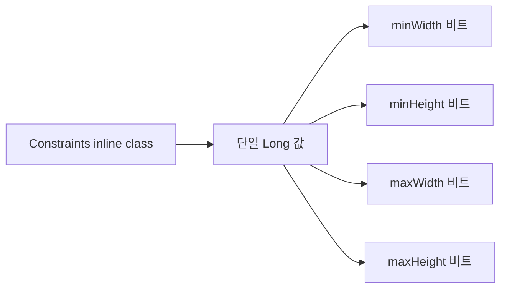

# 레이아웃 제약 조건 (Layout Constraints)

## 개요

**레이아웃 제약 조건(Constraints)** 은 부모 `LayoutNode` 또는 `Modifier`로부터 전달되며, 레이아웃이나 레이아웃 modifier가 자식 레이아웃을 측정하기 위해 사용합니다. 제약 조건은 **너비와 높이에 대한 최솟값과 최댓값**으로 제공받은 픽셀 단위의 범위로 정의되며, 측정된 자식 레이아웃은 이러한 제약 조건 내에 맞아야 합니다.

## 제약 조건의 구조

제약 조건은 다음과 같은 4가지 값으로 구성됩니다:

```kotlin
minWidth <= chosenWidth <= maxWidth
minHeight <= chosenHeight <= maxHeight
```

### 제약 조건 구성 요소

| 구성 요소 | 설명 |
|---------|------|
| `minWidth` | 허용되는 최소 너비 |
| `maxWidth` | 허용되는 최대 너비 |
| `minHeight` | 허용되는 최소 높이 |
| `maxHeight` | 허용되는 최대 높이 |

## 제약 조건의 전달 방식

대부분의 레이아웃은 자식에게 제약 조건을 전달할 때 다음 두 가지 방식 중 하나를 선택합니다:

1. **수정되지 않은 제약 조건 전달**: 부모로부터 받은 제약 조건을 그대로 전달
2. **최소 제약 조건 완화**: 최소 제약 조건을 0으로 설정하여 전달

`Box`는 후자의 대표적인 예시로, 측정 정책에서 최소 제약 조건을 완화하여 자식에게 전달합니다.

## 무한 제약 조건 (Infinity Constraints)

### 무한 제약 조건의 의미

부모 노드나 modifier는 자식에게 크기를 결정하도록 요청할 때 **무한한 `maxWidth` 또는 `maxHeight` 제약 조건**(`Constraints.Infinity`)을 전달할 수 있습니다. 이는 자식이 원하는 크기를 스스로 결정하라는 신호입니다.

### 예시: Box with fillMaxHeight

```kotlin
Box(Modifier.fillMaxHeight()) { 
  Text("test")
}
```

- **일반적인 경우**: Box는 사용 가능한 모든 높이를 채웁니다.
- **`LazyColumn` 내부**: 스크롤 가능하므로 자식에게 무한 높이 제약 조건을 전달합니다. 이 경우 Box는 무한대를 채우는 것이 의미가 없으므로, 대신 내용을 감싸고 Text의 높이만큼만 차지합니다.

> 핵심 레이아웃 컴포넌트들은 무한 제약 조건을 받을 때 자신의 내용을 감싸도록 크기를 조정하는 것이 일반적이지만, 궁극적으로는 레이아웃의 정의에 따라 달라집니다.

## LazyColumn의 무한 제약 조건 활용

`LazyColumn`은 무한 제약 조건을 사용하는 좋은 사례입니다. `LazyColumn`은 내부적으로 더 일반적인 레이아웃인 `LazyList`에 의존하며, `SubcomposeLayout`을 사용하여 자식을 측정합니다.

### Subcomposition의 필요성

**Subcomposition**은 사용 가능한 크기에 기반하여 아이템을 지연하여 구성해야 할 때 유용합니다. `LazyList`는 화면에 보이는 아이템들만 구성하며, 화면 크기를 기반으로 아이템들을 동적으로 구성합니다.

### LazyList의 제약 조건 생성

```kotlin
// LazyMeasuredItemProvider.kt
// The main axis is not restricted
val childConstraints = Constraints(
  maxWidth = if (isVertical) constraints.maxWidth else Constraints.Infinity,
  maxHeight = if (!isVertical) constraints.maxHeight else Constraints.Infinity
)
```



자식을 측정할 때마다 이러한 제약 조건이 사용됩니다:
1. 아이템의 내용을 `subcompose`합니다 (측정 단계 동안 발생)
2. Subcompose 결과는 보이는 자식들의 `measurable` 목록
3. 생성된 `childConstraints`를 사용하여 측정
4. 높이 제약 조건이 `Infinity`이므로 자식들은 자신의 높이를 자유롭게 선택 가능

## 정확한 크기 강제 (Fixed Size)

부모나 modifier가 정확한 크기를 강제하고자 할 때는 다음과 같이 설정합니다:

```kotlin
minWidth == maxWidth
minHeight == maxHeight
```

이는 자식이 정확히 그 크기에 맞추도록 강제합니다.

### 예시: LazyVerticalGrid (레거시)

> ⚠️ **주의**: 아래 내용은 2024년 3월 기준, 변경되어 사라진 내용입니다. `LazyVerticalGrid`는 더 이상 내부적으로 `LazyColumn`을 사용하지 않으며, `LazyLayout`을 사용하여 재구현되었습니다. ([변경 사항 확인](https://android-review.googlesource.com/c/platform/frameworks/support/+/2010612))

이전 `LazyVerticalGrid`는 동적인 아이템을 가지는 수직 그리드를 표시하기 위해 `LazyColumn`을 사용했으며, 각 행마다 여러 항목을 포함하는 `ItemRow`를 렌더링했습니다.

`ItemRow` 레이아웃은 열(컬럼) 수, 컬럼 크기, 항목 간 간격에 의해 결정되는 고정 너비로 각 자식을 측정했습니다:

```kotlin
// LazyGrid.kt
val width = span * columnSize + remainderUsed + spacing * (span - 1)
measurable.measure(Constraints.fixedWidth(width))
```

이는 다음과 같은 제약 조건을 생성합니다:

```kotlin
// Constraints.kt
Constraints(
  minWidth = width,
  maxWidth = width,
  minHeight = 0,
  maxHeight = Infinity
)
```

결과적으로 **너비는 고정**되고, **높이는 0과 무한대 사이**에서 변할 수 있습니다.

## 제약 조건의 내부 구조

제약 조건은 **inline 클래스**로 모델링되어 있으며, 4가지 제약 조건(`minWidth`, `minHeight`, `maxWidth`, `maxHeight`)을 **단일 `Long` 값**과 **비트 마스크**를 사용하여 효율적으로 표현합니다.



## 학습 추천

제약 조건의 다양한 사용 사례를 더 탐색하고 싶다면 다음을 추천합니다:

- **크기 관련 일반 레이아웃 modifier** 내부 구현 살펴보기
- **Compose UI 소스**에서 익숙한 Layout의 내부 들여다보기
- 측정(measuring)을 이해하는 데 매우 교훈적인 학습 자료가 됩니다

## 요약

- **레이아웃 제약 조건**은 부모가 자식 레이아웃의 크기 범위를 제한하기 위해 사용하는 `minWidth`, `maxWidth`, `minHeight`, `maxHeight`로 구성된 구조입니다.
- 대부분의 레이아웃은 제약 조건을 그대로 전달하거나 최소 제약 조건을 0으로 완화하여 전달합니다.
- **무한 제약 조건**(`Constraints.Infinity`)은 자식이 원하는 크기를 스스로 결정하도록 허용할 때 사용되며, `LazyColumn`과 같은 스크롤 가능한 레이아웃에서 흔히 볼 수 있습니다.
- **정확한 크기 강제**는 `minWidth == maxWidth` 및 `minHeight == maxHeight`로 설정하여 자식이 특정 크기에 맞추도록 합니다.
- `LazyList`는 `SubcomposeLayout`을 활용하여 화면에 보이는 아이템만 동적으로 구성하고 측정하며, 메인 축에 대해 무한 제약 조건을 사용합니다.
- 제약 조건은 성능 최적화를 위해 inline 클래스와 비트 마스크를 사용하여 단일 Long 값으로 효율적으로 저장됩니다.
