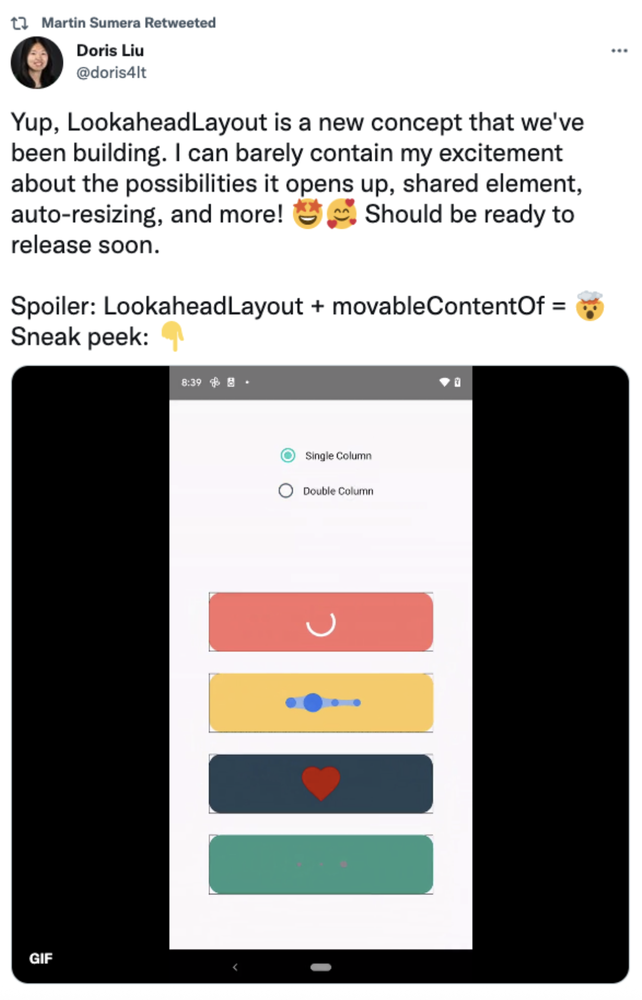
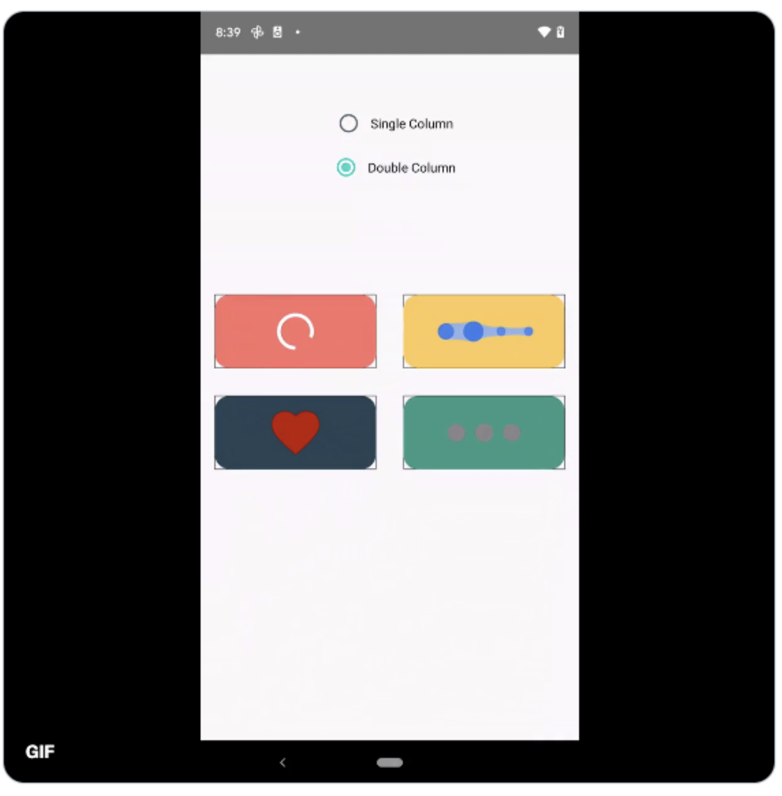
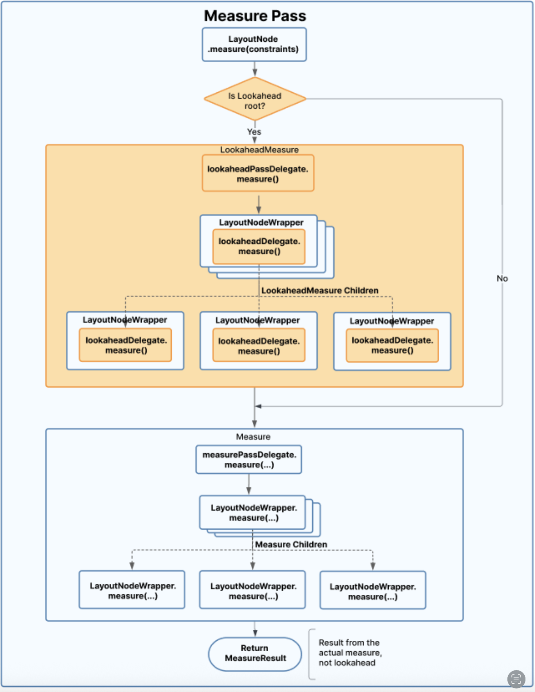
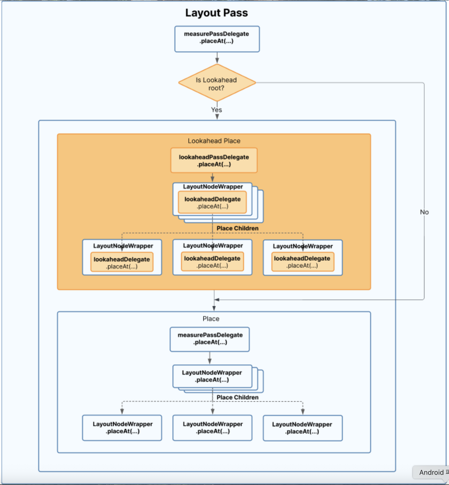

# LookaheadLayout

## 개요

> **Lookahead**라는 용어는 **미리 보기**, **선제적 계산**, 또는 **예측하는 행위**를 의미하는 맥락으로 이해하시면 됩니다.

### 중요 공지

> ⚠️ `LookaheadLayout`과 `LookaheadLayoutScope`는 **Compose 1.6**에서 `LookaheadScope`로 완전히 대체되었습니다. 이 변경 사항에 대한 초기 제안이 담긴 [commit 링크](https://cs.android.com/androidx/platform/frameworks/support/+/fe1c0879d8a72e11a6d2d6662c6c69d64c18fd56)를 첨부합니다. 본 섹션은 원저자의 `LookaheadLayout`에 대한 설명을 그대로 번역해서 싣지만, 최신 버전에선 `LookaheadScope`로 대체되었다는 점을 유념해 주세요.

`LookaheadLayout`을 여기서 소개하는 것은 매우 자연스러운데, 이것은 **Compose에서의 측정과 배치에 전적으로 관련**되어 있기 때문입니다. Doris Liu가 이를 소개하고 공유 요소 전환의 몇 가지 예를 보여주는 멋진 애니메이션을 공유한 [이 트윗](https://x.com/doris4lt/status/1531364543305175041)을 아마도 기억하고 계실 것입니다.



안타깝게도 우리는 정적인 책에서 애니메이션을 경험할 수 없어 설명을 보태자면, 위의 라디오 버튼을 사용하여 두 가지 다른 화면 상태 사이를 전환할 때 요소들이 애니메이션 됩니다. 아래 이미지에서 2개의 열로 전환한 후의 모습을 볼 수 있습니다. 검은색 사각형은 각 공유 요소의 크기와 위치에 따른 애니메이션 대상을 나타냅니다.



### 기본 예제: SmartBox

실제 코드를 사용한 예를 살펴보겠습니다. 클릭 시 변경되는 가변 상태를 기반으로 `Row`와 `Column` 레이아웃을 전환하는 `SmartBox` Composable을 상상해 보세요.

```kotlin
@Composable
fun SmartBox() {
  var vertical by remember { mutableStateOf(false) }
  
  Box(Modifier.clickable { vertical = !vertical }) {
    if (vertical) {
      Column {
        Text("Text 1")
        Text("Text 2")
      }
    } else {
      Row {
        Text("Text 1")
        Text("Text 2")
      }
    }
  }
}
```

두 상태 사이의 텍스트들은 완전히 동일하기 때문에 이상적으로는 **공유 요소(shared element)** 가 되어야 합니다. 또한, 그들을 쉽게 애니메이션 할 수 있는 방법이 있으면 좋을 것입니다(현재는 즉시 변경됩니다). 그에 더하여, 애니메이션 중/후에 그들의 상태를 잃지 않고 재사용할 수 있도록 [`movableContentOf`](https://developer.android.com/reference/kotlin/androidx/compose/runtime/package-summary#movableContentOf(kotlin.Function0))를 사용하는 것도 좋을 것입니다.

### 화면 전환 예제: TvShowApp

위의 예제에서 더 확장한 버전은 가변 상태를 기반으로 앱 내에서 두 Composable 화면 간 탐색하는 것입니다. 아래 예제는 앱에 단지 두 화면만 있는 것이 아니라는 점에서 다소 단순하긴 하지만, 이 상황에 대한 예시로는 충분할 것입니다.

```kotlin
@Composable
fun TvShowApp() {
  var listScreen by remember { mutableStateOf(true) }
  
  Box(Modifier.clickable { listScreen = !listScreen }) {
    if (listScreen) {
      CharacterList()
    } else {
      Detail()
    }
  }
}
```

이 두 화면은 **공유 요소**를 포함할 수도 있으므로, `CharacterList` 내의 캐릭터 행을 클릭했을 때 그 요소들이 애니메이션 됩니다. 아마도 캐릭터 이미지나 전체 캐릭터 행일 수 있습니다. 이 시나리오에서는 각 서브 트리가 몇 개의 텍스트보다 훨씬 복잡할 가능성이 높은데, 완전한 화면을 대표하기 때문입니다. 

전환을 애니메이션 하기 위해서 애니메이션 대상으로 몇 가지 **매직 넘버**를 설정해야 할 수도 있습니다. 목적지 화면에서 모든 공유 요소의 최종 위치와 크기를 알 수 있기 때문인데, 이는 이상적이지 않습니다. **이상적으로는 Compose UI가 사전에 새로운 크기와 위치를 미리 계산하여 그 정보를 제공할 수 있어야 하며**, 우리는 매직 넘버 보다는 그 정보를 사용하여 애니메이션 대상을 설정할 수 있어야 합니다. 여기서 `LookaheadLayout`이 중요한 역할을 합니다.

### LookaheadLayout의 핵심 개념

> `LookaheadLayout`은 변경될 때 **직접적이거나 간접적인 자식들의 새로운 크기와 위치를 미리 계산**할 수 있습니다. `LookaheadLayout`은 각 자식에게 그 측정/배치 단계에서 미리 계산된 값을 관찰(observe)할 수 있도록 하며, 이러한 값을 사용하여 **시간이 지남에 따라 점진적으로 변화하도록 자신의 크기와 위치를 재조정**할 수 있도록 합니다(이것이 애니메이션 효과를 생성합니다). 위 예제에서의 공유 요소 전환에서, 각 공유 요소는 이전할 화면에서 자신의 최종 크기와 위치가 어떻게 될지를 관찰하고, 그 값을 사용하여 자신을 애니메이션 합니다. 다른 예로는 **형태 변환(morph) 애니메이션**을 들 수 있습니다.


## 레이아웃을 사전 계산하는 방법으로서의 LookaheadLayout

잠시 물러나서 생각해 보면, Jetpack Compose에서 `SubcomposeLayout`(Subcomposition)과 **고유 크기 측정(intrinsics)** 같은 것들과 함께 `LookaheadLayout`을 레이아웃을 사전 계산하는 또 다른 방법으로 생각할 수 있습니다. 그러나 세 가지 사이에는 명확히 해야 할 중요한 차이점이 있습니다.

### 사전 계산 방법 비교

| 방법 | 설명 | 특징 |
|------|------|------|
| **SubcomposeLayout** | 측정 시간까지 composition을 지연시켜, 사용할 수 있는 크기를 활용하여 어떤 노드/서브 트리를 구축할지 결정 | - 조건부 composition에 초점<br>- 측정/배치 단계보다 비용이 많이 듦<br>- 레이아웃 사전 계산에는 비추천 |
| **고유 크기 측정(Intrinsics)** | Subcomposition보다 효율적이며, 내부적으로 LookaheadLayout과 유사하게 작동 | - 같은 프레임 내에서 다른 제약 조건으로 측정 람다 호출<br>- 잠정적인 계산 (예: 3개 자식 중 최대 높이 계산)<br>- 실제 측정을 위한 준비 단계 |
| **LookaheadLayout** | 자동 애니메이션을 지원하기 위해 자식의 크기와 위치를 정확하게 사전 계산 | - 측정뿐만 아니라 배치(placement) 계산도 수행<br>- 공격적인 캐싱 (트리 변경 시에만 재계산)<br>- `LookaheadDelegate`가 결과를 캐싱<br>- 사용자가 제약 조건을 조작할 수 없음 |

## LookaheadLayout의 동작 원리

실제로 동작하는 원리를 들여다보자면, `LookaheadLayout`은 **측정과 배치에 대한 사전 단계**를 수행하여 "일반" 측정/배치 단계 동안 미리 계산된 값을 사용하여 프레임마다 노드를 업데이트할 수 있게 합니다. 이 사전 단계는 **트리가 변경되었거나 State 변경의 결과로 레이아웃이 변경될 때만** 발생합니다.

### 사전 단계(Lookahead Pass)의 특징

- 사전 단계가 수행될 때, **레이아웃 애니메이션은 무시**됩니다
- 측정과 배치는 **애니메이션이 이미 완료된 것처럼** 수행됩니다
- 미래에는 모든 레이아웃 애니메이션 API가 설계에 따라 사전 단계 동안 자동으로 건너뛰도록 업데이트될 것입니다
- `LookaheadLayout`의 직접적이거나 간접적인 모든 자식에 대해 작동합니다

### LookaheadLayoutScope와 제공 Modifier

미리 계산된 데이터를 사용할 수 있도록 하기 위해, `LookaheadLayout`은 그것의 content 람다를 `LookaheadLayoutScope` 내에서 실행하는데, 이를 통해 자식들은 몇 가지 modifier를 사용할 수 있습니다.

> ⚠️ 섹션 앞부분에서 `LookaheadLayout`이 deprecate 되었다고 설명해 드렸는데, `Modifier.intermediateLayout`, `Modifier.onPlaced` 두 가지 모두 deprecate 되었습니다. `Modifier.intermediateLayout`는 **`Modifier.approachLayout`** 이라는 modifier로 대체되었습니다. `Modifier.onPlaced`는 삭제되었습니다.

#### Modifier.intermediateLayout (deprecated)

- modifier가 있는 레이아웃이 **다시 측정될 때마다 호출**됩니다
- 레이아웃의 **새로운 선제적(미리 계산된) 크기에 접근**할 수 있게 합니다
- 그 크기(목표 크기)를 기반으로 **예상되는 중간 레이아웃을 생성**합니다

#### Modifier.onPlaced (deprecated)

- modifier가 있는 레이아웃의 **재배치(re-layout)시에 호출**됩니다
- 자식이 부모를 기반으로 **자신의 배치를 조정**할 수 있게 합니다
- `LookaheadLayout`과 modifier 자체에 대한 **선제적으로 계산된 좌표에 접근**을 제공합니다
- 부모에 대한 **선제적 위치와 현재 위치를 모두 계산**할 수 있게 합니다
- 이러한 값들은 중간 레이아웃을 생성할 때 레이아웃 위치를 애니메이션 하기 위해 `intermediateLayout`에서 저장되고 사용될 수 있습니다


### 사용자 정의 Modifier 예제

이 두 modifier는 일반 측정/배치 단계 동안 실행되므로, 그들의 람다에 제공된 사전 계산 정보를 사용하여 목푯값으로 레이아웃의 크기와 위치를 변경할 수 있습니다. 개발자들은 이 두 기능을 기반으로 사용자 정의 애니메이션을 생성하기 위해 사용자 정의 modifier를 구축할 것입니다. 

다음은 선제적 크기를 기반으로 자식을 측정하는 데 사용되는 제약 조건을 애니메이션 하는 사용자 정의 modifier의 예입니다.

> 📝 아래 샘플 코드 역시, 초기 `LookaheadLayout`을 기반으로 한 샘플 코드입니다. 최신 샘플 코드는 [여기](https://cs.android.com/androidx/platform/frameworks/support/+/androidx-main:compose/ui/ui/samples/src/main/java/androidx/compose/ui/samples/LookaheadScopeSample.kt)를 확인해 주세요.

```kotlin
fun Modifier.animateConstraints(lookaheadScope: LookaheadLayoutScope) = 
  composed {
    var sizeAnimation: Animatable<IntSize, AnimationVector2D>? by remember {
      mutableStateOf(null)
    }
    var targetSize: IntSize? by remember { mutableStateOf(null) }
    LaunchedEffect(Unit) {
      snapshotFlow { targetSize }.collect { target ->
        if (target != null && target != sizeAnimation?.targetValue) {
          sizeAnimation?.run {
            launch { animateTo(target) }
          } ?: Animatable(target, IntSize.VectorConverter).let {
            sizeAnimation = it
          }
        }
      }
    }
    
    with(lookaheadScope) {
      this@composed.intermediateLayout { measurable, _, lookaheadSize ->
        targetSize = lookaheadSize
        val (width, height) = sizeAnimation?.value ?: lookaheadSize
        val animatedConstraints = Constraints.fixed(width, height)
        
        val placeable = measurable.measure(animatedConstraints)
        layout(placeable.width, placeable.height) {
          placeable.place(0, 0)
        }
      }
    }
  }
```

#### 코드 설명

1. **크기 애니메이션 생성**: 크기(너비/높이)를 애니메이션 하기 위한 `Animatable`을 생성합니다. 레이아웃이 변경될 때마다 애니메이션이 재시작됩니다(`snapshotFlow` 참조).

2. **LaunchedEffect 사용**: 이 애니메이션은 `LaunchedEffect` 내에서 실행되어 측정/레이아웃 단계에서(이 modifier가 실행될 때) 제어되지 않는 사이드 이펙트가 발생하는 것을 방지합니다.

3. **lookaheadSize 활용**: 미리 계산된 `lookaheadSize`는 `intermediateLayout` 람다에서 사용 가능하며 변경될 때 애니메이션을 트리거하기 위해 `targetSize`를 `lookaheadSize`로 설정합니다.

4. **점진적 크기 변경**: `lookaheadSize`는 자식들을 측정하는 데 사용되며, 이를 통해 자식들은 점차 크기를 변경할 수 있습니다. 이는 **프레임마다** 크기 애니메이션값을 따르는 새로운 고정 제약 조건을 생성함으로써 이루어지며, 시간이 지남에 따라 최종적인 애니메이션 효과를 만듭니다.

> 💡 `intermediateLayout`에서의 람다는 사전 단계 동안 건너뛰어집니다. 이 modifier는 이런 사전 단계에 대한 중간 상태를 생성하는 데 사용되기 때문입니다.


### LookaheadLayout 사용 예제

제약 조건을 애니메이션 하기 위한 사용자 정의 modifier를 가지게 되면, 해당 modifier를 그 어떤 `LookaheadLayout`에서든 사용할 수 있습니다. 아래의 공식 소스에서 발췌한 예시를 통해 살펴볼 수 있습니다.

> 📝 아래 샘플 코드는 마찬가지로 deprecate 된 부분이 있어 완전히 일치하지 않지만, 맥락을 이해하기엔 큰 차이가 없어 보입니다. 현재 버전(1.6)에 맞는 샘플 코드는 [ApproachLayoutSample](https://cs.android.com/androidx/platform/frameworks/support/+/androidx-main:compose/ui/ui/samples/src/main/java/androidx/compose/ui/samples/LookaheadScopeSample.kt)에서 확인하실 수 있습니다.

```kotlin
LookaheadLayout(
  content = {
    var fullWidth by remember { mutableStateOf(false) }
    Row(
      (if (fullWidth) Modifier.fillMaxWidth() else Modifier.width(100.dp))
        .height(200.dp)
        .animateConstraints(this@LookaheadLayout)
        .clickable { fullWidth = !fullWidth }) {
          Box(
            Modifier
              .weight(1f)
              .fillMaxHeight()
              .background(Color.Red)
          )
          Box(
            Modifier
              .weight(2f)
              .fillMaxHeight()
              .background(Color.Yellow)
          )
        }
      }
    ) { measurables, constraints ->
      val placeables = measurables.map { it.measure(constraints) }
      val maxWidth: Int = placeables.maxOf { it.width }
      val maxHeight = placeables.maxOf { it.height }

      layout(maxWidth, maxHeight) {
        placeables.forEach {
          it.place(0, 0)
        }
      }
    }
```

#### 코드 설명

1. **가변 상태**: 가변 상태를 사용하여 `Row`를 "전체 너비"와 "짧은 너비" 사이에서 전환합니다.

2. **크기 애니메이션**: `Row` 레이아웃 변경은 이전 스니펫에서 `animateConstraints` 사용자 정의 modifier를 사용하여 애니메이션 됩니다. 가변 상태가 전환될 때마다 `Row`의 너비가 변경되고 이는 새로운 선제적 사전 계산(lookahead pre-calculation) 및 애니메이션을 트리거합니다.

3. **레이아웃 측정**: 모든 자식이 안에 들어갈 수 있도록 `LookaheadLayout`을 측정하는 데 모든 자식들 사이의 **최대 너비와 최대 높이**가 사용됩니다.

4. **배치**: 모든 자식은 `0,0`에 배치됩니다.

이는 레이아웃이 변경될 때마다 멋진 애니메이션을 자동으로 생성합니다. 이는 **사전 계산된 선제적 크기를 기반으로 한 크기 변경 애니메이션**의 좋은 예시입니다. 

### 위치(Position) 애니메이션 예제

이제 선제적 위치에 대해서는 어떨까요? 앞서 언급했듯이, `LookaheadLayoutScope`에서도 `Modifier.onPlaced`를 사용할 수 있습니다. `onPlaced` modifier는 부모를 기반으로 자식의 배치(위치)를 조정하기 위해 존재합니다. 이는 부모에 대한 레이아웃의 선제적 위치와 현재 위치를 모두 계산할 수 있는 충분한 데이터를 제공합니다. 그런 다음 이를 변수에 저장하고 `intermediateLayout`에 대한 후속 호출에서 사용하여 선제적 측정값에 따라 레이아웃을 재배치할 수 있습니다.

다음은 이의 예시이며, 공식 소스에서 발췌되었습니다. 이 예시에서는 **레이아웃이 변경될 때 수정된 레이아웃의 로컬 위치를 애니메이션** 합니다.

> 📝 아래 샘플 코드는 마찬가지로 deprecate 된 부분이 있어 완전히 일치하지 않습니다. 현재 버전(1.6)에 맞는 샘플 코드는 [LookaheadLayoutCoordinatesSample](https://cs.android.com/androidx/platform/frameworks/support/+/androidx-main:compose/ui/ui/samples/src/main/java/androidx/compose/ui/samples/LookaheadScopeSample.kt)에서 확인하실 수 있습니다.

```kotlin
fun Modifier.animatePlacementInScope(lookaheadScope: LookaheadLayoutScope) = 
  composed {
    var offsetAnimation: Animatable<IntOffset, AnimationVector2D>? by remember {
      mutableStateOf(null)
    }

    var placementOffset: IntOffset by remember { mutableStateOf(IntOffset.Zero) }
    var targetOffset: IntOffset? by remember { mutableStateOf(null) }
    LaunchedEffect(Unit) {
      snapshotFlow {
        targetOffset
      }.collect { target ->
        if (target != null && target != offsetAnimation?.targetValue) {
          offsetAnimation?.run {
            launch { animateTo(target) }
          } ?: Animatable(target, IntOffset.VectorConverter).let {
            offsetAnimation = it
          }
        }
      }
    }
    
    with(lookaheadScope) {
      this@composed.onPlaced { lookaheadScopeCoordinates, layoutCoordinates ->
        // the *target* position of this modifier in local coordinates.
        targetOffset = lookaheadScopeCoordinates.localLookaheadPositionOf(
          layoutCoordinates
        ).round()
        
        // the *current* position of this modifier in local coordinates.
        placementOffset = lookaheadScopeCoordinates.localPositionOf(
          layoutCoordinates, Offset.Zero
        ).round()
      }
      .intermediateLayout { measurable, constraints, _ ->
        val placeable = measurable.measure(constraints)
        layout(placeable.width, placeable.height) {
          val (x, y) = offsetAnimation?.run { value - placementOffset }
            ?: (targetOffset!! - placementOffset)
          placeable.place(x, y)
        }
      }
    }
  }
```

#### 코드 설명

1. **오프셋 애니메이션**: 위치에 대한 오프셋 애니메이션이 사용됩니다. 이는 부모에 대한 상대적인 오프셋을 애니메이션 합니다.

2. **LaunchedEffect 사용**: 이 애니메이션은 `LaunchedEffect` 내에서 실행되어, 이 modifier가 실행될 때 측정/배치 단계에서 의도치 않은 사이드 이펙트가 발생하는 것을 방지합니다.

3. **좌표 계산**: `lookaheadScopeCoordinates`와 `layoutCoordinates`를 `onPlaced` 람다에서 사용할 수 있습니다. 전자는 `LookaheadLayout` 자체의 선제적 위치 좌표에 해당하고, 후자는 이 자식 레이아웃의 선제적 위치 좌표를 제공합니다. 이 값들은 현재 및 목표 오프셋을 로컬 좌표에서 계산하는 데 사용됩니다.

4. **위치 업데이트**: 계산된 오프셋은 최종적으로 `intermediateLayout`에서 레이아웃 위치를 적절히 업데이트하는 데 사용됩니다(`placeable.place(x, y)` 참조).

사용자 정의 modifier가 준비되면, 이전 예제에서와 같은 방식으로 `LookaheadLayout`의 모든 (직접적 또는 간접적) 자식에 대해 사용할 수 있습니다.

## LookaheadLayout의 내부 동작

이제 `LookaheadLayout`이 무엇이고 어떻게 작동하는지에 대한 이해를 했으니, 그 내부를 알아볼 준비가 되었습니다. 그리고 이를 이해하는 가장 좋은 방법은 몇 가지 다이어그램을 통해서입니다.

이 섹션에서 보여줄 다이어그램들은 **Google Jetpack Compose 팀의 Doris Liu**에 의해 제공되었습니다. 이 다이어그램들은 초기 측정 및 배치 단계 동안에 **선제적 측정과 선제적 배치(주황색으로 표시됨)** 를 포함하여 어떤 일이 발생하는지 보여줍니다.

### 측정 단계 (Measure Pass)

측정 단계부터 시작해 봅시다.



#### 측정 단계 동작 순서

1. **선제적 측정 확인**: `LayoutNode`가 처음 측정되어야 할 때(예: 막 연결되었을 때), 선제적 측정 단계(`LookaheadLayout` 서브 트리에만 실행)를 먼저 시작하기 위해 `LookaheadLayout`의 루트에 배치되었는지 확인합니다.

2. **LookaheadPassDelegate 호출**: `LayoutNode`는 선제적 측정 단계를 시작하기 위해 `LookaheadPassDelegate#measure()`를 호출합니다. 이 delegate는 노드에 대하여 들어오는 모든 선제적 측정/배치 요청을 처리합니다. 이 호출은 외부 `LayoutNodeWrapper`(보통 노드를 측정하는 데 사용되는)의 `LookaheadDelegate`를 사용해 선제적 측정을 실행합니다.

3. **LayoutNodeWrapper 체인**: `LayoutNodeWrapper`의 체인에 대해 배울 수 있었던 Compose의 측정에 관한 그래픽을 돌아봅시다. 
   - 외부 래퍼가 현재 노드를 측정
   - 첫 번째 modifier 래퍼를 감쌈
   - 두 번째 modifier 래퍼를 감싸는 식으로 연달아 modifier들이 래핑되고 체인됨
   - 체인의 마지막 modifier는 자식들을 측정하는 데 사용되는 내부 `LayoutNodeWrapper`를 래핑(그들의 외부 래퍼를 통해)
   - 선제적 측정을 할 때도 같은 방식으로 진행되는데, "일반" 측정을 수행하는 대신, 모든 단계에서 `LookaheadDelegate`를 통해 선제적 측정이 실행됩니다.

4. **일반 측정 단계**: 루트 노드와 그 모든 직접적 또는 간접적 자식들에 대한 선제적 측정이 완료되거나, 노드가 `LookaheadLayout`의 루트가 아닌 경우, "일반" 측정 단계가 실행됩니다.

5. **MeasurePassDelegate 사용**: 측정 과정은 조금 전 설명한 것을 기본적으로 따릅니다. 유일한 차이점은 이제 실제 측정을 수행할 시간이기 때문에, `LookaheadPassDelegate` 대신 모든 단계에서 **`MeasurePassDelegate`가 사용**된다는 것입니다.

### 배치 단계 (Placement Pass)

이제 배치 단계를 살펴보겠습니다.



#### 배치 단계 특징

배치 단계도 측정 단계와 크게 다르지 않습니다. 이미 측정 단계에 관해 설명한 것과 정확히 같으며, 같은 delegate가 사용됩니다. 

**유일한 차이점은 `placeAt(...)`을 호출하는 목적**이 다르다는 것입니다:

- **일반 배치 단계**: 노드와 그 자식들을 배치하기 위한 것
- **선제적 배치 단계**: 선제적 위치를 계산하기 위한 것

### 재측정/재배치 최적화

지금까지 우리는 처음 측정/배치되는 노드에 초점을 맞췄습니다. 다른 한편으로, `LayoutNode`가 재측정/재배치가 필요한 경우(예: 내용이 변경된 경우), 타이밍은 조금 다릅니다. 

**측정/배치와 선제적 계산의 무효화는 가능한 한 무효화 범위를 줄이기 위해 최적화됩니다.** 그 방식으로, 트리에서의 변경에 영향을 받지 않는 `LayoutNode`들은 무효화되지 않습니다. 이런 동작 덕분에 트리에 변경 사항이 생겼을 때, `LookaheadLayout`의 서브 트리의 **(작은) 일부분만 무효화** 되는 것이 가능해졌습니다.


## 추가 정보

### LookaheadScope 상속

- 새로운 `LayoutNode`가 추가되면, **트리에서 가장 바깥쪽에 존재하는 `LookaheadScope`를 상속**받습니다
- 따라서 `LookaheadLayout`의 모든 직접적 또는 간접적인 자식들은 **동일한 `LookaheadScope`를 공유**할 수 있습니다
- 이는 **중첩된 `LookaheadLayout`이 지원**되기 때문입니다
- Compose UI는 또한 모든 것에 대해 **단일 선제적 계산 단계(lookahead pass)를 보장**합니다

### movableContent와의 조합

`LookaheadLayout`은 **애니메이션 하는 동안 Composable들의 상태를 유지**하기 위해 `movableContentOf` 및 `movableContentWithReceiverOf`를 함께 활용할 수 있습니다.

### 버전 정보

- `LookaheadLayout`은 Compose 1.3에서 출시되었습니다
- 번역 시점(2024년 1분기) 기준으로 Compose의 최신 버전은 1.6입니다

> ⚠️ **중요**: 앞서 계속 언급했듯이, 이 섹션은 deprecate 된 용어와 코드들을 담고 있습니다. 초기 `LookaheadLayout`가 제공하고자 했던 **가치와 동작 원리를 이해하는 것은 새로운 interface인 `LookaheadScope`, `Modifier.approachLayout` 같은 것들을 활용하는 데 도움이 될 것입니다.**

## 요약

- `LookaheadLayout`은 **레이아웃 변경 시 자식들의 새로운 크기와 위치를 미리 계산**하여 부드러운 애니메이션을 제공하는 Compose UI 구성 요소입니다
- **Compose 1.6**에서 `LookaheadScope`로 대체되었으며, 관련 Modifier들도 `Modifier.approachLayout` 등으로 변경되었습니다
- **공유 요소(Shared Element) 전환**, **화면 간 애니메이션**, **레이아웃 크기/위치 변경 애니메이션** 등에 활용됩니다
- **레이아웃 사전 계산 방법** 비교: `SubcomposeLayout`은 조건부 composition에, `Intrinsics`는 잠정적 계산에, `LookaheadLayout`은 자동 애니메이션에 최적화되어 있습니다
- **동작 원리**: 측정/배치 전에 **사전 단계(Lookahead Pass)** 를 수행하여 최종 크기와 위치를 미리 계산하고, 일반 단계에서는 이를 바탕으로 점진적으로 애니메이션합니다
- **제공 Modifier** (deprecated):
  - `Modifier.intermediateLayout`: 미리 계산된 크기를 기반으로 중간 레이아웃 생성 (→ `Modifier.approachLayout`으로 대체)
  - `Modifier.onPlaced`: 선제적 위치를 계산하여 배치 조정 (→ 삭제됨)
- **내부 구조**: `LookaheadPassDelegate`와 `MeasurePassDelegate`를 통해 선제적 측정/배치와 일반 측정/배치를 분리 실행합니다
- **최적화**: 트리 변경 시에만 재계산하며, `LookaheadDelegate`가 결과를 캐싱하여 성능을 개선합니다
- **movableContent**와 함께 사용하면 애니메이션 중에도 Composable의 상태를 유지할 수 있습니다
- 초기 `LookaheadLayout`의 개념을 이해하면 최신 버전의 `LookaheadScope`와 관련 API를 더 효과적으로 활용할 수 있습니다