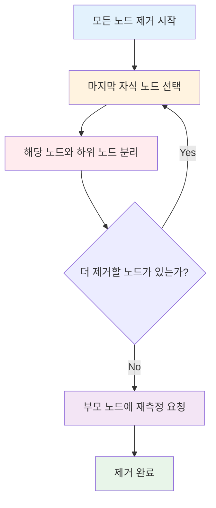
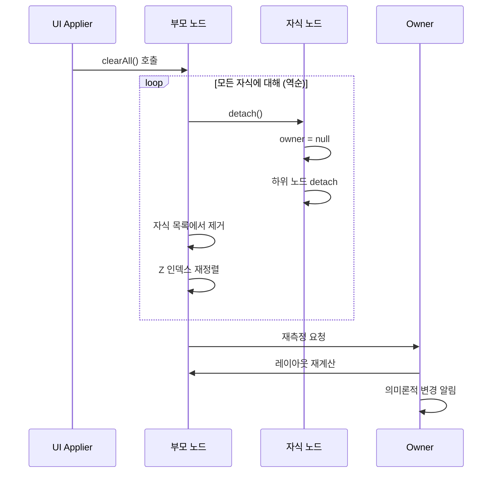
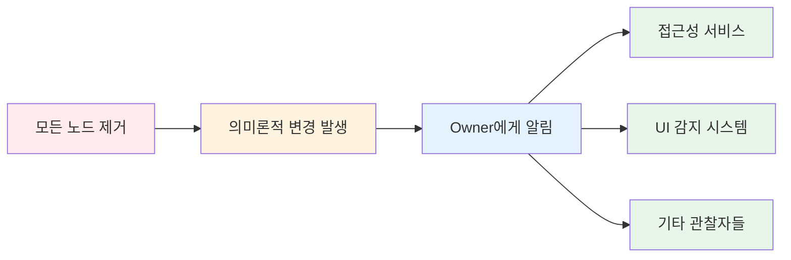
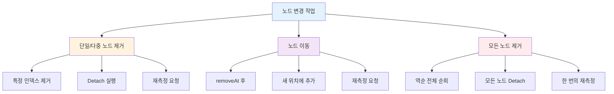

# 모든 노드를 지우는 변경 사항 구체화 (Materializing a change to clear all the nodes)

## 개요

모든 노드를 지우는 작업은 **여러 노드를 제거하는 것과 동일한 메커니즘**을 사용합니다. Compose UI에서 모든 자식 노드를 제거할 때, 시스템은 효율적이고 안전한 방식으로 각 노드를 순차적으로 제거합니다.

## 모든 노드 제거 프로세스

### 기본 동작 방식

모든 노드를 제거하는 작업은 다음과 같은 프로세스를 따릅니다:

1. **마지막 노드부터 시작**하여 순회
2. **모든 자식 노드를 차례로 분리**
3. **부모 노드에게 재측정 요청**



## 세부 프로세스

### 1. 역순 순회 (마지막 노드부터)

모든 노드를 제거할 때 **역순으로 순회**하는 이유:

- **인덱스 안정성**: 앞에서부터 제거하면 인덱스가 계속 변경되어 혼란 발생
- **효율적인 메모리 관리**: 뒤에서부터 제거하면 리스트 재정렬 비용 감소
- **안전한 작업 보장**: 예상치 못한 인덱스 에러 방지

```kotlin
// 개념적 구현 예시
fun clearAllNodes() {
    val count = childNodes.size
    // 마지막부터 제거
    for (i in count - 1 downTo 0) {
        removeAt(i)
    }
}
```

### 2. 노드 분리 (Detach)

각 노드를 제거할 때 수행되는 작업:

| 단계 | 작업 내용 | 목적 |
|-----|---------|-----|
| **1. 자식 목록에서 제거** | 부모의 자식 리스트에서 해당 노드 제거 | 논리적 연결 해제 |
| **2. Z 인덱스 재정렬** | 화면 표시 순서 목록 업데이트 | 올바른 렌더링 순서 유지 |
| **3. Owner 참조 제거** | 노드의 `owner` 참조를 `null`로 설정 | 메모리 누수 방지 |
| **4. 하위 노드 분리** | 모든 하위 노드에 대해 재귀적으로 분리 | 완전한 트리 정리 |

### 3. 부모 노드 재측정 요청

모든 자식이 제거되면:

- 부모 노드에게 **재측정(remeasure)** 요청
- 레이아웃 재계산 필요성 알림
- UI 업데이트 트리거



## 핵심 개념

### Detach vs Remove

- **Detach**: 노드를 트리에서 논리적으로 분리하는 작업 (owner 참조 해제)
- **Remove**: 노드를 부모의 자식 목록에서 물리적으로 제거하는 작업

### 의미론적(Semantics) 변경 알림

모든 노드 제거는 **의미론적 변경**을 발생시킵니다:

- **접근성(Accessibility) 서비스**에 알림
- **UI 구조 변경** 감지 시스템에 통지
- **화면 리더**와 같은 보조 기술 업데이트



## 다른 작업과의 비교

### 단일 노드 제거 vs 모든 노드 제거

| 특성 | 단일 노드 제거 | 모든 노드 제거 |
|-----|-------------|-------------|
| **순회 방식** | 특정 인덱스 제거 | **역순 전체 순회** |
| **재측정 빈도** | 제거 시마다 요청 | **한 번만 요청** |
| **성능** | 개별 작업 | **배치 최적화** |
| **의미론적 알림** | 각각 알림 | **한 번만 알림** |

### 제거 vs 이동 vs 모든 노드 제거



## 최적화 포인트

### 배치 처리의 장점

모든 노드를 한 번에 제거할 때의 이점:

1. **재측정 최적화**: 여러 번 재측정하지 않고 마지막에 한 번만 수행
2. **의미론적 알림 최적화**: 각 노드마다 알림을 보내지 않음
3. **Z 인덱스 재정렬 최적화**: 최종 상태로 한 번에 업데이트

```kotlin
// 비효율적인 방법 (개별 제거)
for (child in children) {
    removeChild(child)  // 매번 재측정, 매번 알림
}

// 효율적인 방법 (배치 제거)
clearAllNodes()  // 한 번의 재측정, 한 번의 알림
```

## 실제 사용 사례

### 화면 전환 시

```kotlin
// Composable이 완전히 제거될 때
@Composable
fun Screen() {
    if (shouldShowContent) {
        Content()  // 모든 자식 노드 포함
    }
    // shouldShowContent가 false가 되면
    // Content()의 모든 노드가 제거됨
}
```

### 리스트 초기화

```kotlin
// LazyColumn의 모든 아이템 제거
@Composable
fun ItemList(items: List<Item>) {
    LazyColumn {
        items(items) { item ->
            ItemRow(item)
        }
    }
    // items가 빈 리스트가 되면 모든 노드 제거
}
```

## 요약

- **모든 노드 제거**는 여러 노드를 제거하는 것과 동일한 메커니즘을 사용하며, 마지막 노드부터 시작하여 역순으로 순회합니다
- 역순 순회를 통해 **인덱스 안정성을 보장**하고 효율적인 메모리 관리가 가능합니다
- 각 노드 제거 시 **Detach 프로세스**가 실행되어 자식 목록 제거, Z 인덱스 재정렬, owner 참조 해제, 하위 노드 분리 작업이 수행됩니다
- 모든 자식 제거 완료 후 부모 노드에게 **한 번의 재측정만 요청**하여 성능을 최적화합니다
- **의미론적 변경 알림**을 통해 접근성 서비스와 UI 감지 시스템에 변경 사항을 전달합니다
- 배치 처리 방식으로 재측정, 의미론적 알림, Z 인덱스 재정렬을 최적화하여 개별 제거보다 효율적입니다
- 화면 전환이나 리스트 초기화 같은 시나리오에서 모든 노드를 안전하고 효율적으로 제거할 수 있습니다
