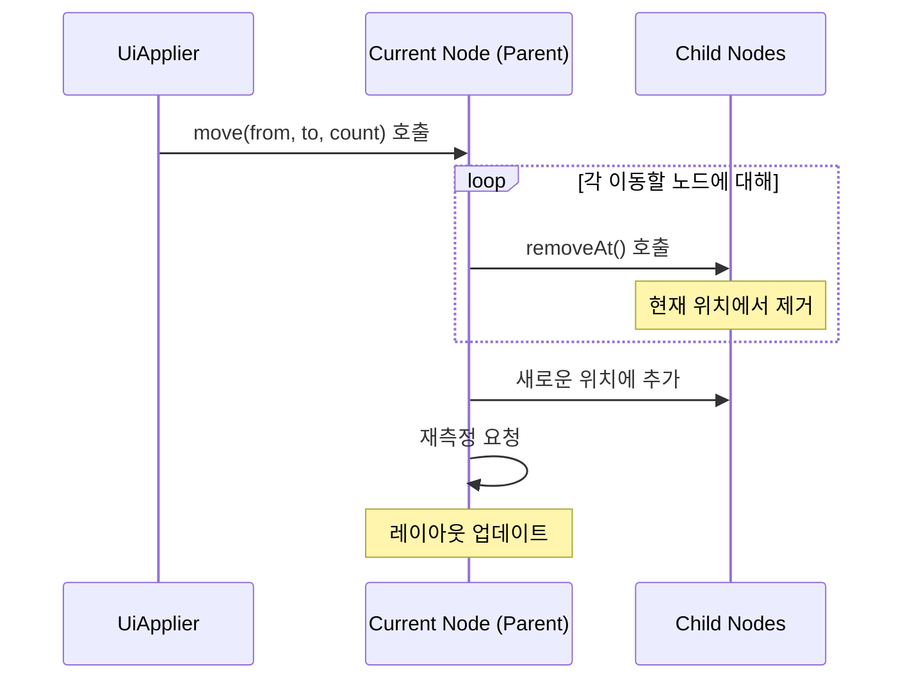

# 노드 이동을 위한 변경 사항 구체화 (Materializing a change to move nodes)

## 개요

노드를 이동한다는 것은 **자식 노드들의 순서를 재배치**하는 것을 의미합니다. Compose UI에서 노드 이동은 `UiApplier`를 통해 수행되며, 여러 단계를 거쳐 처리됩니다.

## 노드 이동 프로세스

`UiApplier`가 하나 또는 여러 자식 노드를 이동하기 위해 다음과 같은 과정을 수행합니다:

### 1. move 메서드 호출

```kotlin
current.move(from, to, count)
```

- `from`: 이동할 노드의 시작 위치
- `to`: 노드가 이동될 목표 위치
- `count`: 이동할 노드의 개수

### 2. 노드 제거 단계

이동될 각 노드에 대해 순회하며 `removeAt()` 메서드를 호출합니다.

> `removeAt()`은 노드를 현재 위치에서 제거하는 작업을 수행합니다.

### 3. 노드 재추가 단계

제거된 노드들을 **새로운 위치에 다시 추가**합니다.

### 4. 재측정 요청

마지막으로, 현재 노드(부모 노드)에 대한 **재측정(remeasure)을 요청**합니다. 이는 자식 노드의 위치 변경으로 인해 레이아웃이 변경될 수 있기 때문입니다.

## 노드 이동 흐름도



## 핵심 포인트

- 노드 이동은 **제거 후 재추가** 방식으로 동작
- `UiApplier`가 이동 작업의 중심 역할을 수행
- 이동 후 부모 노드의 재측정이 자동으로 요청됨
- 여러 노드를 한 번에 이동할 수 있음 (`count` 매개변수 활용)

## 요약

- 노드 이동은 자식 노드들의 순서를 재배치하는 작업입니다.
- `UiApplier`가 `current.move(from, to, count)`를 호출하여 이동을 시작합니다.
- 이동 프로세스는 `removeAt()`을 통한 제거, 새 위치로의 재추가, 부모 노드의 재측정 요청 순서로 진행됩니다.
- 이 과정을 통해 Compose UI는 효율적으로 노드의 위치를 변경하고 레이아웃을 업데이트합니다.