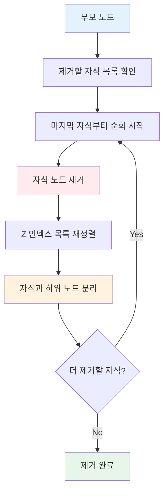
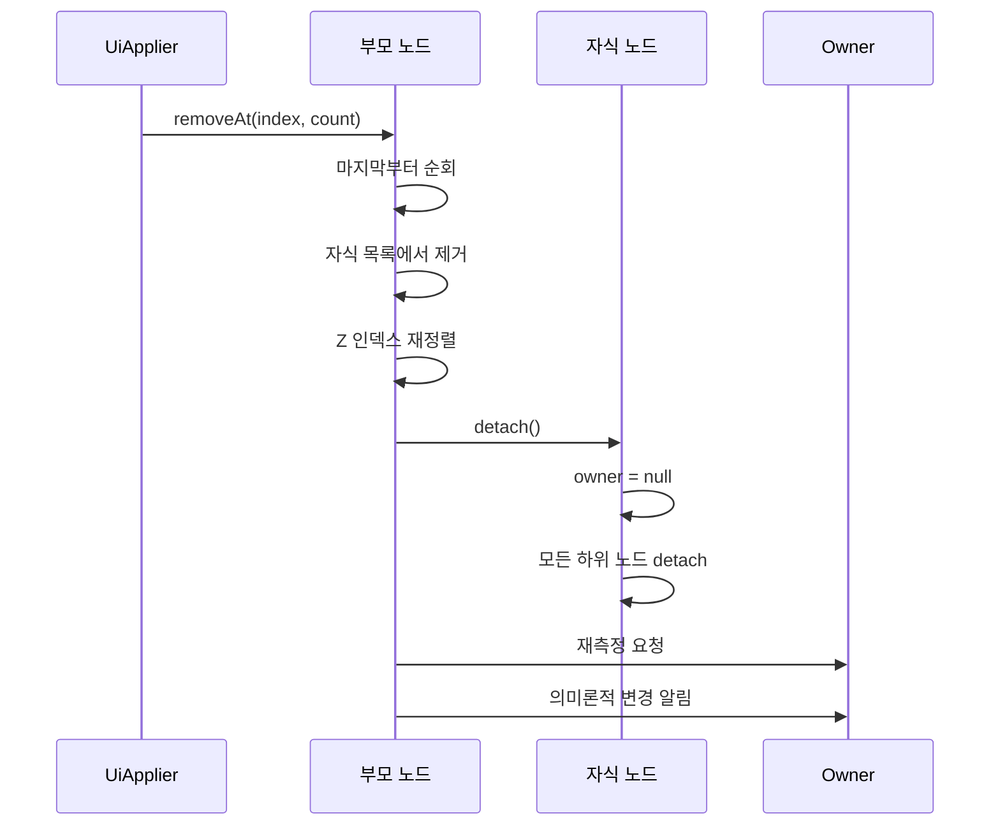
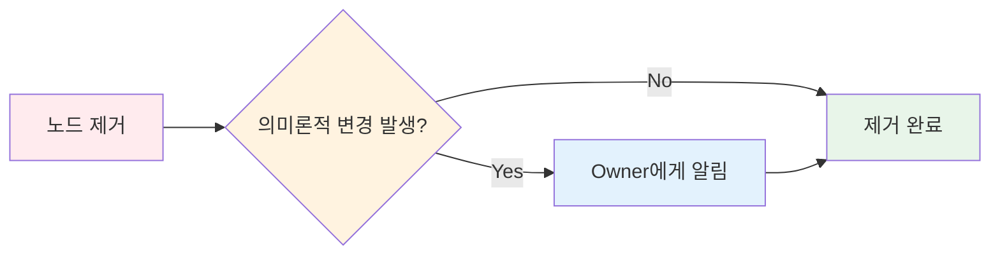

# 노드 제거를 위한 변경 사항 구체화 (Materializing a change to remove nodes)

## 개요

노드 제거는 노드 삽입과 유사한 방식으로 동작하지만, 반대 방향의 프로세스를 따릅니다. **UiApplier**는 `current.removeAt(index, count)` 메서드를 통해 하나 또는 여러 자식 노드를 제거하며, 이 작업은 현재 노드에 위임됩니다.

## 노드 제거 프로세스

### 제거 메서드 호출

**UiApplier**는 부모 노드에게 자식 제거를 위임합니다:

```kotlin
current.removeAt(index, count)
```

### 제거 순서

부모 노드는 제거할 자식들을 **역순(마지막 것부터)**으로 순회하며 제거합니다.



## 제거 프로세스 단계별 설명

각 자식 노드를 제거할 때, 다음 단계들이 순차적으로 실행됩니다:

### 1. 자식 목록에서 제거

부모 노드의 **자식 목록**에서 해당 자식을 제거합니다.

### 2. Z 인덱스 재정렬

**Z 인덱스 자식 목록**의 재정렬을 트리거합니다. 이는 화면 표시 순서를 올바르게 유지하기 위함입니다.

### 3. 트리에서 분리 (Detach)

해당 자식과 그 자식의 **모든 하위 노드**를 트리에서 차례로 분리합니다:

- 노드들의 **owner 참조를 null로 재설정**
- 제거의 영향을 받을 **부모에 대해 재측정 요청**



## 의미론적(Semantics) 변경 알림

새 노드를 연결할 때와 마찬가지로, **노드 제거로 인한 의미론적 변경**이 있으면 **Owner**에게 알립니다.

이는 접근성(Accessibility) 서비스나 UI 구조 변경을 감지해야 하는 시스템에 중요한 정보입니다.



## 노드 삽입 vs 노드 제거 비교

| 단계 | 노드 삽입 | 노드 제거 |
|------|----------|----------|
| **순회 방향** | 앞에서부터 | **뒤에서부터 (역순)** |
| **Owner 참조** | null → Owner 설정 | Owner → **null로 재설정** |
| **재측정 요청** | 삽입 시 요청 | 제거 시 요청 |
| **Z 인덱스 처리** | 재정렬 | 재정렬 |
| **의미론적 알림** | Owner에게 알림 | Owner에게 알림 |
| **하위 노드 처리** | 연결(attach) | **분리(detach)** |

## 핵심 개념

### Detach 프로세스

**Detach**는 노드를 트리에서 완전히 분리하는 과정입니다:

- 노드의 `owner` 참조를 `null`로 설정
- 해당 노드의 **모든 하위 노드**에 대해서도 재귀적으로 수행
- 분리된 노드는 더 이상 렌더링 파이프라인에 포함되지 않음

### 역순 순회의 이유

마지막 자식부터 제거하는 이유:

- 인덱스 변경으로 인한 혼란 방지
- 안전한 목록 조작
- 성능 최적화

## 요약

- **노드 제거**는 `UiApplier`가 `removeAt(index, count)` 메서드를 통해 수행하며, 부모 노드에 작업을 위임합니다
- 제거 프로세스는 **마지막 자식부터 역순**으로 순회하며 진행되어 인덱스 변경으로 인한 혼란을 방지합니다
- 각 노드 제거 시 자식 목록에서 제거, **Z 인덱스 재정렬**, 그리고 트리에서 **분리(detach)** 작업이 순차적으로 실행됩니다
- **Detach 프로세스**는 노드와 모든 하위 노드의 owner 참조를 null로 재설정하고, 영향받는 부모 노드에 대해 재측정을 요청합니다
- 노드 제거로 인한 **의미론적(semantics) 변경**이 발생하면 Owner에게 알림을 보내어 접근성 서비스나 UI 구조 변경 감지가 필요한 시스템에 정보를 제공합니다
- 노드 삽입과 제거는 유사한 프로세스를 따르지만, 순회 방향과 owner 참조 설정 방향이 반대입니다
