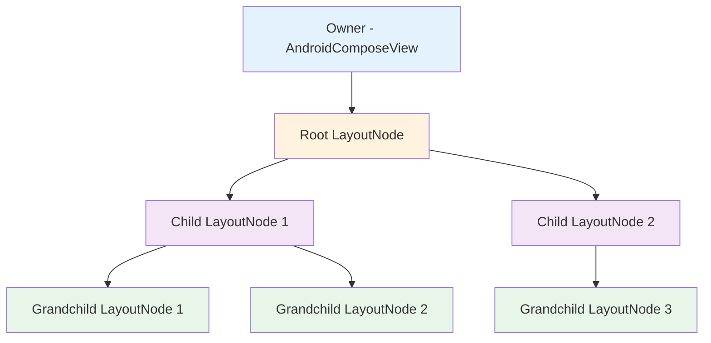
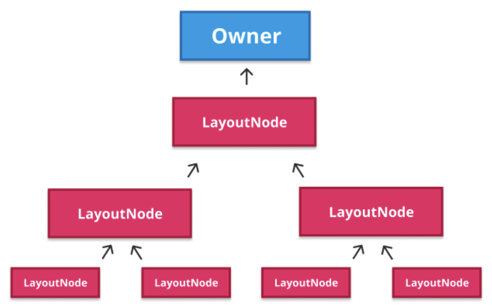
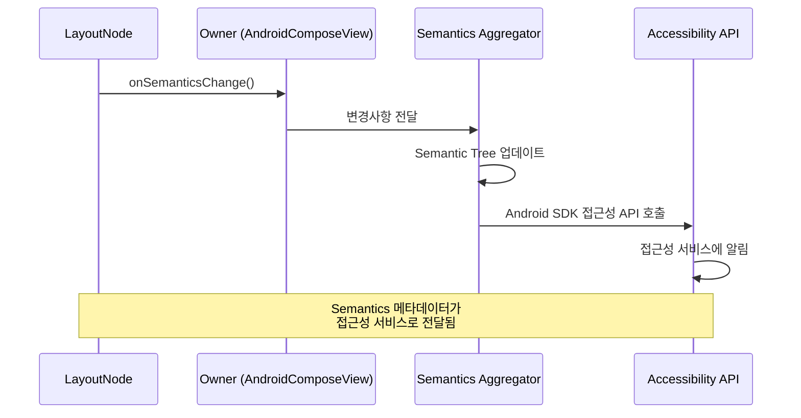
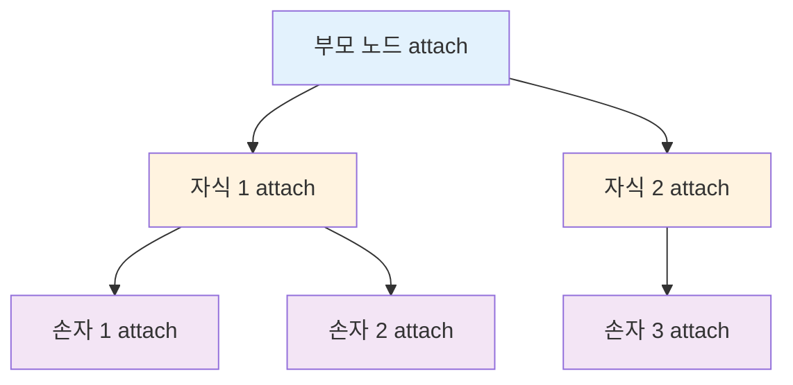
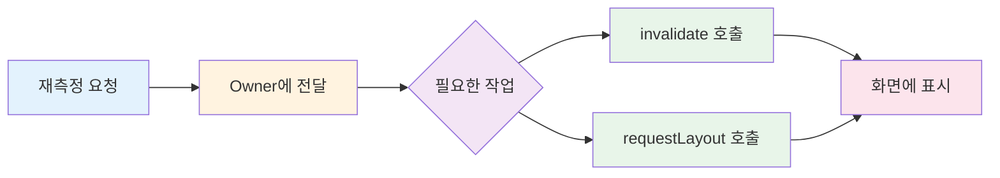
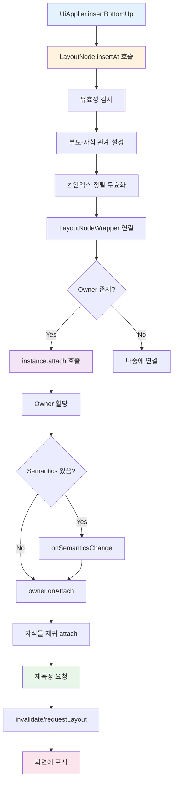

# 새로운 LayoutNode를 구체화하기 (Materializing a new LayoutNode)

Compose UI에서 사용하는 **UiApplier**의 간소화 버전을 살펴보고, 새로운 노드가 어떻게 트리에 삽입되고 실제로 구현되는지 이해해봅시다.

## UiApplier의 구현

Compose UI에서 사용하는 **UiApplier**는 `LayoutNode` 타입의 노드들을 관리하며, 트리 구조의 삽입, 제거, 이동 작업을 처리합니다.

### UiApplier의 구조

```kotlin
// UiApplier.android.kt
internal class UiApplier(
    root: LayoutNode
) : AbstractApplier<LayoutNode>(root) {

  override fun insertTopDown(index: Int, instance: LayoutNode) {
    // Ignored. (The tree is built bottom-up with this one).
  }

  override fun insertBottomUp(index: Int, instance: LayoutNode) {
    current.insertAt(index, instance)
  }

  override fun remove(index: Int, count: Int) {
    current.removeAt(index, count)
  }

  override fun move(from: Int, to: Int, count: Int) {
    current.move(from, to, count)
  }

  override fun onClear() {
    root.removeAll()
  }
  ...
}
```

### 주요 특징

이 구현에서 주목할 점은 다음과 같습니다:

- **노드 타입이 `LayoutNode`로 고정**되어 있습니다
- **트리 작업이 현재 방문한 노드에 위임**됩니다 (삽입, 제거, 이동)
- `LayoutNode`가 자체적으로 구체화할 수 있어 **런타임이 플랫폼에 대해 알지 못하도록** 설계되었습니다

## LayoutNode 트리 구조와 Owner

### LayoutNode 트리 아키텍처





### Owner의 역할

**Owner**는 추상화된 개념으로, 각 플랫폼이 서로 다르게 구현할 수 있습니다.

| 플랫폼 | Owner 구현 | 역할 |
|--------|-----------|------|
| Android | `AndroidComposeView` (View) | Composable 트리와 Android View 시스템 간의 연결점 |
| 기타 플랫폼 | 플랫폼별 구현 | 각 플랫폼의 UI 시스템과의 통합 |

#### Owner의 주요 기능

- 노드가 **연결(attach)** 또는 **분리(detach)** 될 때 처리
- 노드가 **재정렬**되거나 **재측정**될 때 처리
- Android View API를 사용한 **무효화(invalidation)** 트리거
- 최신 변경 사항을 다음 **그리기 단계**에서 화면에 반영

> 💡 **핵심**: Owner를 통해 Compose UI의 마법이 실현됩니다. 모든 UI 업데이트가 Owner를 거쳐 플랫폼의 네이티브 UI 시스템으로 전달됩니다.

## 새 노드 삽입하기

새 노드가 어떻게 삽입되어 실제로 구현되는지 `LayoutNode#insertAt` 작업을 통해 살펴보겠습니다.

### LayoutNode#insertAt 구현

```kotlin
// LayoutNode#insertAt.kt
internal fun insertAt(index: Int, instance: LayoutNode) {
  // 1. 유효성 검사
  check(instance._foldedParent == null) {
    "Cannot insert, it already has a parent!"
  }
  check(instance.owner == null) {
    "Cannot insert, it already has an owner!"
  }

  // 2. 부모-자식 관계 설정
  instance._foldedParent = this
  _foldedChildren.add(index, instance)
  onZSortedChildrenInvalidated()

  // 3. LayoutNodeWrapper 연결
  instance.outerLayoutNodeWrapper.wrappedBy = innerLayoutNodeWrapper

  // 4. Owner에 연결
  val owner = this.owner
  if (owner != null) {
    instance.attach(owner)
  }
}
```

### 삽입 프로세스 상세 설명

#### 1. 유효성 검사
새 노드가 **이미 트리에 있거나 연결되어 있지 않은지** 확인합니다.

#### 2. 부모-자식 관계 설정
- 현재 노드를 삽입되는 노드의 **부모로 설정**
- 새 노드를 부모의 **자식 목록에 추가**
- **Z 인덱스 정렬 목록을 무효화**

##### Z 인덱스 정렬이 필요한 이유

Z 인덱스는 다음 두 가지 방식으로 결정됩니다:

| 결정 방식 | 설명 | 예시 |
|----------|------|------|
| 레이아웃 순서 | `placeable.place()` 호출 순서 | 나중에 배치된 자식이 위에 표시 |
| 명시적 설정 | `Modifier.zIndex()` 사용 | 임의의 Z 값 설정 가능 |


#### 3. LayoutNodeWrapper 연결

```kotlin
instance.outerLayoutNodeWrapper.wrappedBy = innerLayoutNodeWrapper
```

> ⚠️ **중요 변경사항**: `LayoutNodeWrapper`는 `NodeCoordinator`로 이름이 변경되었습니다. 실제 코드를 보실 때는 `NodeCoordinator`를 참고하세요.

이 부분은 **노드, modifier 및 자식들의 측정과 그리기**와 관련된 것으로, 이 챕터의 후반부에서 자세히 설명됩니다.

#### 4. Owner에 연결 (attach)

새 노드에 부모와 같은 Owner를 할당하는 과정입니다.

## 노드 연결하기 (Attach)

노드를 트리에 연결하는 `attach` 메서드의 동작을 살펴보겠습니다.

### LayoutNode#attach 구현

```kotlin
// LayoutNode#attach.kt
internal fun attach(owner: Owner) {
  // 1. 부모의 Owner와 동일한지 확인
  check(_foldedParent == null || _foldedParent?.owner == owner) {
    "Attaching to a different owner than the parent's owner"
  }
  val parent = this.parent // [this] is the node being attached
  
  // 2. Owner 할당
  this.owner = owner
  
  // 3. Semantics 변경 알림
  if (outerSemantics != null) {
    owner.onSemanticsChange()
  }
  
  // 4. Owner에 노드 연결 알림
  owner.onAttach(this)
  
  // 5. 재귀적으로 자식 노드들 연결
  _foldedChildren.forEach { child ->
    child.attach(owner)
  }

  // 6. 재측정 요청
  requestRemeasure()
  parent?.requestRemeasure()
}
```

### Attach 프로세스 상세 설명

#### 1. 유효성 검사 (Guard)
- 모든 자식 노드가 **부모와 동일한 Owner에 할당**되도록 보장
- 동일한 Composable 트리의 모든 노드가 **동일한 View를 통해 무효화**되도록 보장

#### 2. Owner 할당
부모의 Owner를 현재 노드에 할당합니다.

#### 3. Semantics 메타데이터 처리

**Semantics**는 접근성(Accessibility)과 테스트를 위한 메타데이터입니다.

##### Semantics 변경이 발생하는 경우

- 노드가 **삽입**되거나 **제거**될 때
- 노드의 값이 **업데이트**될 때
- **Semantics modifier**가 추가되거나 제거될 때

##### Android에서의 Semantics 처리 흐름



> 📚 **추가 정보**: **의미론적 트리(Semantic Tree)** 는 UI를 접근성 서비스 및 테스트 프레임워크가 이해할 수 있는 방식으로 표현한 병렬 트리입니다. 병렬로 유지되는 두 개의 의미론적 트리가 있으며, 이에 대해서는 추후 섹션에서 자세히 설명할 예정입니다.

#### 4. 재귀적 자식 연결
`attach` 함수가 **재귀적으로 호출**되어 전체 하위 트리가 동일한 Owner에 연결됩니다.



#### 5. 재측정 요청

마지막으로 **새로운 노드와 그 부모에 대한 재측정**을 요청합니다.

##### 재측정이 중요한 이유

- 실제로 **노드를 구체화(Materialize)하는 단계**
- Owner를 통해 이루어지며, 필요에 따라 다음을 호출:
  - `invalidate()`: 다시 그리기
  - `requestLayout()`: 레이아웃 재계산



> 🎯 **핵심**: 재측정 요청을 통해 노드가 결과적으로 **화면에 표시**됩니다.

## 전체 노드 삽입 프로세스

새로운 LayoutNode가 트리에 삽입되고 화면에 표시되기까지의 전체 과정을 정리하면 다음과 같습니다.



## 요약

- **UiApplier**는 `LayoutNode` 타입의 노드들을 관리하며, 모든 트리 작업을 현재 노드에 위임하여 런타임이 플랫폼에 독립적이도록 설계되었습니다
- **Owner**는 플랫폼과의 통합 지점으로, Android에서는 `AndroidComposeView`가 Composable 트리와 View 시스템을 연결하며, 모든 무효화와 업데이트를 처리합니다
- **노드 삽입 과정**은 유효성 검사, 부모-자식 관계 설정, Z 인덱스 정렬, LayoutNodeWrapper 연결, Owner 연결의 단계로 이루어집니다
- **Z 인덱스 정렬**은 레이아웃 배치 순서와 `Modifier.zIndex()`를 통한 명시적 설정을 모두 고려하여 올바른 그리기 순서를 보장합니다
- **attach 메서드**는 재귀적으로 동작하여 전체 하위 트리가 동일한 Owner에 연결되도록 하며, Semantics 메타데이터를 처리하고 접근성 API와 통합합니다
- **재측정 요청**은 노드를 실제로 구체화하는 핵심 단계로, Owner를 통해 `invalidate()`와 `requestLayout()`을 호출하여 최종적으로 화면에 노드를 표시합니다
