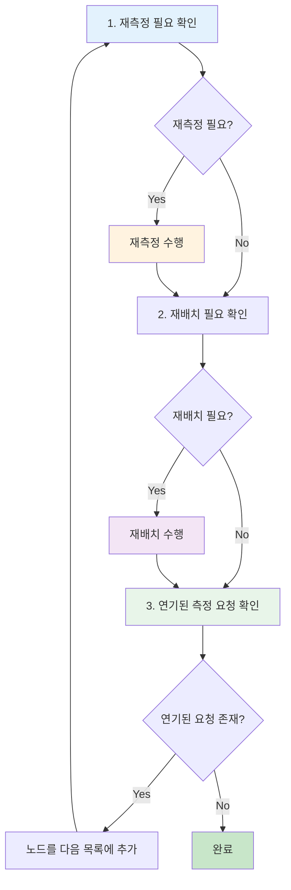
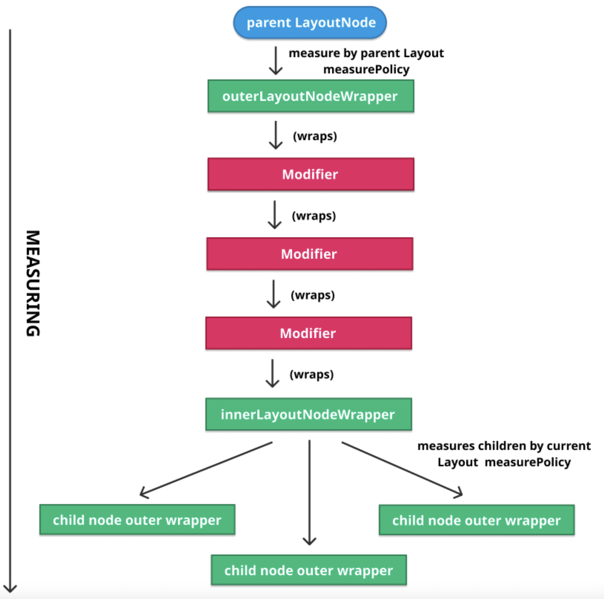
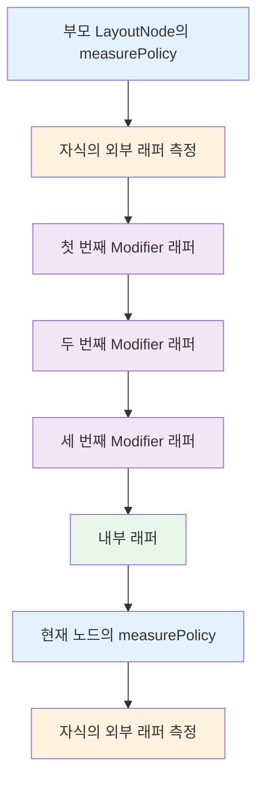

# Compose UI에서의 측정 (Measuring in Compose UI)

우리는 이미 **재측정(Remeasure)** 이 언제, 어떻게 요청되는지 알고 있습니다. 이제 실제로 측정이 어떻게 이루어지는지 이해할 시간입니다.

## 재측정 요청 프로세스

자식이 연결되거나 분리되거나 이동될 때와 같이 어떤 **LayoutNode**도 `Owner`를 통해 재측정을 요청할 수 있습니다. 그 시점에서 다음과 같은 과정이 발생합니다:

1. **뷰(Owner)** 는 `"dirty"`로 표시(`invalidate`)됩니다
2. 노드는 **재측정 및 재배치할 노드 목록**에 추가됩니다
3. 다음 그리기 시점에서 `AndroidComposeView#dispatchDraw`가 호출됩니다 (무효화된 ViewGroup에 대해 발생하는 것처럼)
4. `AndroidComposeView`는 재측정 및 재배치할 노드 목록을 순회하고 `delegate`를 통해 해당 작업을 수행합니다

## 재측정 및 재배치 3단계

재측정 및 재배치가 예정된 각 노드에 대해, 다음의 **3단계**가 순서대로 이루어집니다:



### 단계별 설명

1. **재측정 단계**: 노드가 재측정이 필요한지 확인하고, 해당하는 경우 재측정을 수행합니다.

2. **재배치 단계**: 측정 후, 노드가 재배치가 필요한지 확인하고, 해당하는 경우 재배치를 수행합니다.

3. **연기된 요청 처리**: 최종적으로 모든 노드에 대해 연기된 측정 요청이 있는지 확인하고 이 노드들의 재측정을 예약합니다. 즉, 해당 노드들을 다음 시점에 재측정 및 재배치할 목록에 추가하여 1단계로 돌아갑니다. 
   - **중요**: 측정이 이루어지고 있을 때 발생한 재측정 요청은 연기됩니다.

> **노드 측정 위임**: 각 노드를 측정하는 경우, 이를 **외부 LayoutNodeWrapper**에 위임합니다. 노드의 크기가 측정 결과 변경되고 노드에 부모가 있는 경우 필요에 따라 부모에게 재측정이나 재배치를 요청합니다.

## LayoutNodeWrapper의 이해

### LayoutNode와 래퍼의 기본 구조

이제 래퍼에 대해 알아보겠습니다. 이를 통해 측정 과정이 어떻게 이루어지는지 학습할 수 있습니다.

`LayoutNode#insertAt` 함수(새 노드를 삽입하기 위해 `UiApplier`에 의해 호출된 함수)로 잠시 돌아가 보면, 외부 및 내부 `LayoutNodeWrapper`와 관련된 할당을 다음과 같이 확인할 수 있습니다:

```kotlin
// LayoutNode#insertAt.kt
internal fun insertAt(index: Int, instance: LayoutNode) {
  ...
  instance.outerLayoutNodeWrapper.wrappedBy = innerLayoutNodeWrapper
  ...
}
```

각 **LayoutNode**는 외부와 내부의 `LayoutNodeWrapper`를 가지고 있습니다:

| 래퍼 타입 | 역할 |
|---------|------|
| **외부 래퍼 (Outer Wrapper)** | 현재 노드의 측정과 그리기를 담당 |
| **내부 래퍼 (Inner Wrapper)** | 자식 노드들에 대해 동일한 작업을 수행 |

### Modifier와 래퍼의 관계

이것은 훌륭하지만 안타깝게도 불완전합니다. 사실 노드에는 `Modifier`가 적용될 수 있고, **Modifier는 측정에 영향을 줄 수 있으므로** 노드를 측정할 때도 이를 고려해야 합니다.

#### Modifier가 측정에 미치는 영향

예를 들어:
- `Modifier.padding`은 노드의 자식 노드들의 측정에 직접적으로 영향을 끼칩니다
- Modifier는 뒤에 연결된 다른 Modifier의 크기에도 영향을 줄 수 있습니다
- `Modifier.padding(8.dp).background(Color.Red)`의 경우 패딩을 적용한 후 남은 공간에만 색을 입힙니다

이 모든 것은 **Modifier의 측정된 크기를 어딘가에 보관할 필요**가 있다는 것을 의미합니다. 하지만 `Modifier`는 상태가 없으므로 상태를 유지하려면 래퍼가 필요합니다.

#### 래퍼의 연쇄 구조

이러한 이유로 **LayoutNode**는 다음과 같은 래퍼들을 가집니다:

- 내부 래퍼 (Inner Wrapper)
- 외부 래퍼 (Outer Wrapper)
- 적용된 Modifier 각각에 대한 래퍼

모든 래퍼(외부, Modifier, 내부)는 **연쇄적으로 연결**되어 있으므로 항상 순서대로 적용됩니다.

> **래퍼의 추가 기능**: Modifier의 래퍼에는 측정된 크기뿐만 아니라 측정에 의해 영향을 받을 수 있는 다른 **훅(hook)** 들도 포함하고 있습니다. 예를 들어:
> - `Modifier.drawBehind()`와 같은 그리기 수행
> - 터치에 대한 **히트 테스팅(Hit Testing)**

## Modifier 해결 체인

모든 래퍼가 서로 연결된 방식은 다음과 같습니다:



### 측정 순서



#### 단계별 프로세스

1. **부모 LayoutNode**는 해당 노드의 `measurePolicy`(Layout Composable에서 정의)를 사용하여 모든 자식의 외부 래퍼를 측정합니다

2. 각 자식의 **외부 래퍼**는 체인에서 첫 번째 Modifier를 감쌉니다

3. 해당 Modifier는 두 번째 Modifier를 감쌉니다

4. 두 번째는 세 번째를 감쌉니다

5. 세 번째는 **내부 래퍼**를 감쌉니다 (이 노드에 3개의 Modifier가 있다고 가정)

6. (다시 1단계와 같이) **내부 래퍼**는 현재 노드의 `measurePolicy`를 사용하여 각 자식의 외부 래퍼를 측정합니다

### 중요한 특징

이는 측정이 순서대로 이루어지고 **Modifier 또한 순서대로 처리**되는 것을 보장합니다.

> **버전별 차이**: 다른 유형의 Modifier는 더 쉬운 추상화로 감싸지기 때문에, 이 감싸기는 **Compose 1.2부터 시작되는 LayoutModifier**에 대해서만 수행된다는 점을 유의해야 합니다. 그러나 사용된 추상화와 무관하게 접근 방식은 동일합니다.

### 그리기 프로세스

그리기에 있어서도 같은 방식으로 작동하지만, 마지막 단계에서 내부 래퍼는 **Z 인덱스별로 정렬된 자식 목록**을 순회하며 각각에 대해 `draw`를 호출합니다.

## 노드 삽입 시 래퍼 연결

이제 `insertAt` 함수에서의 `LayoutNodeWrapper`를 할당하는 예시를 다시 살펴보겠습니다:

```kotlin
instance.outerLayoutNodeWrapper.wrappedBy = innerLayoutNodeWrapper
```

노드가 삽입될 때 **그 노드의 외부 래퍼**가 **현재 노드(새로운 부모)의 내부 래퍼**에 의해 감싸지는 것을 볼 수 있습니다. 이는 앞서 공유했던 다이어그램의 첫 번째와 마지막 단계에 모두 나타나 있습니다.

> **래퍼의 생명주기**: 새 노드를 연결할 때, 모든 `LayoutNodeWrapper`들이 알림을 받습니다. 그들은 상태를 가지고 있기 때문에 생명주기를 가지며 초기화 및 해제가 필요한 경우를 대비하여 어떤 연결 및 분리에 대해서도 알림을 받습니다. 예시로는 **focus modifier**가 있으며, 이들을 연결할 때 focus 이벤트를 전송합니다.

## 재측정 위임 체인

노드에 대한 재측정이 요청될 때마다, 이 작업은 다음과 같은 체인을 따라 위임됩니다:


### 위임 프로세스

1. 노드의 **외부 LayoutNodeWrapper**에 위임됩니다
2. 외부 래퍼는 측정 시 **부모의 측정 정책**을 사용합니다
3. 그것의 체인을 따라 모든 **Modifier를 재측정**합니다
4. 최종적으로 현재 노드의 측정 정책을 사용하여 자식을 재측정하기 위한 **내부 LayoutNodeWrapper**에 도달합니다

## 상태 추적과 자동 재실행

### 측정 람다와 상태 읽기

노드를 측정하는 동안, **측정 람다(측정 정책)** 내의 모든 **변경 가능한 상태 읽기**가 기록됩니다. 이는 언급된 상태가 변할 때마다 람다가 자체를 재실행하게 만듭니다.


결국, 측정 정책은 외부에서 전달되며 **Compose State**에 자유롭게 의존할 수 있습니다. 자동으로 스냅샷 상태를 읽는 것은 다음 장에서 더 자세히 다룰 것입니다.

### 부모에게 재측정 요청

측정 후, **이전 측정된 크기**와 **현재 측정된 크기**를 비교하여 변경된 경우 **부모에게 재측정을 요청**합니다.

## 요약

- **재측정 프로세스**는 Owner를 통해 요청되며, 노드가 dirty로 표시되어 재측정 목록에 추가되고, dispatchDraw 시점에 처리됩니다
- 재측정 및 재배치는 **3단계**(재측정 확인 및 수행, 재배치 확인 및 수행, 연기된 요청 처리)로 순서대로 이루어집니다
- 각 **LayoutNode**는 외부 래퍼(현재 노드 담당)와 내부 래퍼(자식 노드 담당)를 가지며, 각 Modifier에 대해서도 별도의 래퍼를 생성하여 연쇄적으로 연결합니다
- **Modifier 체인**은 외부 래퍼 → Modifier 래퍼들 → 내부 래퍼 순서로 연결되어, 측정과 그리기가 순서대로 처리되도록 보장합니다
- 재측정은 노드의 외부 LayoutNodeWrapper에 위임되며, 부모의 측정 정책을 사용하여 Modifier 체인을 거쳐 최종적으로 내부 래퍼가 자식들을 측정합니다
- 측정 람다 내에서 읽히는 **Compose State는 자동으로 추적**되어, 상태 변경 시 람다가 자동으로 재실행됩니다
- 측정 결과 크기가 변경되면 부모에게 재측정을 요청하여 **상향식 재측정 전파**가 이루어집니다