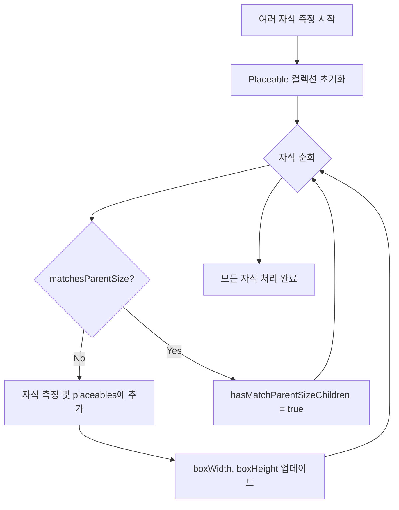
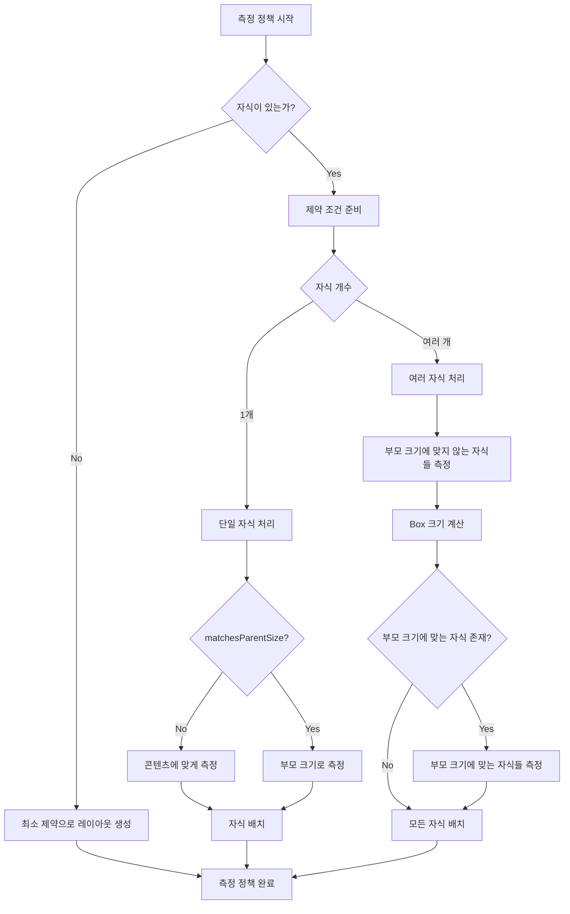

# 측정 정책 (Measuring Policies)

## 개요

노드가 측정되어야 할 때, 해당하는 `LayoutNodeWrapper`는 노드를 방출할 때 제공된 **측정 정책(MeasurePolicy)** 에 의존합니다.

### Layout과 MeasurePolicy

```kotlin
@Composable inline fun Layout(
  content: @Composable () -> Unit,
  modifier: Modifier = Modifier,
  measurePolicy: MeasurePolicy
) {
  ...
  ReusableComposeNode<ComposeUiNode, Applier<Any>>(
    factory = { LayoutNode() },
    update = {
      set(measurePolicy, { this.measurePolicy = it })
      ...
    },
    skippableUpdate = materializerOf(modifier),
    content = content
  )
}
```

> **주요 특징**: `LayoutNode`는 항상 자신과 해당 하위 항목을 측정하는 데 사용되는 측정 정책을 무시합니다. Compose UI는 사용 사례마다 다르기 때문에 모든 `Layout`의 구현에 대하여 자체적인 측정 정책을 제공할 것으로 기대합니다.

**중요**: `LayoutNode`에 대한 측정 정책이 변경될 때마다 재측정이 요청됩니다.

### 커스텀 레이아웃과 측정 정책

이전에 Jetpack Compose에서의 **커스텀 레이아웃**을 만들어본 적이 있다면, 이는 다소 익숙하게 들릴 수 있습니다. 커스텀 `Layout`을 생성할 때 전달하는 **람다식**이 바로 측정 정책입니다.

## Spacer의 측정 정책

가장 간단한 정책 중 하나로 `Spacer` Composable에 설정된 정책을 예시로 들 수 있습니다.

```kotlin
@Composable
fun Spacer(modifier: Modifier) {
  Layout({}, modifier) { _, constraints ->
    with(constraints) {
      val width = if (hasFixedWidth) maxWidth else 0
      val height = if (hasFixedHeight) maxHeight else 0
      layout(width, height) {}
    }
  }
}
```

### Spacer의 동작 방식

**후행 람다(trailing lambda)** 는 정책을 정의합니다. 이것은 `MeasurePolicy#measure` 함수의 실질적인 구현입니다.

#### 측정 정책의 입력 파라미터

| 파라미터 | 설명 |
|---------|------|
| `measurables` | 자식 레이아웃들에 대한 목록 (Spacer의 경우 무시됨) |
| `constraints` | 각 자식이 준수해야 하는 제약 조건 |

#### 제약 조건(Constraints)의 역할

`constraints`는 레이아웃의 너비와 높이를 결정하는 데 사용됩니다:

- **고정된 값인 경우**: `maxWidth == minWidth`, `maxHeight == minHeight`이면 해당 값들을 설정
- **그렇지 않은 경우**: 너비와 높이의 기본값은 0

> 이는 실질적으로 `Spacer`가 부모나 `modifier`를 통해 어떤 크기 제약을 부여받아야 함을 의미합니다. `Spacer`는 자식을 포함하지 않아 감싸고 있는 콘텐츠에 의해 크기가 조정될 수 없습니다.

## Box의 측정 정책

측정 정책에 대한 더 완전한 예시는 `Box` Composable에서 찾을 수 있습니다.

### Box의 기본 구조

```kotlin
@Composable
inline fun Box(
  modifier: Modifier = Modifier,
  contentAlignment: Alignment = Alignment.TopStart,
  propagateMinConstraints: Boolean = false,
  content: @Composable BoxScope.() -> Unit
) {
  val measurePolicy = rememberBoxMeasurePolicy(contentAlignment, propagateMinConstraints)
  Layout(
    content = { BoxScopeInstance.content() },
    measurePolicy = measurePolicy,
    modifier = modifier
  )
}
```

### Box 측정 정책의 특징

`Box`의 정책은 다음 두 가지 요소에 의존합니다:

1. **정렬(Alignment)**: 기본값은 `TopStart` (자식들을 상단에서 하단으로, 왼쪽에서 오른쪽으로 정렬)
2. **최소 제약 조건 전파**: 부모의 최소 제약 조건을 content에 부여해야 하는지 여부

#### Box를 기반으로 하는 컴포넌트들

- `Crossfade`
- `Switch`
- `Surface`
- `FloatingActionButton`
- `IconButton`
- `AlertDialog`

### Box 측정 정책의 구현

#### 1. 자식이 없는 경우

```kotlin
MeasurePolicy { measurables, constraints ->
  if (measurables.isEmpty()) {
    return@MeasurePolicy layout(
      constraints.minWidth,
      constraints.minHeight
    ) {}
  }
```

`Box`에 자식이 전혀 없는 경우, 부모(또는 `modifier`)에 의해 부여된 최소 너비와 높이에 맞추어 크기가 조정됩니다.

#### 2. 제약 조건 준비

```kotlin
val contentConstraints = if (propagateMinConstraints) {
  constraints
} else {
  constraints.copy(minWidth = 0, minHeight = 0)
}
```

- **`propagateMinConstraints`가 true인 경우**: 부여된 제약 조건을 그대로 적용
- **그렇지 않은 경우**: 최소 너비와 높이 제한을 제거하여 자식들이 이에 대해 결정할 수 있도록 함

#### 3. 자식이 하나인 경우

```kotlin
if (measurables.size == 1) {
  val measurable = measurables[0]
  ...
  if (!measurable.matchesParentSize) {
    placeable = measurable.measure(contentConstraints)
    boxWidth = max(constraints.minWidth, placeable.width)
    boxHeight = max(constraints.minHeight, placeable.height)
  } else {
    boxWidth = constraints.minWidth
    boxHeight = constraints.minHeight
    placeable = measurable.measure(
      Constraints.fixed(constraints.minWidth, constraints.minHeight)
    )
  }
  return@MeasurePolicy layout(boxWidth, boxHeight) {
    placeInBox(placeable, measurable, layoutDirection, boxWidth, boxHeight, alignment)
  }
}
```

##### 두 가지 시나리오

| 시나리오 | 동작 |
|---------|------|
| **콘텐츠에 맞게 조정** | 자식이 부모 크기에 맞추도록 설정되지 않은 경우 (`Modifier.fillMaxSize()` 사용 안함) |
| **부모 크기에 맞춤** | `Box`가 부모 크기와 일치하도록 설정된 경우 |

**콘텐츠에 맞게 조정하는 경우**:
1. 부여된 제약 조건을 사용하여 자식을 측정
2. 자식이 차지할 크기가 반환됨
3. `Box`는 그 크기를 사용하여 자신의 크기를 결정
4. `boxWidth = max(constraints.minWidth, placeable.width)`
5. `boxHeight = max(constraints.minHeight, placeable.height)`

> **결과**: `Box`가 단일 자식보다 작아지지 않습니다.

**부모 크기에 맞추는 경우**:
- 너비와 높이가 상위 제약 조건에 의해 부과된 최소 너비 및 높이와 정확히 동일한 값으로 설정

#### 4. 여러 자식이 있는 경우

```kotlin
val placeables = arrayOfNulls<Placeable>(measurables.size)

var hasMatchParentSizeChildren = false
var boxWidth = constraints.minWidth
var boxHeight = constraints.minHeight
measurables.fastForEachIndexed { index, measurable ->
  if (!measurable.matchesParentSize) {
    val placeable = measurable.measure(contentConstraints)
    placeables[index] = placeable
    boxWidth = max(boxWidth, placeable.width)
    boxHeight = max(boxHeight, placeable.height)
  } else {
    hasMatchParentSizeChildren = true
  }
}
```

##### 측정 프로세스



**프로세스 설명**:

1. **`Placeable` 컬렉션 초기화**: 모든 측정된 자식들을 추적하여 배치하기 위함
2. **자식 순회**: 부모에 의해 부여된 최소 제약 조건들 사이에서 가능한 최대 너비와 높이를 계산
3. **부모 크기에 맞추지 않는 자식들**: 측정하고 `placeables`에 추가
4. **부모 크기에 맞추는 자식들**: 다음 단계에서 측정될 것이므로 일단 무시

#### 5. 부모 크기에 맞추는 자식들 측정

```kotlin
if (hasMatchParentSizeChildren) {
  // The infinity check is needed for default intrinsic measurements.
  val matchParentSizeConstraints = Constraints(
    minWidth = if (boxWidth != Constraints.Infinity) boxWidth else 0,
    minHeight = if (boxHeight != Constraints.Infinity) boxHeight else 0,
    maxWidth = boxWidth,
    maxHeight = boxHeight
  )
  measurables.fastForEachIndexed { index, measurable ->
    if (measurable.matchesParentSize) {
      placeables[index] = measurable.measure(matchParentSizeConstraints)
    }
  }
}
```

##### Infinity 제약 조건 처리

| 조건 | 동작 |
|-----|-----|
| `boxWidth` 또는 `boxHeight`가 `Infinity` | 최소 제약 조건을 0으로 설정 (자식이 스스로 크기 결정) |
| 그렇지 않은 경우 | 이미 계산된 `boxWidth`와 `boxHeight` 사용 |

> **주의**: Infinity 체크는 기본 intrinsic 측정을 위해 필요합니다.

#### 6. 레이아웃 생성 및 자식 배치

```kotlin
layout(boxWidth, boxHeight) {
  placeables.forEachIndexed { index, placeable ->
    placeable as Placeable
    val measurable = measurables[index]
    placeInBox(placeable, measurable, layoutDirection, boxWidth, boxHeight, alignment)
  }
}
```

최종 작업은 계산된 너비와 높이를 사용하여 레이아웃을 생성하고, 모든 자식을 내부에 배치하는 것입니다.

## 측정 정책 흐름도



## 추가 측정 정책 예시

Compose UI에는 훨씬 더 많은 측정 정책의 예시가 있습니다. 모든 것을 나열하고 설명할 수는 없지만, `Box`의 예시를 통해 측정 정책이 어떻게 작동하는지 이해하는 데 도움이 되었을 것입니다.

### 다른 측정 정책을 가진 컴포넌트들

- `Row`, `Column`: 자식들을 선형으로 배치
- `LazyRow`, `LazyColumn`: 지연 로딩을 지원하는 리스트
- `LazyGrid`: 그리드 형태의 레이아웃
- 기타 커스텀 레이아웃들

## 요약

- **측정 정책(MeasurePolicy)** 은 Compose UI에서 레이아웃의 크기를 결정하고 자식들을 배치하는 핵심 메커니즘입니다
- `Layout` Composable을 사용할 때 제공하는 **람다식**이 바로 측정 정책을 정의합니다
- **제약 조건(Constraints)** 은 레이아웃의 최소/최대 너비와 높이를 정의하며, 자식들에게 전파됩니다
- `Spacer`는 가장 간단한 측정 정책의 예시로, 고정된 제약 조건이 있으면 그 값을 사용하고 없으면 0을 사용합니다
- `Box`의 측정 정책은 더 복잡하며, 다음을 고려합니다:
  - 자식이 없는 경우: 최소 제약 조건 사용
  - 자식이 하나인 경우: 콘텐츠에 맞추거나 부모 크기에 맞춤
  - 여러 자식이 있는 경우: 부모 크기에 맞지 않는 자식들을 먼저 측정하고, 그 후 부모 크기에 맞는 자식들을 측정
- **`LayoutNode`의 측정 정책이 변경되면 재측정이 자동으로 요청**됩니다
- `propagateMinConstraints` 파라미터를 통해 부모의 최소 제약 조건을 자식에게 전파할지 결정할 수 있습니다
- 측정 정책은 `Measurable`을 측정하여 `Placeable`을 얻고, 이를 레이아웃 내에 배치하는 순서로 동작합니다
