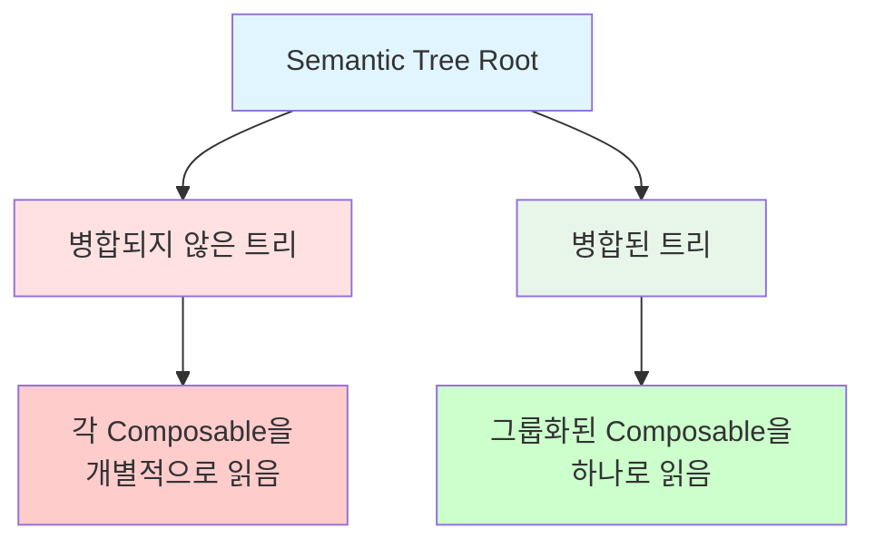
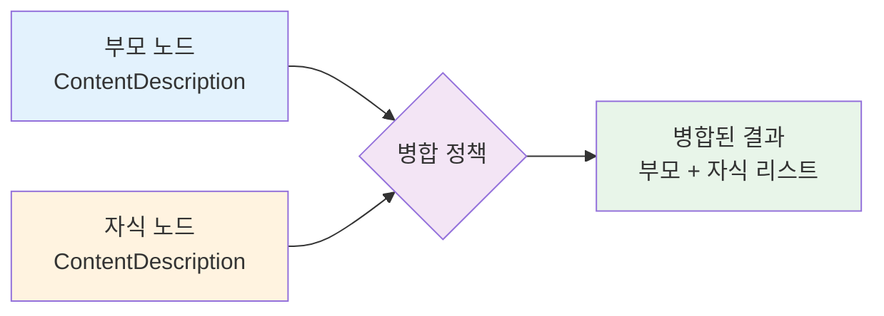

# 병합된/병합되지 않은 Semantic 트리 (Merged and Unmerged Semantic Trees)

## 개요

**Jetpack Compose**는 **병합된(merged)** 트리와 **병합되지 않은(unmerged)** 트리, 두 가지 **semantic 트리**를 제공합니다. 때때로 우리는 Composable들을 의미론적으로(semantically) 병합할 필요가 있습니다. 왜냐하면 그것들을 **그룹으로 접하는 것**이 개별적으로 접하는 것보다 사용자에게 더 나은 의미를 제공하기 때문입니다.

### 병합이 필요한 이유

예를 들어, **TalkBack**과 같은 접근성 도구가 매우 큰 아이템 목록의 각 행 내의 각각의 작은 Composable을 읽는다고 상상해 보세요. 이것은 매우 피곤하고 쓸모없는 사용자 경험을 초래할 것입니다. 보통의 경우, **각 행을 전체적으로 읽는 것**이 선호됩니다.



## mergeDescendants 속성

병합은 `mergeDescendants` 속성을 통해 이루어집니다. 이 속성을 사용하면 **semantics 노드**(예: Composable 또는 modifier)가 그것의 자손들을 자신에게 병합할 필요가 있는지 결정할 수 있습니다.

### 주요 특징

| 트리 타입 | 병합 수행 | 노드 관리 | 사용처 |
|---------|---------|---------|--------|
| **병합된 트리** | `mergeDescendants` 기반으로 수행 | 자손을 부모에 병합 | 접근성 도구 (TalkBack 등) |
| **병합되지 않은 트리** | 수행하지 않음 | 노드를 별도로 유지 | 개발자 도구, 디버깅 |

> **💡 참고**: 많은 foundation 및 material Composable과 modifier에 이미 `mergeDescendants`가 적용되어 있습니다. 도구는 자신이 소비하고자 하는 트리를 결정합니다.

## 병합의 내부 동작

### 1. Semantic 속성 사용 예제

`contentDescription`을 사용한 예제입니다:

```kotlin
MyButton(
  modifier = Modifier.semantics { 
    contentDescription = "Add to favorites" 
  }
)
```

### 2. SemanticsPropertyReceiver 인터페이스

`SemanticsPropertyReceiver`는 **semantics 블록에 사용되는 범위(scope)** 이며, 블록 내에서 어떤 속성이든 설정할 수 있게 해줍니다.

```kotlin
interface SemanticsPropertyReceiver {
  operator fun <T> set(key: SemanticsPropertyKey<T>, value: T)
}
```

### 3. Semantic 키와 병합 정책

Semantic 속성을 설정하기 위해서는 **semantic 키**와 **값**이 필요합니다. Semantic 키는 **타입 안전(type safe)** 하게 정의되며, 생성을 위해 속성의 이름과 **병합 정책(merge policy)** 이 필요합니다.

```kotlin
val ContentDescription = SemanticsPropertyKey<List<String>>(
  name = "ContentDescription",
  mergePolicy = { parentValue, childValue ->
    parentValue?.toMutableList()?.also { 
      it.addAll(childValue) 
    } ?: childValue
  }
)
```

### 4. 병합 정책의 동작

**병합 정책(merge policy)** 람다는 속성이 자신의 자손을 어떻게 병합할지 결정하는 곳입니다.

- **ContentDescription의 경우**: 모든 자손의 `ContentDescription` 값을 리스트에 추가
- **기본 병합 정책**: 사실상 아무런 병합도 하지 않음
  - 노드에 대해 부모 값이 사용 가능한 경우 그 값을 유지
  - 자식은 무시



## 추가 학습 자료

이 책은 내부에 초점을 맞추고 있고, semantics에 대한 모든 사용 가능한 구성 옵션이나 API를 나열하는 것이 목적은 아닙니다. 

**Jetpack Compose semantics**에 대한 API 및 개발자 관점에서의 자세한 내용은 [공식 문서](https://developer.android.com/develop/ui/compose/accessibility/semantics)를 읽어보는 것을 추천합니다.

## 요약

- **Jetpack Compose**는 병합된 트리와 병합되지 않은 트리, 두 가지 semantic 트리를 제공하며, 각각 다른 용도로 사용됩니다
- **병합이 필요한 이유**는 접근성 도구가 여러 Composable을 개별적으로 읽는 대신 그룹으로 읽어 더 나은 사용자 경험을 제공하기 위함입니다
- **`mergeDescendants` 속성**을 통해 semantic 노드가 자손들을 자신에게 병합할지 결정할 수 있으며, 많은 foundation과 material Composable에 이미 적용되어 있습니다
- **병합 정책(merge policy)** 은 `SemanticsPropertyKey` 생성 시 정의되며, 부모와 자식 값을 어떻게 병합할지 결정합니다
- `ContentDescription`의 경우 모든 자손의 값을 리스트에 추가하는 방식으로 병합하며, 기본 병합 정책은 부모 값을 유지하고 자식을 무시합니다
- 병합된 트리는 접근성 도구에서 사용되고, 병합되지 않은 트리는 개발자 도구나 디버깅에서 사용됩니다