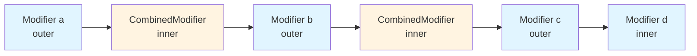

# Modifier 체인 모델링 (Modeling modifier chains)

이 장에서 우리는 modifier에 대해 약간 다루었지만, 우리가 배운 것보다 분명히 더 살펴볼 것이 있습니다. **Modifier**는 **Compose UI**에서 정말 중요한 부분이기 때문에, modifier의 내부를 조금 다루는 몇 개의 섹션을 제공하고자 합니다.

## Modifier 인터페이스란?

`Modifier` 인터페이스는 **UI Composable을 장식하거나 동작을 추가하는 불변 요소의 컬렉션**을 모델링합니다. Modifier는 아래 3가지를 제공하는 추상화입니다:

- **수정자의 모든 유형을 체인으로 결합할 수 있는 기능** (`then`)
- **체인을 통과하면서 값을 누적하는 접기 기능** (`foldIn` 및 `foldOut`)
- **체인 내의 any 또는 all 수정자가 주어진 조건과 일치하는지 확인하는 연산**

## Modifier 체인의 구조

코드 내에 modifier의 체인이 다음과 같이 존재할 때, 이는 `Modifier` 타입 자체가 자신의 헤드에 의해 참조되는 **"연결 리스트(linked list)"** 입니다.

### 예제: Modifier 체인 연결

```kotlin
Box(
  modifier.then(indentMod)        // Returns Modifier
    .fillMaxWidth()                // Returns Modifier
    .height(targetThickness)       // Returns Modifier
    .background(color = color)     // Returns Modifier
)
```

### 명시적/암시적 체인 연결

Modifier를 연결하는 것은 위의 스니펫처럼 **명시적**이거나 **암시적**일 수 있으며, 두 가지의 조합을 가질 수 있습니다. `then`이 명시되지 않은 경우, 확장 함수를 통해 그 modifier들을 연결하고 있기 때문이며, 이는 사실 내부적으로 `then`을 호출하고 있습니다. 두 접근 방식은 동등합니다. 실제 프로젝트에서는 확장 함수가 훨씬 더 자주 사용됩니다.

여기 확장 함수를 통해 선언된 modifier의 예시가 있습니다:

```kotlin
@Stable
fun Modifier.padding(
  horizontal: Dp = 0.dp,
  vertical: Dp = 0.dp
) = this.then(
  PaddingModifier(
    start = horizontal,
    top = vertical,
    end = horizontal,
    bottom = vertical,
    ...
  )
)
```

> **💡 부가적인 팁**
> 
> 위 확장 함수 코드는 `Modifier.Node` 방식으로 [재작성](https://cs.android.com/androidx/platform/frameworks/support/+/9a48dd7582b10e866702b71d4dcf28f4df1d255f:compose/foundation/foundation-layout/src/commonMain/kotlin/androidx/compose/foundation/layout/Padding.kt;dlc=e348fefef529f899427b89130275c74b7e8a5ec8)되었습니다. `Modifier.padding` 뿐만 아니라 라이브러리가 제공하는 대부분의 modifier들은 `Modifier.Node` 방식으로 재작성되었습니다. 왜 이런 변경 사항이 생겼는지는 Android Dev Summit 2022의 세션([링크](https://www.youtube.com/watch?v=BjGX2RftXsU))을 참고하세요.

## CombinedModifier

두 modifier를 연결하기 위해 `then`이 호출될 때, 그 결과는 **`CombinedModifier`** 가 됩니다. `CombinedModifier`는 modifier의 체인을 모델링한 것입니다. 

`CombinedModifier`는 다음을 가지고 있습니다:
- **현재 modifier**에 대한 참조 (`outer`)
- **체인에서 다음 modifier**로의 포인터 (`inner`)

이 modifier들 역시 `CombinedModifier`일 수 있습니다.

```kotlin
class CombinedModifier(
  private val outer: Modifier,
  private val inner: Modifier
): Modifier
```

### Outer와 Inner의 의미

노드들이 `outer`와 `inner`라고 불리는 이유는 **`CombinedModifier`들의 체인에서 현재 노드가 다음 노드를 감싸기 때문**입니다.

```kotlin
CombinedModifier(a, CombinedModifier(b, CombinedModifier(c, d)))
```

이를 시각화하면 다음과 같습니다:



### Modifier 체인의 구조 비교

| 구성 요소 | 역할 | 설명 |
|---------|------|------|
| `outer` | 현재 modifier | 체인에서 현재 위치의 modifier를 참조 |
| `inner` | 다음 modifier | 체인에서 다음 modifier를 가리키는 포인터 |
| `then` | 연결 함수 | 두 modifier를 연결하여 `CombinedModifier` 생성 |
| `CombinedModifier` | 체인 모델 | modifier 체인을 연결 리스트로 모델링 |

## 다음 단계

이것이 바로 modifier 체인이 모델링되는 방식입니다. 그러나 **modifier는 실제로 `LayoutNode`에 어떻게 설정될까요?** 이제 그것에 대해 알아볼 예정입니다.

## 요약

- `Modifier`는 **UI Composable을 장식하거나 동작을 추가하는 불변 요소의 컬렉션**을 모델링하는 인터페이스입니다.
- Modifier 체인은 **연결 리스트(linked list)** 구조로 모델링되며, 각 노드는 다음 노드를 참조합니다.
- `then` 메서드를 통해 두 modifier를 연결하면 **`CombinedModifier`** 가 생성됩니다.
- `CombinedModifier`는 **`outer`(현재 modifier)** 와 **`inner`(다음 modifier)** 로 구성되며, 체인 구조를 유지합니다.
- 대부분의 modifier 확장 함수는 내부적으로 `then`을 호출하여 체인을 구성합니다.
- Compose 라이브러리의 modifier들은 성능 향상을 위해 **`Modifier.Node` 방식으로 재작성**되었습니다.
- Modifier 체인의 구조를 이해하면 Compose UI에서 modifier가 어떻게 동작하고 결합되는지 파악할 수 있습니다.
