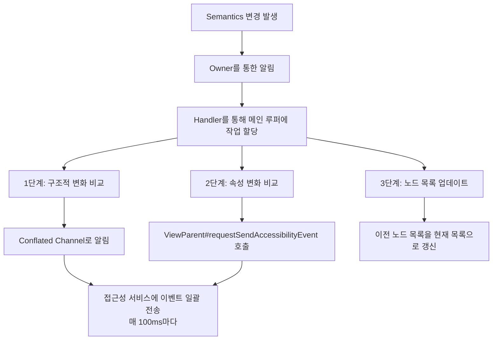

# Semantics 변화 알림 (Notifying about Semantic Changes)

**Semantics** 변화가 `Owner`를 통해 안드로이드 SDK에 어떻게 알려지는지에 대해 자세히 알아봅니다.

## AccessibilityDelegateCompat의 역할

**AndroidX Core 라이브러리**는 여러 시스템 버전에 걸쳐 접근성 서비스를 다루는 것을 정규화(normalize)하기 위해 `AccessibilityDelegateCompat`를 제공합니다.

- `LayoutNode` 계층의 `Owner`는 이 delegate의 구현을 사용하여 **접근성 변경을 처리**합니다
- 이 구현은 `Owner`로부터 얻은 안드로이드 `Context`를 통해 **시스템 접근성 서비스**를 받아옵니다

## Semantics 변경 알림 프로세스

Semantics 변경이 `Owner`를 통해 알려질 때, **semantics 트리의 변경을 확인하기 위한 작업**이 네이티브 `Handler`를 통해 **메인 루퍼**에 할당됩니다.

### 1단계: 구조적 변화 감지

**구조적 변화**를 찾기 위해 이전과 새로운 semantics 트리를 비교합니다.

- **구조적 변화**: 자식 노드가 추가되거나 제거된 경우
- 변화 감지 시 `delegate`는 **conflated Channel**을 사용하여 알림
  - 시스템 접근성 서비스에 알리는 코드가 **코루틴**에서 실행되는 `suspend` 함수이기 때문
  - 이 작업은 **Compose 인스턴스의 전체 생애주기 동안 반복**됩니다
  - 최근 레이아웃 변경을 처리하고 접근성 프레임워크로 **이벤트를 일괄적으로 전송** (매 **100ms**마다)

> **Channel 사용 이유**: 이 작업이 처리할 이벤트를 생성하는 적절한 방법이기 때문입니다.

### 2단계: 속성 변화 감지

**Semantics 속성**의 변화를 찾기 위해 이전과 새로운 semantics 트리를 비교합니다.

- Semantics 속성이 변경되면 네이티브의 `ViewParent#requestSendAccessibilityEvent()`를 사용하여 **접근성 서비스에 알림**

### 3단계: 노드 목록 업데이트

이전 semantic 노드 목록을 현재의 semantic 노드 목록으로 업데이트합니다.

## 핵심 컴포넌트

| 컴포넌트 | 역할 |
|---------|------|
| `AccessibilityDelegateCompat` | 여러 시스템 버전의 접근성 서비스를 정규화 |
| `Owner` | Semantics 변경을 처리하고 접근성 delegate와 통신 |
| `Handler` (메인 루퍼) | Semantics 변경 확인 작업을 스케줄링 |
| `Conflated Channel` | 구조적 변화를 코루틴에서 비동기적으로 처리 |
| `ViewParent#requestSendAccessibilityEvent()` | 속성 변화를 접근성 서비스에 알림 |

## 요약

- Semantics 변화는 `Owner`를 통해 안드로이드 접근성 시스템에 알려집니다
- `AccessibilityDelegateCompat`가 여러 안드로이드 버전에서 일관된 접근성 처리를 보장합니다
- 변경 알림은 3단계로 처리됩니다: **구조적 변화 감지**, **속성 변화 감지**, **노드 목록 업데이트**
- 구조적 변화는 conflated Channel을 통해 비동기적으로 처리되며, 100ms마다 일괄 전송됩니다
- 속성 변화는 `ViewParent#requestSendAccessibilityEvent()`를 통해 즉시 알려집니다
- 메인 루퍼의 Handler를 사용하여 메인 스레드에서 안전하게 처리됩니다