# Compose UI

## 개요

**Jetpack Compose**에 관해 이야기할 때는 일반적으로 모든 부분을 통틀어 말합니다. **Compose**는 크게 세 가지 핵심 구성 요소로 이루어져 있습니다:

이전 장에서는 다음 내용을 학습했습니다:

1. **Compose Compiler**: 컴파일러가 런타임에서 최적화와 다양한 기능들을 활성화하는 방법
2. **Compose Runtime**: Compose의 강력함과 기능들을 제공하는 런타임의 기본 구조와 작동 원리

이제 마지막으로 **런타임을 위한 클라이언트 라이브러리**인 `Compose UI`를 살펴볼 차례입니다.

## Compose Runtime의 다양한 클라이언트 라이브러리

> **Note**: 이 책에서는 **Compose Runtime**을 위한 클라이언트 라이브러리의 예시로 **Compose UI**를 선택했지만, 다른 클라이언트 라이브러리도 존재합니다.

### 주요 클라이언트 라이브러리

| 라이브러리 | 개발사/개발자 | 설명 | 링크 |
|----------|------------|-----|------|
| **Compose UI** | Google | Android UI를 위한 공식 라이브러리 | - |
| **Compose for Web** | JetBrains | 웹 플랫폼을 위한 Compose | [Compose Multiplatform](https://www.jetbrains.com/compose-multiplatform/) |
| **Mosaic** | Jake Wharton | 커맨드 라인 UI 라이브러리 | [GitHub](https://github.com/JakeWharton/mosaic) |

이러한 라이브러리들은 모두 **Compose Runtime**을 기반으로 하며, 각각의 플랫폼에 맞는 UI를 구현하는 좋은 예시입니다. 이 책의 마지막 장에서는 실제로 **Jetpack Compose를 위한 클라이언트 라이브러리를 작성하는 방법**에 대한 심층적인 분석을 다룹니다.

## 학습 가이드

> **💡 기술 번역팀 Tip**: 
> 
> 서론에서 언급한 것과 같이 [공식 오픈 소스(cs.android.com)](https://cs.android.com/) 또는 **Android Studio**에 인덱싱 되어있는 코드를 통해 실제 구현 코드를 편하게 둘러보실 수 있습니다.

### 효과적인 학습 방법

- **4장 Compose UI**는 실제 구현 코드의 축약본을 많이 담고 있습니다
- 이번 장을 읽으실 때는 **관련 코드를 찾아가며 읽어보는 것**이 이해에 큰 도움이 됩니다
- 원서 작성 시점으로부터 시간이 흘렀기에 `outdated` 된 부분이 있을 수 있습니다
- 코드 변경 시에는 **변경 내역**을 확인해보세요
  - 어떤 문제와 논의가 있었는지
  - 어떤 의사 결정을 통해 변경이 이뤄진 것인지
  - 이를 통해 지식을 확장해 나갈 수 있습니다

### 권장 학습 순서

```mermaid
flowchart TD
  A[1. Compose Compiler 학습] --> B[2. Compose Runtime 학습]
  B --> C[3. Compose UI 학습]
  C --> D[4. 실제 구현 코드 분석]
  D --> E[5. 변경 내역 추적]
  E --> F[커스텀 클라이언트 라이브러리 작성]
  
  style A fill:#e3f2fd
  style B fill:#fff3e0
  style C fill:#f3e5f5
  style D fill:#e8f5e9
  style E fill:#fce4ec
  style F fill:#fff9c4
```

## 요약

- **Compose UI**는 Jetpack Compose의 세 가지 핵심 구성 요소(컴파일러, 런타임, UI) 중 마지막 부분으로, 런타임을 위한 클라이언트 라이브러리입니다
- Compose Runtime은 다양한 플랫폼을 위한 클라이언트 라이브러리를 가질 수 있으며, Android UI용 Compose UI, 웹용 Compose for Web, CLI용 Mosaic 등이 대표적인 예입니다
- 효과적인 학습을 위해서는 공식 오픈 소스 코드를 직접 확인하며 학습하는 것이 권장되며, 코드 변경 내역을 추적하여 설계 의도와 결정 과정을 이해하는 것이 중요합니다
- 이 책의 마지막 장에서는 Compose를 위한 커스텀 클라이언트 라이브러리를 작성하는 방법에 대해 심층적으로 다룹니다

## 관련 문서

- [Compose UI와 런타임의 통합](./IntegratingUI/README.md)
- [예약된 변경 목록을 실제 트리의 변경 목록으로 대응](./ScheduledToActualChanges/README.md)
- [Compose UI 관점에서의 Composition](./CompositionFromThePointOfViewOfComposeUI/README.md)
- [Compose UI 관점에서의 Subcomposition](./SubcompositionFromComposeUI/README.md)
- [UI에 변경사항 반영하기](./ReflectingChangesInTheUI/README.md)
- [다양한 타입의 Applier들](./DifferentTypesOfAppliers/README.md)
- [새로운 LayoutNode를 구체화하기](./MaterializingNewLayoutNode/README.md)
- [전체 과정의 마무리](./ClosingTheCircle/README.md)
- [노드 제거를 위한 변경 사항 구체화](./MaterializingChangeToRemoveNodes/README.md)
- [노드 이동을 위한 변경 사항 구체화](./MaterializingChangeToMoveNodes/README.md)
- [모든 노드를 지우는 변경 사항 구체화](./MaterializingChangeToClearAllTheNodes/README.md)
- [Compose UI에서의 측정](./MeasuringInComposeUI/README.md)
- [측정 정책](./MeasuringPolicies/README.md)
- [고유 크기 측정](./IntrinsicMeasurements/README.md)
- [레이아웃 제약 조건](./LayoutConstraints/README.md)
- [LookaheadLayout](./LookaheadLayout/README.md)
- [Modifier 체인 모델링](./ModelingModifierChains/README.md)
- [LayoutNode에 Modifier 설정](./SettingModifiersToTheLayoutNode/README.md)
- [LayoutNode가 새로운 Modifier를 수용하는 방법](./HowLayoutNodeIngestsNewModifiers/README.md)
- [노드 트리 그리기](./DrawingNodeTree/README.md)
- [Jetpack Compose에서의 Semantics](./Semantics/README.md)
- [Semantics 변화 알림](./NotifyingSemanticChanges/README.md)