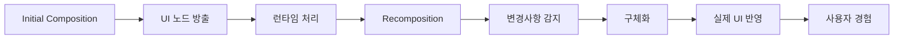

# UI에 변경사항 반영하기 (Reflecting changes in the UI)

## 개요

**초기 Composition**과 **후속 Recomposition** 과정을 통해 UI 노드가 어떻게 방출되고 런타임에 제공되는지 배웠습니다. 이 시점에서 런타임은 이 과정을 인계받아 작업을 수행합니다. 하지만 이것은 전체 프로세스의 한쪽 면일 뿐입니다.

발생한 모든 변경 사항을 실제 UI에 반영하여 사용자가 경험할 수 있도록 하는 통합 과정이 필요합니다.

## 구체화(Materialization)

노드 트리의 변경사항을 실제 UI에 반영하는 과정을 **구체화(Materialization)** 라고 부릅니다.

### 주요 특징

- **책임 주체**: `Compose UI`와 같은 클라이언트 라이브러리
- **역할**: 런타임에서 생성된 노드 트리의 변경사항을 실제 화면에 렌더링
- **목적**: 사용자가 변경사항을 실제로 경험할 수 있도록 UI를 업데이트

### 프로세스 흐름

## 요약

- **Composition과 Recomposition**은 UI 노드를 방출하고 런타임에 제공하는 과정임
- **구체화(Materialization)** 는 노드 트리의 변경사항을 실제 UI에 반영하는 핵심 과정
- Compose UI와 같은 클라이언트 라이브러리가 구체화 작업을 담당
- 변경사항의 실제 UI 반영을 통해 사용자가 업데이트된 화면을 경험할 수 있음