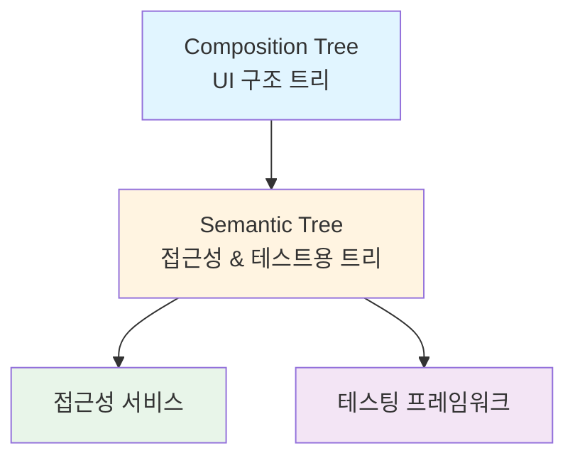
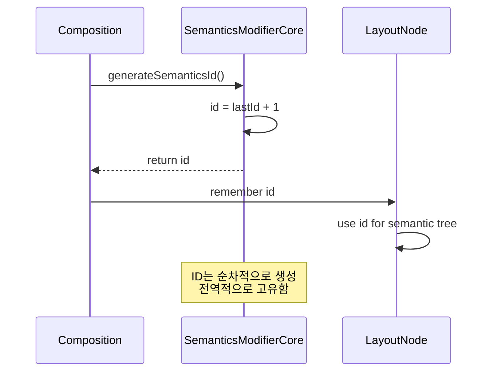

# Jetpack Compose에서의 Semantics (Semantics in Jetpack Compose)

## 개요

**Semantics**는 사전적 의미로 "**의미론**"이라는 뜻을 가지고 있습니다. 저자는 `semantics`라는 단어를 "**컴퓨터도 이해할 수 있는, Node를 설명하기 위한 일련의 정보, 의미**"라는 관점으로 폭넓게 사용하고 있습니다. 

더 나은 이해와 자연스러운 표현을 위해 `semantics`, `semantic`과 같은 단어를 그대로 기재했습니다. [공식 문서](https://developer.android.com/jetpack/compose/semantics)를 참고하여 semantics라는 단어와 Compose에서의 semantics에 대한 이해를 높여보세요.

## Semantic Tree란?

Jetpack Compose에서 **Composition**은 UI를 설명하는 트리입니다. 동시에, **접근성 서비스**와 **테스팅 프레임워크**가 이해할 수 있는 대안적인 방식으로 UI를 설명하는 **또 다른 트리**가 있습니다. 이 트리의 노드들은 **의미론적(semantic)**으로 그들의 의미에 관련된 **메타데이터**를 제공합니다.



## Owner와 Semantic Tree의 관계

이전 섹션에서 우리는 `LayoutNode` 계층 구조의 **Owner**가 semantics와 **Android SDK 접근성 API**와의 연결을 처리하는 일을 위임받은 **delegate**가 있다는 것을 배웠습니다. 

그런 다음, 노드가 **추가**되거나 **분리**되거나 노드의 **의미론적 요소가 업데이트**될 때마다 `semantic tree`가 Owner를 통해 알림을 받는다는 것도 배웠습니다.

## 루트 LayoutNode의 Semantics 설정

Owner가 생성될 때(`AndroidComposeView`의 경우 `setContent`가 호출될 때), 몇 가지 기본 modifier가 설정된 **ad-hoc 루트 LayoutNode**를 생성합니다.

```kotlin
// AndroidComposeView.android.kt
override val root = LayoutNode().also {
  it.measurePolicy = RootMeasurePolicy
  it.modifier = Modifier
    .then(semanticsModifier)
    .then(_focusManager.modifier)
    .then(keyInputModifier)
  it.density = density
}
```

### 루트 노드의 Modifier 구성

이 modifier들은 **접근성** 및 **semantics**와 관련이 있습니다:

| Modifier | 역할 | 설명 |
|---------|------|-----|
| `semanticsModifier` | Semantics 추가 | semantic tree를 구축하기 위해 기본적인 구성의 핵심 semantics를 루트 노드에 추가 |
| `_focusManager.modifier` | 포커스 관리 | Composable 계층 구조 전체에서 포커스를 처리하기 위한 루트 modifier 설정 |
| `keyInputModifier` | 키보드 입력 처리 | 키보드 입력을 처리하고 포커스 관리자로 KeyDown 이벤트를 전달 |

**포커스 관리자(focus manager)** 는 필요에 따라 Composable 사이에서 포커스를 설정하고 이동하는 것을 관리합니다. **키 입력 modifier**는 키보드를 통해서도 포커스를 관리할 수 있게 합니다. 후자의 두 modifier는 **접근성 관점에서도 매우 중요**합니다.

## Modifier.semantics 함수

루트가 아닌 다른 노드에 semantics를 추가하기 위해, `Modifier.semantics` 함수를 사용합니다. Layout에 설정하는 모든 semantics modifier는 **id**와 일부 **semantics 구성**을 포함합니다.

> ⚠️ **Deprecated 주의사항**
>
> 다음 내용을 읽기 전에 첨언하자면, `Modifier.semantics`에 대한 설명은 **deprecated** 된 내용입니다. 성능 향상을 위해 semantics modifier를 **stateless**로 만들었고, `Modifier.Node`로 migrate 되었습니다. (`composed modifier`, `id`가 사라질 것이라는 점은 본문에도 언급되었습니다) 고로, 아래 내용을 읽은 뒤 링크를 통해 변경 사항을 참고하시면 도움이 될 것입니다.

### Modifier.semantics 구현 (Deprecated)

```kotlin
// SemanticsModifier.kt
fun Modifier.semantics(
  mergeDescendants: Boolean = false,
  properties: (SemanticsPropertyReceiver.() -> Unit)
): Modifier = composed(
  inspectorInfo = debugInspectorInfo {
    name = "semantics"
    this.properties["mergeDescendants"] = mergeDescendants
    this.properties["properties"] = properties
  }
) {
  val id = remember { SemanticsModifierCore.generateSemanticsId() }
  SemanticsModifierCore(id, mergeDescendants, clearAndSetSemantics = false, properties)
}
```

### 디버그 인스펙터 정보

여기서 **Compose 도구**에 이 노드에 대한 일부 세부 정보를 제공하기 위해 암시적으로 생성된 일부 **디버그 인스펙터 정보**를 볼 수 있습니다. 이 때 생성된 정보들이 **Composable 트리를 조사(inspect)** 할 때 표시되는 것입니다.

### Semantics ID 생성

**id**는 자동적으로 생성되고 기억됩니다. 이러한 id들은 `LayoutNode` 계층 구조 전반에 걸쳐 **고유**하며(정적으로 공유됨), **순차적**으로 생성됩니다. 각각 새로 생성된 id는 이전 것보다 큽니다. 

이는 새로운 Composition이 아주 처음부터 id를 생성하기 시작하거나, 이전에 생성된 다른 Composition에 의해 생성된 최신 id 이후로, 순차적으로 id를 생성한다는 것을 의미합니다.



마지막으로, semantics modifier는 **디버그 인스펙터 정보**와 **id**와 같은 요소들과 제공된 구성 매개변수를 사용하여 생성됩니다.

### 향후 변경 예정 사항

> 📝 **리팩토링 진행 중**
>
> 현재, semantics modifier는 블록에서 생성된 id를 사용하기 위해 `remember`에 접근할 필요가 있기 때문에 `composed modifier`로 구현되었습니다. 그렇지만, 이 구현은 곧 변경될 예정입니다. 왜냐하면 **LayoutNode를 생성할 때 id를 생성**하도록 리팩토링이 진행 중이기 때문에, 더 이상 `remember`가 필요하지 않게 되고, 따라서 Composition 맥락에 대한 필요성이 제거될 것입니다.

## AndroidComposeView의 Semantics Modifier

`AndroidComposeView`가 루트 노드에 기본 semantics modifier를 할당할 때, 그것을 동일한 방식으로 생성합니다.

```kotlin
// AndroidComposeView.android.kt
private val semanticsModifier = SemanticsModifierCore(
  id = SemanticsModifierCore.generateSemanticsId(),
  mergeDescendants = false,
  clearAndSetSemantics = false,
  properties = {}
)
```

## 커스텀 레이아웃에서의 Semantics

> 💡 **중요한 권장사항**
>
> `material` 또는 `foundation` 라이브러리에서 제공하는 Composable을 사용할 때, 이미 Composable들의 semantics를 **암시적으로 연결**하고 있을 가능성이 매우 높습니다. semantics를 신경 쓰지 않아도 동작한다는 것은 반갑고 좋은 일입니다. 
>
> 하지만 **스스로 작성한 커스텀 레이아웃**에서는 그렇지 않습니다. 그러한 이유로, Jetpack Compose에서 **새로운 Layout을 작성할 때마다 그것의 semantics를 제공하는 것은 중요**합니다. 
>
> **접근성**과 **테스팅**은 높은 우선순위여야 합니다.

## 요약

- **Semantics**는 컴퓨터가 이해할 수 있는 Node를 설명하는 메타데이터로, 접근성 서비스와 테스팅 프레임워크를 위한 중요한 정보를 제공합니다
- Compose에는 UI 구조를 나타내는 Composition Tree 외에도 접근성과 테스트를 위한 **Semantic Tree**가 별도로 존재합니다
- 루트 `LayoutNode`는 `semanticsModifier`, `_focusManager.modifier`, `keyInputModifier` 세 가지 핵심 modifier를 통해 접근성과 키보드 포커스 관리를 지원합니다
- `Modifier.semantics` 함수를 사용하여 커스텀 노드에 semantics를 추가할 수 있으며, 각 semantics modifier는 고유한 ID를 가집니다
- Semantics ID는 `LayoutNode` 계층 구조 전반에 걸쳐 고유하며 순차적으로 생성됩니다
- Material이나 Foundation 라이브러리의 Composable은 이미 semantics가 내장되어 있지만, **커스텀 레이아웃을 작성할 때는 반드시 semantics를 명시적으로 제공해야 합니다**
- 성능 향상을 위해 semantics modifier는 `composed modifier`에서 `Modifier.Node`로 마이그레이션되었으며, 이는 stateless 구조로 변경되었습니다