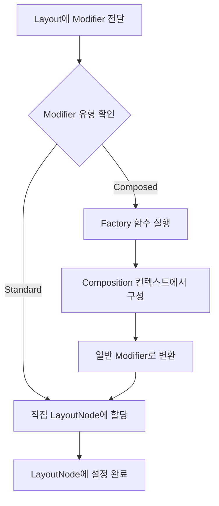

# LayoutNode에 modifier 설정 (Setting modifiers to the LayoutNode)

## 개요

모든 `LayoutNode`는 `Modifier`(또는 Modifier 체인)를 가집니다. `Layout`을 선언할 때 Compose UI는 `update` 람다를 매개변수로 전달하여 노드의 상태를 초기화하고 업데이트합니다.

## Layout에서 Modifier 설정

### update 람다를 통한 초기화

```kotlin
@Composable 
inline fun Layout(
  modifier: Modifier = Modifier,
  measurePolicy: MeasurePolicy
) {
  val density = LocalDensity.current
  val layoutDirection = LocalLayoutDirection.current
  val viewConfiguration = LocalViewConfiguration.current
  
  val materialized = currentComposer.materialize(modifier)
  
  ReusableComposeNode<ComposeUiNode, Applier<Any>>(
    factory = { LayoutNode() },
    update = {
      set(measurePolicy, { this.measurePolicy = it })
      set(density, { this.density = it })
      set(layoutDirection, { this.layoutDirection = it })
      set(viewConfiguration, { this.viewConfiguration = it })
      set(materialized, { this.modifier = it })
    },
  )
}
```

`update` 람다는 노드가 `factory` 람다를 통해 생성되자마자 호출되며, `LayoutNode`의 상태를 초기화하거나 업데이트합니다. 여기서 다음과 같은 속성들이 설정됩니다:

- **측정 정책** (`measurePolicy`)
- **밀도** (`density`)
- **레이아웃 방향** (`layoutDirection`)
- **뷰 구성** (`viewConfiguration`)
- **Modifier** (`modifier`)

마지막 줄에서 **"구체화된(materialized)"** Modifier 체인이 `LayoutNode`에 설정됩니다:

```kotlin
set(materialized, { this.modifier = it })
```

## Modifier의 Materialization (구체화)

### Materialization이란?

노드를 방출하기 직전에 Modifier가 "구체화(materialize)"되는 과정을 거칩니다:

```kotlin
val materialized = currentComposer.materialize(modifier)
```

Modifier 매개변수는 **단일 Modifier** 또는 **여러 Modifier의 체인**일 수 있습니다. `Layout`에 전달된 모든 Modifier가 "표준(standard)"인 경우, 이 함수는 단순히 수정 없이 반환하며, 추가 처리 없이 `LayoutNode`에 설정됩니다.

## Modifier의 두 가지 유형

Compose UI에는 두 가지 유형의 Modifier가 있습니다:

### 비교 표

| 구분 | Standard Modifier | Composed Modifier |
|------|-------------------|-------------------|
| **상태** | Stateless (상태 없음) | Stateful (상태 있음) |
| **처리 방식** | 추가 처리 없이 직접 할당 | Factory 함수를 통해 구성 후 할당 |
| **Composition 필요** | 불필요 | 필요 |
| **사용 목적** | 일반적인 레이아웃 수정 | `remember`, `CompositionLocal` 접근 등 |
| **성능** | 빠름 | 상대적으로 느림 |
| **예시** | `padding`, `size`, `background` | `clickable`, `focusable`, `draggable` |

### Standard Modifier

- **상태가 없는(Stateless)** Modifier
- 추가 처리 없이 `LayoutNode`에 직접 설정
- 상태를 유지하려면 별도로 래핑 필요

### Composed Modifier

- **상태를 가진(Stateful)** 특별한 유형의 Modifier
- Composition이 필요한 경우에 사용:
  - `remember`를 통한 상태 유지
  - `CompositionLocal`에서 값 읽기
  - 기타 Composable 함수 사용

## Composed Modifier의 동작 원리

### ComposedModifier 클래스

```kotlin
private open class ComposedModifier(
  inspectorInfo: InspectorInfo.() -> Unit,
  val factory: @Composable Modifier.() -> Modifier
) : Modifier.Element, InspectorValueInfo(inspectorInfo)
```

### 처리 흐름



**Composed Modifier가 구성되는 이유:**
- `LayoutNode`는 Composed Modifier를 직접 처리할 수 없음
- Factory 람다를 통해 일반 Modifier로 변환 후 할당
- Factory 람다는 Composition 컨텍스트에서 실행되어 모든 Composable 함수에 접근 가능

## Composed Modifier 예시

### Modifier.clickable 구현

`Modifier.composed()` 확장 함수를 사용하여 상태를 가진 Modifier를 생성합니다:

```kotlin
fun Modifier.clickable(
  interactionSource: MutableInteractionSource,
  indication: Indication?,
  enabled: Boolean = true,
  onClick: () -> Unit
  ...
) = composed(
  factory = {
    val onClickState = rememberUpdatedState(onClick)
    val pressedInteraction = remember { 
      mutableStateOf<PressInteraction.Press?>(null) 
    }
    ...
    val isClickableInScrollableContainer = remember { 
      mutableStateOf(true) 
    }
    val delayPressInteraction = rememberUpdatedState {
      isClickableInScrollableContainer.value || isRootInScrollableContainer()
    }
    val gesture = Modifier.pointerInput(interactionSource, enabled) {
      ...
    }
    Modifier
      .then(...adds more extra modifiers)
      .genericClickableWithoutGesture(
        gestureModifiers = gesture,
        ...
      )
  },
  inspectorInfo = ...append info about the modifier for dev tooling
)
```

블록 내에서 **상태를 `remember`** 할 수 있도록 Composition이 필요하기 때문에 Composed Modifier가 사용됩니다.

### 다른 Composed Modifier 예시

- `focusable`
- `scroll`
- `swipeable`
- `border`
- `selectable`
- `pointerInput`
- `draggable`
- `toggleable`

> 💡 **팁**: 더 많은 예시를 보려면 소스 코드에서 `Modifier.composed()` 확장 함수의 사용 사례를 찾아보세요.

## 성능 고려사항

### Modifier.composed의 성능 이슈

공식 문서에서는 커스텀 Modifier 구현 시 `Modifier.composed` 확장 함수를 **"성능상의 이유로 추천하지 않는다"** 고 안내합니다.

### 현대적인 접근 방식

그럼에도 불구하고 다음의 경우 여전히 `Modifier.composed`가 필요합니다:
- `CompositionLocal` 값 읽기
- `remember` 사용

**개선 사례:**
- `Modifier.clickable`의 핵심 로직은 성능 개선을 위해 **`Modifier.Node` 방식으로 마이그레이션**
- `LocalIndication` 값 읽기와 `MutableInteractionSource` remember를 위해 여전히 `Modifier.composed` 사용
- 이를 통해 성능 문제를 최소화하면서 필요한 경우에만 `Modifier.composed` 활용

## 특별한 LayoutNode의 Modifier 설정

### AndroidComposeView의 루트 LayoutNode

Compose UI는 특별한 목적을 가진 `LayoutNode`를 생성할 때도 Modifier를 설정합니다. 예를 들어, `Owner`(예: `AndroidComposeView`)의 루트 `LayoutNode`:

```kotlin
override val root = LayoutNode().also {
  it.measurePolicy = RootMeasurePolicy
  it.modifier = Modifier
    .then(semanticsModifier)
    .then(_focusManager.modifier)
    .then(keyInputModifier)
  it.density = density
}
```

`AndroidComposeView`가 자신의 루트 `LayoutNode`를 연결할 때 다음을 설정합니다:

- **측정 정책** 설정
- **밀도** 설정
- **View 시스템 연결을 위한 Modifier 체인**:
  - `semanticsModifier`: 의미론적 트리의 기본 구성
  - `_focusManager.modifier`: 접근성을 위한 포커스 처리 관리자
  - `keyInputModifier`: 키 입력 처리

## 요약

- `LayoutNode`는 `update` 람다를 통해 Modifier를 포함한 다양한 속성을 초기화하고 업데이트합니다
- Modifier는 `LayoutNode`에 설정되기 전에 "구체화(materialization)" 과정을 거칩니다
- **Standard Modifier**는 상태가 없으며 추가 처리 없이 직접 할당됩니다
- **Composed Modifier**는 상태를 가지며 Composition 컨텍스트에서 구성된 후 일반 Modifier로 변환되어 할당됩니다
- Composed Modifier는 `remember`, `CompositionLocal` 접근 등 Composable 기능이 필요할 때 사용됩니다
- `Modifier.composed`는 성능상의 이유로 최소화하되, 필요한 경우 `Modifier.Node` 방식과 함께 사용하여 성능 문제를 최소화할 수 있습니다
- 루트 `LayoutNode`와 같은 특별한 노드도 시스템 통합을 위해 Modifier 체인을 설정합니다