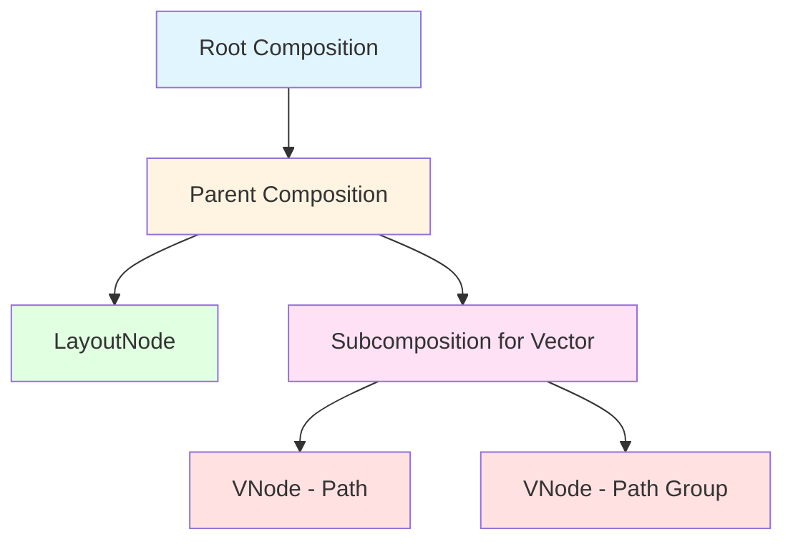
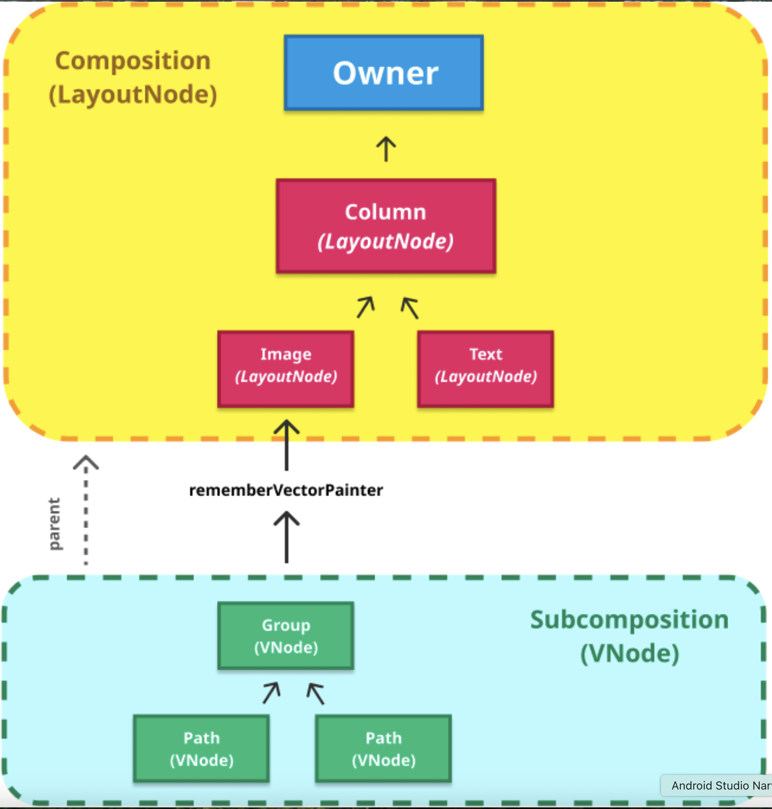

# Compose UI 관점에서의 Subcomposition (Subcomposition from the point of view of Compose UI)


## 개요

**Composition**은 루트 레벨에서만 존재하는 것이 아닙니다. Composition은 **Composable 트리의 더 깊은 수준에서 생성**될 수 있으며 부모 Composition과 연결될 수 있습니다. 이것이 Compose에서 **Subcomposition**이라 부르는 것입니다.

Composition들은 트리처럼 연결될 수 있습니다. 즉, 각 Composition은 부모 Composition을 나타내는 부모의 `CompositionContext`에 대한 참조를 가지고 있습니다. (루트 Composition은 예외로, 그 부모는 `Recomposer` 자체입니다.)

## Subcomposition을 만드는 이유

Compose UI에서 **Subcomposition**을 만드는 이유는 크게 2가지가 있습니다:

| 이유 | 설명 |
|------|------|
| **초기 Composition 과정 지연** | 초기 composition 과정에서 특정 정보를 알 때까지 연기하기 위해 |
| **노드 타입 변경** | 하위 트리에서 생성되는 노드의 타입을 변경하기 위해 |

## 초기 Composition 과정의 지연

### SubcomposeLayout

**SubcomposeLayout**은 `Layout`과 유사하지만, **레이아웃 단계에서 독립적인 Composition을 생성하고 실행**합니다. 이를 통해 SubcomposeLayout은 자식 Composable들로 하여금 자신 안에서 계산된 값에 의존하도록 할 수 있습니다.

### BoxWithConstraints 예제

`BoxWithConstraints`는 부모의 제약사항을 content block에 제공하여 그 값에 따라 내용을 다르게 구성할 수 있습니다. 다음 예시에서는 `maxHeight`의 값에 따라 두 Composable 중 어떤 Composable을 사용할 것인지 결정합니다:

```kotlin
BoxWithConstraints {
  val rectangleHeight = 100.dp
  if (maxHeight < rectangleHeight * 2) {
    Box(Modifier.size(50.dp, rectangleHeight).background(Color.Blue))
  } else {
    Column {
      Box(Modifier.size(50.dp, rectangleHeight).background(Color.Blue))
      Box(Modifier.size(50.dp, rectangleHeight).background(Color.Gray))
    }
  }
}
```

### Composition 제어 및 독립성

**Subcomposition의 생성자**는 초기 composition이 일어나는 시점을 제어할 수 있고, `SubcomposeLayout`은 루트가 compose되는 시점이 아니라 **레이아웃 단계**에 초기 composition을 수행하도록 결정합니다.

**Subcomposition**은 부모 Composition과 **독립적으로 recompose** 할 수 있게 해줍니다:

- 레이아웃 단계가 발생할 때마다 `SubcomposeLayout`의 람다에 전달되는 매개변수가 변할 수 있으며, 이는 recomposition을 유발합니다.
- 반면에 Subcomposition에서 읽은 state가 변경되면, 초기 composition이 수행된 후 부모 Composition에 대한 recomposition이 예약됩니다.

### 노드 타입 지원

노드 유형 측면에서, `SubcomposeLayout`은 `LayoutNode`를 방출시키므로, 서브 트리에 사용된 노드의 타입은 부모 Composition에서 사용된 것과 동일합니다.

> **궁금증**: 같은 Composition에서 다른 노드 타입들을 지원할 수 있을까요?

**Applier**가 허용하는 한, 기술적으로 가능하긴 합니다. 사용된 노드 타입이 여러 하위 타입의 공통된 부모라면 서로 다른 노드 타입들도 지원될 수 있습니다. 하지만 이는 Applier의 로직을 더 복잡하게 만들 수 있습니다.

> 이런 기술적인 가능성에도 불구하고 **Compose UI에서 사용할 수 있는 Applier 구현체들은 단일 노드 타입을 지원하도록 고정**되어 있습니다.

실제로 **Subcomposition**은 서브 트리에서 **완전히 다른 노드 타입을 지원**할 수 있게 해줍니다. 이는 앞서 소개한 Subcomposition의 두 번째 사용 사례입니다.

## 서브 트리의 노드 타입 변경

### Vector Graphics 예제

Compose UI에서 이런 사례의 좋은 예시는 **벡터 그래픽을 생성하고 표시하는 것**입니다 (예: `rememberVectorPainter`).

**Vector Composable**은 벡터 그래픽을 트리로 모델링하기 위해 자체 Subcomposition을 생성하는 흥미로운 사례입니다. Vector Composable이 compose될 때, **VNode**라는 다른 노드 타입으로 Subcomposition을 구성합니다.

`VNode`는 **재귀적인 타입**으로, 단일 경로(Paths)나 경로 그룹을 모델링합니다.

```kotlin
@Composable
fun MenuButton(onMenuClick: () -> Unit) {
  Icon(
    painter = rememberVectorPainter(image = Icons.Rounded.Menu),
    contentDescription = "Menu button",
    modifier = Modifier.clickable { onMenuClick() }
  )
}
```

### Composition과 Subcomposition의 관계

벡터를 그릴 때, 일반적으로 `Image`, `Icon` 또는 유사한 Composable 내에서 `VectorPainter`를 사용합니다. 이는 다음과 같은 구조를 갖습니다:

- 벡터를 포함하는 Composable이 `Layout`이므로 관련된 Composition에 **LayoutNode**를 방출합니다.
- 동시에 `VectorPainter`는 벡터를 표현하기 위한 **자체적인 Subcomposition**을 생성하고, 이를 이전 Composition에 연결하여 부모로 만듭니다.





### Subcomposition의 장점

이러한 구성을 통해 **벡터 서브트리(Subcomposition)** 는 다른 노드 타입인 `VNode`를 사용할 수 있습니다.

벡터가 Subcomposition을 통해 모델링되는 이유:
- 벡터 Composable 호출(예: `rememberVectorPainter`) 내에서 부모 Composition에서 사용할 수 있는 `CompositionLocal` 중 일부에 접근할 수 있습니다.
- 예: 테마 색상, 밀도(density) 등

### Subcomposition의 생명주기

벡터를 표현하기 위해 생성된 **Subcomposition**은 다음과 같은 시점에 폐기됩니다:

- 해당하는 `VectorPainter`가 부모 Composition을 떠날 때
- 그것을 포함하고 있는 Composable이 부모 Composition을 떠날 때

> **핵심 개념**: "모든 Composable은 어느 시점에 Composition에 들어갔다가 떠난다."

## 결론

루트 Composition과 Subcomposition에 대해 알아보며 보통의 Compose UI 애플리케이션(안드로이드 또는 데스크탑)에서 트리가 어떤 구조로 되어있는지 자세히 알 수 있었습니다.

이제 플랫폼과의 통합의 다른 측면을 알아볼 차례입니다. 다음으로는 **화면에 나타날 변화를 구체화하는(Materializing) 과정**에 대해 알아보겠습니다.

## 요약

- **Subcomposition**은 Composable 트리의 깊은 수준에서 생성되며 부모 Composition과 연결되는 독립적인 Composition입니다.
- Subcomposition을 만드는 2가지 주요 이유는 **초기 Composition 과정 지연**과 **서브 트리의 노드 타입 변경**입니다.
- `SubcomposeLayout`은 레이아웃 단계에서 독립적인 Composition을 생성하여 자식이 계산된 값에 의존할 수 있게 합니다.
- `BoxWithConstraints`는 SubcomposeLayout의 실용적인 예로, 부모의 제약사항에 따라 다른 UI를 구성할 수 있습니다.
- Subcomposition은 부모 Composition과 **독립적으로 recompose** 할 수 있습니다.
- Vector Graphics는 `VNode`라는 다른 노드 타입을 사용하는 Subcomposition의 좋은 예시입니다.
- Subcomposition을 통해 `CompositionLocal`에 접근할 수 있어 테마 색상, 밀도 등의 값을 활용할 수 있습니다.
- Subcomposition은 관련 Composable이 Composition을 떠날 때 자동으로 폐기됩니다.