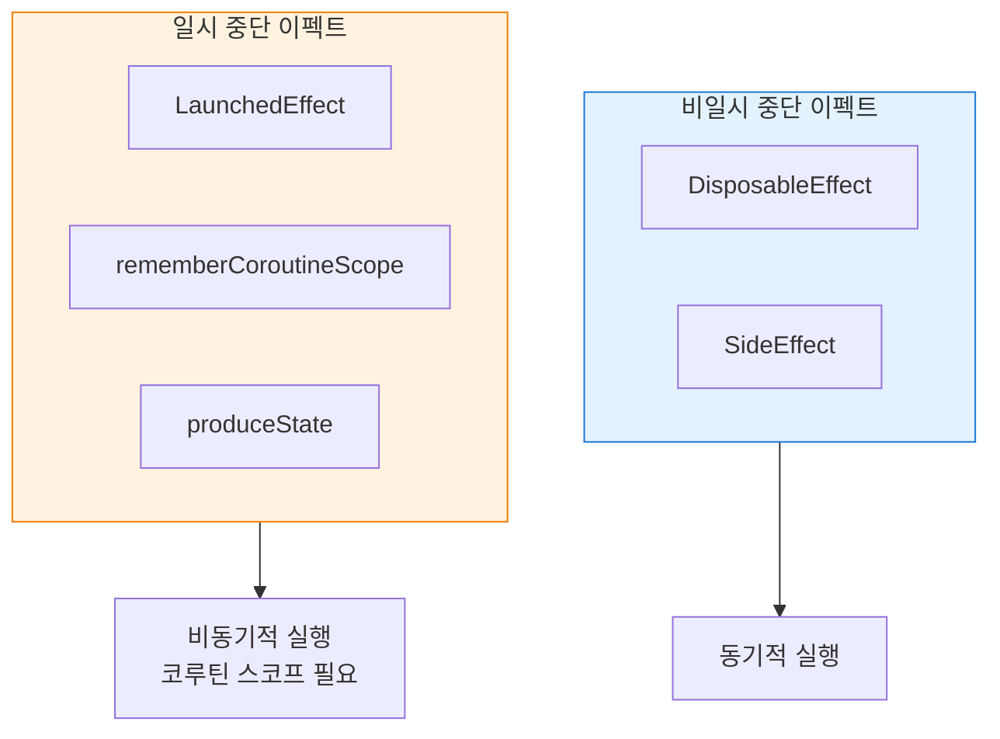

# 이펙트 핸들러의 종류 (Effect Handlers)

## Composable 생명주기 개요

설명에 앞서, `@Composable` 생명주기에 대한 간략한 소개를 해드리겠습니다.

> 어떤 Composable도 화면에 **구체화(materialized)** 될 때 Composition에 들어가고, UI 트리에서 제거될 때 Composition을 떠납니다. 이 두 사건 사이에 이펙트가 실행될 수 있습니다.

일부 이펙트는 **Composable 생명주기를 초과하여 지속**될 수 있고, 그에 따라 여러 Composition에 걸쳐 이펙트를 지속시킬 수 있습니다.

---

## 이펙트 핸들러 분류

이펙트 핸들러는 **두 가지 범주**로 나눌 수 있습니다.

### 1. 비일시 중단 이펙트 (Non-suspended Effects)

`suspend` 함수가 아닌 일반 함수로 실행되는 이펙트입니다.

**예시:**
- Composable이 Composition에 **들어갈 때** 콜백을 초기화하기 위한 사이드 이펙트 실행
- Composable이 Composition을 **떠날 때** 리소스 폐기(dispose)

| 핸들러 | 설명 | 사용 시점 |
|--------|------|----------|
| `DisposableEffect` | 정리(cleanup)가 필요한 이펙트 | 리스너 등록/해제, 콜백 관리 |
| `SideEffect` | 매 Recomposition마다 실행 | 외부 상태 동기화 |

### 2. 일시 중단 이펙트 (Suspended Effects)

`suspend` 함수로 실행되는 이펙트로, 코루틴 스코프 내에서 동작합니다.

**예시:**
- 네트워크에서 데이터를 로드하여 UI 상태에 공급
- 비동기 작업 수행 후 결과 반영

| 핸들러 | 설명 | 사용 시점 |
|--------|------|----------|
| `LaunchedEffect` | Composition 진입 시 코루틴 시작 | 비동기 작업, API 호출 |
| `rememberCoroutineScope` | 이벤트 기반 코루틴 실행 | 버튼 클릭 등 사용자 이벤트 |
| `produceState` | Flow/Observable을 State로 변환 | 스트림 데이터 수집 |

---

## 비일시 중단 vs 일시 중단 이펙트 비교

---

## 요약

- `@Composable`은 **Composition 진입**과 **이탈** 사이에 이펙트를 실행할 수 있음
- 이펙트 핸들러는 **비일시 중단 이펙트**와 **일시 중단 이펙트** 두 가지로 분류됨
- **비일시 중단 이펙트**: `DisposableEffect`, `SideEffect` - 동기적 실행, 리소스 관리에 적합
- **일시 중단 이펙트**: `LaunchedEffect`, `rememberCoroutineScope`, `produceState` - 비동기 작업에 적합
- 일부 이펙트는 Composable 생명주기를 **초과하여 여러 Composition에 걸쳐 지속**될 수 있음
