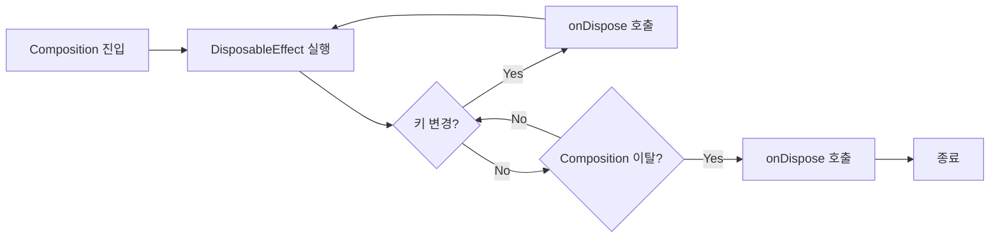

# 비일시 중단 이펙트 (Non-suspended Effects)

Composition 생명주기와 관련된 **사이드 이펙트**를 처리하기 위한 이펙트 핸들러들입니다. 일시 중단 함수가 아닌 일반 함수 형태로 동작하며, `DisposableEffect`, `SideEffect`, `currentRecomposeScope` 세 가지가 있습니다.

---

## DisposableEffect

> **폐기(dispose)가 필요한 비일시 중단 이펙트**에 사용됩니다.

### 특징

- Composable이 **composition에 들어갈 때** 처음 실행됨
- 이후 **키(key)가 변경될 때마다** 재실행됨
- 반드시 마지막에 `onDispose` 콜백이 필요함
- Composable이 **composition을 떠날 때** 폐기됨
- Recomposition 시 키가 변경되면 **폐기 후 다시 시작**됨

### 생명주기 흐름



### 사용 예시

```kotlin
@Composable
fun backPressHandler(onBackPressed: () -> Unit, enabled: Boolean = true) {
  val dispatcher = LocalOnBackPressedDispatcherOwner.current.onBackPressedDispatcher

  val backCallback = remember {
    object : OnBackPressedCallback(enabled) {
      override fun handleOnBackPressed() {
        onBackPressed()
      }
    }
  }

  DisposableEffect(dispatcher) { // dispatcher가 변경되면 dispose/relaunch
    dispatcher.addCallback(backCallback)
    onDispose {
      backCallback.remove() // 메모리 누수 방지!
    }
  }
}
```

위 예시에서는 `CompositionLocal`에서 얻은 `dispatcher`에 콜백을 연결합니다. `dispatcher`를 이펙트 핸들러 키로 전달하면, **dispatcher가 변경될 때마다** 이펙트가 폐기되고 다시 시작됩니다. 콜백은 Composable이 최종적으로 composition을 떠날 때도 폐기됩니다.

### 상수 키 사용

composition에 들어갈 때 **한 번만** 이펙트를 실행하고 떠날 때 폐기하고 싶다면, 상수를 키로 전달합니다:

```kotlin
DisposableEffect(Unit) { // 또는 DisposableEffect(true)
  // 한 번만 실행되는 로직
  onDispose {
    // 정리 로직
  }
}
```

> ⚠️ **주의**: `DisposableEffect`는 항상 **적어도 하나의 키**가 필요합니다.

---

## SideEffect

> **폐기가 필요하지 않은 이펙트**에 사용됩니다.

### 특징

- **모든 composition / recomposition 후**에 실행됨
- composition이 실패하면 폐기됨 ("이 composition에서 실행하거나 잊어버리라")
- **슬롯 테이블에 저장되지 않음** → composition을 넘어 지속되지 않음
- 외부 상태에 업데이트를 게시하는 데 유용함

### 사용 예시

```kotlin
@Composable
fun MyScreen(drawerTouchHandler: TouchHandler) {
  val drawerState = rememberDrawerState(DrawerValue.Closed)

  SideEffect {
    drawerTouchHandler.enabled = drawerState.isOpen
  }

  // ...
}
```

위 예시에서 서랍의 현재 상태는 언제든지 변할 수 있습니다. 모든 composition이나 recomposition이 발생할 때마다 `TouchHandler`에 상태를 알려야 합니다. 이 화면이 항상 보이는 메인 화면이고, `TouchHandler`가 싱글턴으로 존재한다면 참조를 폐기할 필요가 없습니다.

### 핵심 용도

`SideEffect`는 **Compose의 State 시스템이 관리하지 않는 외부 상태**를 항상 동기화 상태로 유지하는 데 사용됩니다.

---

## currentRecomposeScope

> 이펙트 핸들러보다는 **이펙트 자체**에 가깝지만, 알아둘 가치가 있습니다.

### 개념

Android View 시스템의 `invalidate()`와 유사한 개념입니다. `invalidate()`는 뷰에 새로운 측정, 레이아웃 및 그리기 단계를 강제 실행합니다.

### 인터페이스 정의

```kotlin
interface RecomposeScope {
  /**
   * Invalidate the corresponding scope, requesting the composer recompose this scope.
   */
  fun invalidate()
}
```

`currentRecomposeScope.invalidate()`를 호출하면 composition을 **로컬에서 무효화**하여 **recomposition을 강제**합니다.

### 사용 예시

```kotlin
interface Presenter {
  fun loadUser(after: @Composable () -> Unit): User
}

@Composable
fun MyComposable(presenter: Presenter) {
  val user = presenter.loadUser { currentRecomposeScope.invalidate() } // State가 아님!

  Text("The loaded user: ${user.name}")
}
```

위 코드에서는 `presenter`의 `loadUser`를 호출하고 결과를 기다립니다. `State`를 전혀 사용하지 않기 때문에, 결과가 나왔을 때 recomposition을 강제하기 위해 **수동으로 invalidate를 실행**합니다.

### 주의사항

> ⚠️ **되도록 신중하게 사용하세요!** 가능한 한 변화하는 값에 대해서는 `State`를 사용하여 **smart recomposition**을 활용하세요. 이를 통해 Compose Runtime을 최대한 활용할 수 있습니다.

> 💡 **프레임 기반 애니메이션**의 경우, Compose는 choreographer에서 다음 렌더링 프레임까지 일시 중단하고 기다리기 위한 API를 제공합니다. 더 나은 이해를 위해 [공식 애니메이션 문서](https://developer.android.com/jetpack/compose/animation#targetbasedanimation)를 참고하세요.

---

## 비교 표

| 이펙트 핸들러 | 폐기 필요 | 실행 시점 | 키 필요 | 주요 용도 |
|:---|:---:|:---|:---:|:---|
| `DisposableEffect` | ✅ | Composition 진입 시 / 키 변경 시 | ✅ | 리소스 정리가 필요한 작업 |
| `SideEffect` | ❌ | 매 composition/recomposition 후 | ❌ | 외부 상태 동기화 |
| `currentRecomposeScope` | ❌ | 수동 호출 시 | ❌ | 강제 recomposition (비권장) |

---

## 요약

- **DisposableEffect**는 폐기가 필요한 사이드 이펙트에 사용되며, 반드시 `onDispose` 콜백과 최소 하나의 키가 필요함
- **SideEffect**는 폐기가 필요 없는 이펙트로, 매 composition/recomposition 후 실행되어 외부 상태를 동기화하는 데 적합함
- **currentRecomposeScope**는 수동으로 recomposition을 강제할 수 있지만, 가능하면 `State`와 smart recomposition을 활용하는 것이 권장됨
- 세 가지 이펙트 핸들러는 각각의 사용 목적이 명확하므로, 상황에 맞게 적절한 것을 선택해야 함
