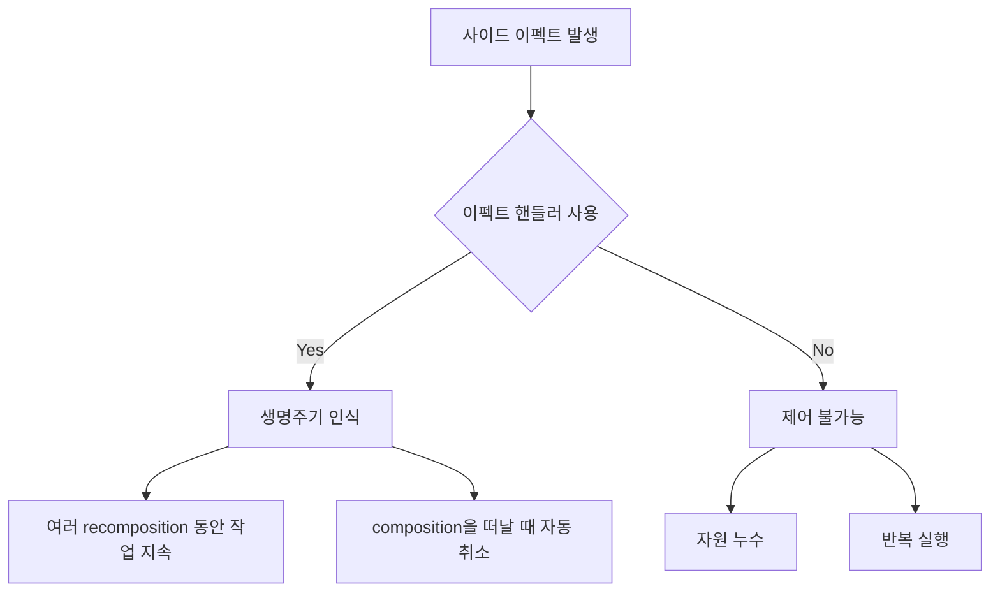

# Compose에서의 사이드 이펙트 (Side effects in Compose)

## 개요

**Composable 함수** 내에서 `사이드 이펙트`가 실행될 때, Composable **수명 주기**가 부과하는 통제와 제약에서 벗어날 수 있다는 문제가 발생합니다. 

> 어떤 Composable 함수도 여러 번 **recomposition**될 수 있으므로, Composable 내부에서 직접 이펙트를 실행하는 것은 위험합니다.

Composable 함수의 핵심 속성 중 하나는 **"Composable 함수는 재시작할 수 있다"**는 것입니다. 이는 Composable 내부에서 이펙트를 실행할 때 코드와 애플리케이션 상태의 무결성을 저해할 수 있음을 의미합니다.

## 문제가 되는 사이드 이펙트 예시

### 네트워크에서 상태를 로드하는 경우

다음은 네트워크에서 데이터를 로드하는 잘못된 사이드 이펙트 사용 예시입니다:

```kotlin
@Composable
fun EventsFeed(networkService: EventsNetworkService) {
  val events = networkService.loadAllEvents() // side effect
  
  LazyColumn {
    items(events) { event ->
      Text(text = event.name)
    }
  }
}
```

**문제점:**
- 이 이펙트는 **매번 recomposition될 때마다 실행**됩니다
- 런타임은 아주 짧은 시간 내에 이 Composable을 여러 번 recompose할 수 있습니다
- 결과적으로 서로 조정 없이 동시에 많은 이펙트가 발생합니다

**원하는 동작:**
- 첫 composition에서 **한 번만** 이펙트를 실행
- 그 상태를 Composable의 **전체 생명주기 동안 유지**

### 외부 상태를 업데이트하는 경우

Android UI를 구축할 때 모든 애플리케이션은 사이드 이펙트를 포함합니다. 다음은 외부 상태를 업데이트하는 사이드 이펙트의 예시입니다:

```kotlin
@Composable
fun MyScreen(drawerTouchHandler: TouchHandler) {
  val drawerState = rememberDrawerState(DrawerValue.Closed)
  
  drawerTouchHandler.enabled = drawerState.isOpen  // side effect
  
  // ...
}
```

이 Composable은 터치 처리를 지원하는 서랍이 있는 화면을 나타냅니다:
- 서랍 상태는 `Closed`로 초기화되지만, 시간이 지남에 따라 `Open`으로 변경될 수 있습니다
- 모든 composition 및 recomposition에 대해, 현재 서랍 상태를 `TouchHandler`에 알립니다
- 터치 처리 지원이 `Open`일 때만 활성화되도록 합니다

**사이드 이펙트 발생:**
```kotlin
drawerTouchHandler.enabled = drawerState.isOpen
```

이 코드는 **외부 객체에 콜백 참조를 할당**하고 있으며, 이는 composition의 사이드 이펙트입니다.

## 사이드 이펙트의 주요 문제점

Composable 함수 본문에서 바로 사이드 이펙트를 수행하는 문제점:

| 문제 | 설명 |
|-----|------|
| **실행 시점 제어 불가** | 이펙트가 언제 실행될지 제어할 수 없음 |
| **반복 실행** | 모든 composition/recomposition마다 실행됨 |
| **해제되지 않음** | 절대 해제되지 않아 **잠재적인 자원 누수** 발생 |

### 예시: 네트워크 요청의 경우

- 네트워크 요청이 끝나기 전에 Composable이 composition을 떠나면?
- **작업을 취소**하는 것이 바람직합니다

## 해결책: 이펙트 핸들러 (Effect Handlers)

사이드 이펙트는 **상태가 있는(Stateful) 프로그램**을 작성하는 데 필수적입니다. 

Jetpack Compose는 **생명주기를 인식하는 방식**으로 사이드 이펙트를 실행할 수 있는 메커니즘을 제공합니다:



**이펙트 핸들러의 장점:**
- 여러 recomposition이 일어나는 동안 **작업을 지속**할 수 있습니다
- Composable이 composition을 떠날 때 **자동으로 취소**되는 작업을 수행할 수 있습니다
- 사이드 이펙트의 **생명주기를 제어**할 수 있습니다

## 요약

- Composable 함수는 **여러 번 recomposition**될 수 있으므로, 내부에서 직접 사이드 이펙트를 실행하면 안 됩니다
- 사이드 이펙트를 Composable 본문에서 직접 실행하면 **실행 시점을 제어할 수 없고**, **매번 반복 실행**되며, **자원 누수**가 발생할 수 있습니다
- 네트워크 요청이나 외부 상태 업데이트와 같은 사이드 이펙트는 **이펙트 핸들러**를 통해 관리해야 합니다
- Jetpack Compose는 **생명주기를 인식하는 이펙트 핸들러**를 제공하여 안전하게 사이드 이펙트를 실행하고 관리할 수 있도록 합니다
- 이펙트 핸들러를 사용하면 여러 recomposition 동안 작업을 지속하거나 composition을 떠날 때 자동으로 취소할 수 있습니다