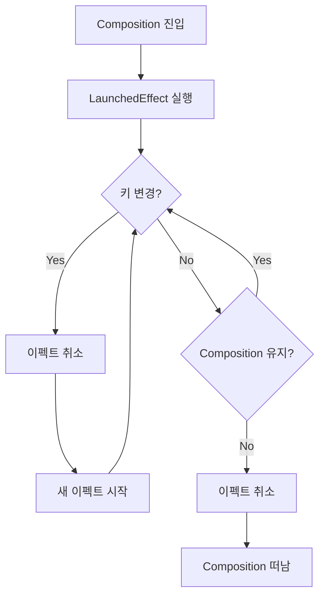

# 일시 중단 이펙트 (Suspended Effects)

Jetpack Compose에서 **일시 중단 이펙트**는 `코루틴`을 활용하여 비동기 작업을 안전하게 처리하는 메커니즘입니다. 이 문서에서는 세 가지 주요 이펙트 핸들러를 다룹니다.

---

## rememberCoroutineScope

`rememberCoroutineScope`는 **composition의 생명주기에 바인딩된** `CoroutineScope`를 생성합니다.

### 핵심 특징

| 특징 | 설명 |
|-----|------|
| **생명주기 바인딩** | composition 생명주기에 바인딩된 CoroutineScope를 생성 |
| **자동 취소** | composition을 떠날 때 스코프가 취소됨 |
| **스코프 유지** | composition 간에 동일한 스코프가 반환됨 |
| **Dispatcher** | Applier dispatcher(일반적으로 `AndroidUiDispatcher.Main`)에서 실행 |

### 주요 용도

- **사용자 상호작용에 응답**하여 작업을 시작하는 데 유용
- composition 간에 계속해서 작업을 수행할 수 있음
- 최종적으로 composition을 떠날 때 모든 진행 중인 작업이 취소됨

### 사용 예시

```kotlin
@Composable
fun SearchScreen() {
  val scope = rememberCoroutineScope()
  var currentJob by remember { mutableStateOf<Job?>(null) }
  var items by remember { mutableStateOf<List<Item>>(emptyList()) }

  Column {
    Row {
      TextField(
        "Start typing to search",
        onValueChange = { text ->
          currentJob?.cancel()
          currentJob = scope.async {
            delay(threshold)
            items = viewModel.search(query = text)
          }
        }
      )
    }
    Row { ItemsVerticalList(items) }
  }
}
```

위 코드는 **UI 측에서의 스로틀링 구현**입니다. 과거에 View 시스템에서 `postDelayed`나 `Handler`를 사용하여 이와 유사한 동작을 구현했을 수 있습니다. 텍스트 입력이 변경될 때마다 이전에 진행 중이던 작업을 취소하고 새로운 작업을 지연과 함께 예약합니다. 이를 통해 잠재적인 네트워크 요청 사이에 **최소한의 지연을 항상 강제**합니다.

> **LaunchedEffect와의 차이점**: `rememberCoroutineScope`는 **사용자 상호작용**에 의해 시작된 작업의 범위를 정하는 데 사용되는 반면, `LaunchedEffect`는 **composition**에 의해 시작된 작업의 범위를 정하는 데 사용됩니다.

---

## LaunchedEffect

`LaunchedEffect`는 Composable이 **composition에 들어갈 때** 초기 상태를 로드하는 데 사용됩니다.

### 핵심 특징

| 특징 | 설명 |
|-----|------|
| **진입 시 실행** | composition에 진입할 때 이펙트를 실행 |
| **자동 취소** | composition을 떠날 때 이펙트를 취소 |
| **키 기반 재시작** | 키가 변경될 때 이펙트를 취소하고 재시작 |
| **지속성** | 여러 recomposition에 걸쳐 작업을 지속하는 데 유용 |
| **Dispatcher** | Applier dispatcher(일반적으로 `AndroidUiDispatcher.Main`)에서 실행 |

### 사용 예시

```kotlin
@Composable
fun SpeakerList(eventId: String) {
  var speakers by remember { mutableStateOf<List<Speaker>>(emptyList()) }
  
  LaunchedEffect(eventId) { // eventId 변경 시 취소 / 재시작
    speakers = viewModel.loadSpeakers(eventId) // suspended effect
  }

  ItemsVerticalList(speakers)
}
```

### 동작 방식



이펙트는 **진입 시 한 번**, 그리고 **키가 변할 때마다 한 번씩** 실행됩니다. composition을 떠날 때 이펙트는 취소됩니다.

> **중요**: `LaunchedEffect`는 **적어도 하나의 키를 필요**로 하며, 재시작이 필요할 때마다 취소됩니다.

---

## produceState

`produceState`는 `LaunchedEffect`를 기반으로 구축된 **문법 설탕(Syntax Sugar)** 입니다.

### 핵심 특징

| 특징 | 설명 |
|-----|------|
| **State 채우기** | LaunchedEffect가 State를 채우는 경우에 사용 |
| **의존성** | 내부적으로 LaunchedEffect에 의존 |
| **초기값 제공** | 상태에 대한 기본값을 제공할 수 있음 |
| **키 지원** | 하나 이상의 키를 제공할 수 있음 |

### 사용 예시

```kotlin
@Composable
fun SearchScreen(eventId: String) {
  val uiState = produceState(initialValue = emptyList<Speaker>(), eventId) {
    viewModel.loadSpeakers(eventId) // suspended effect
  }

  ItemsVerticalList(uiState.value)
}
```

### 키 없이 사용하기

`produceState`는 **키를 전달하지 않고** 사용할 수도 있습니다. 이 경우 `Unit`을 키로 사용하여 `LaunchedEffect`를 호출하게 되어 **composition을 걸쳐 지속**됩니다.

> **주의**: 키를 전달하지 않으면 API 표면이 명시적으로 표시되지 않으므로 이 점을 유념하세요.

---

## 비교: 일시 중단 이펙트 핸들러

| 핸들러 | 트리거 | 용도 | 키 필요 여부 |
|-------|-------|------|------------|
| `rememberCoroutineScope` | 사용자 상호작용 | 이벤트 기반 작업 시작 | ❌ |
| `LaunchedEffect` | Composition 진입/키 변경 | 초기 데이터 로딩, 상태 동기화 | ✅ (1개 이상) |
| `produceState` | Composition 진입/키 변경 | State 생성 및 채우기 | ⭕ (선택적) |

---

## 요약

- **rememberCoroutineScope**: 사용자 상호작용에 응답하여 작업을 시작하고, composition 생명주기에 바인딩된 CoroutineScope를 제공합니다
- **LaunchedEffect**: composition 진입 시 이펙트를 실행하며, 키 변경 시 취소/재시작되고, 여러 recomposition에 걸쳐 작업을 지속합니다
- **produceState**: LaunchedEffect 기반의 문법 설탕으로, State를 채우는 일반적인 패턴을 간결하게 표현합니다
- 세 핸들러 모두 **composition을 떠날 때 자동으로 취소**되어 자원 누수를 방지합니다
- `rememberCoroutineScope`는 **사용자 상호작용** 기반, `LaunchedEffect`와 `produceState`는 **composition 기반** 작업에 적합합니다
