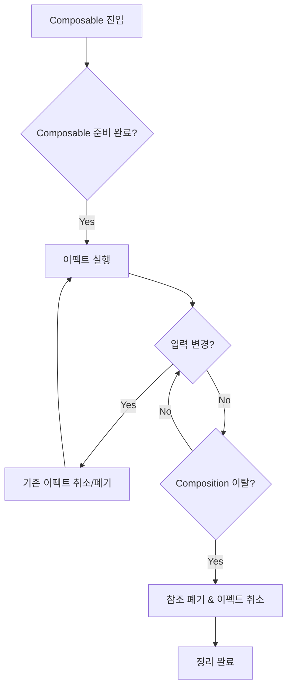

# 우리가 필요로 하는 것 (What We Need)

**Composition**들은 다른 스레드로 오프로드될 수 있고, **병렬로 실행**되거나 **다른 순서로 실행**하는 등 다양한 런타임 실행 전략을 사용할 수 있습니다. 이는 Compose 팀에서 다양한 잠재적 최적화를 위한 문을 열어두고자 하는 것이며, 어떠한 제어도 없이 Composition 중에 바로 이펙트를 실행하고 싶지 않은 이유이기도 합니다.

## 이펙트 핸들러가 필요한 이유

> Compose는 **이펙트 핸들러(Effect Handler)** 라는 메커니즘을 제공하여 사이드 이펙트를 안전하게 관리합니다.

전반적으로 우리가 필요로 하는 메커니즘은 다음과 같습니다:

| 요구사항 | 설명 |
|---------|------|
| **올바른 생명주기 단계에서 실행** | 이펙트가 너무 이르지도, 너무 늦지도 않게 Composable이 준비되었을 때 정확히 실행됩니다. |
| **적절한 런타임 환경 제공** | 일시 중단된 이펙트는 적절히 구성된 런타임(코루틴 및 적절한 `CoroutineContext`)에서 실행됩니다. |
| **참조 폐기 기회 제공** | 참조를 캡처하는 이펙트는 Composition을 떠날 때 그 참조를 폐기할 기회를 가집니다. |
| **진행 중인 이펙트 취소** | Composition을 떠날 때 진행 중이던 일시 중단 이펙트는 자동으로 취소됩니다. |
| **입력 변경 시 자동 재시작** | 시간이 지남에 따라 변하는 입력에 의존하는 이펙트는 자동으로 폐기/취소되고 매번 입력이 변할 때마다 다시 시작됩니다. |

## 이펙트 핸들러의 생명주기 흐름

## 핵심 개념

- **이펙트 핸들러(Effect Handler)**: Jetpack Compose에서 제공하는 사이드 이펙트 관리 메커니즘
- **생명주기 인식**: Composable의 생명주기에 맞춰 이펙트 실행 타이밍을 제어
- **자동 정리**: Composition 이탈 시 리소스 자동 해제 및 취소

---

## 요약

- Composition은 **다양한 스레드**에서 **병렬** 또는 **다른 순서**로 실행될 수 있어, 제어 없이 이펙트를 실행하는 것은 위험합니다.
- **이펙트 핸들러**는 이펙트가 **올바른 생명주기 단계**에서 실행되도록 보장합니다.
- 일시 중단 이펙트는 적절한 `CoroutineContext`에서 실행되며, Composition 이탈 시 **자동으로 취소**됩니다.
- 입력이 변경되면 이펙트는 **자동으로 재시작**되어 항상 최신 상태를 유지합니다.
- 이러한 메커니즘은 **Jetpack Compose의 이펙트 핸들러**를 통해 제공됩니다.
