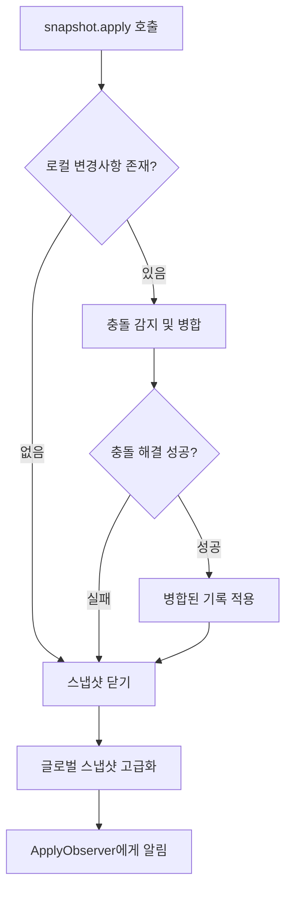
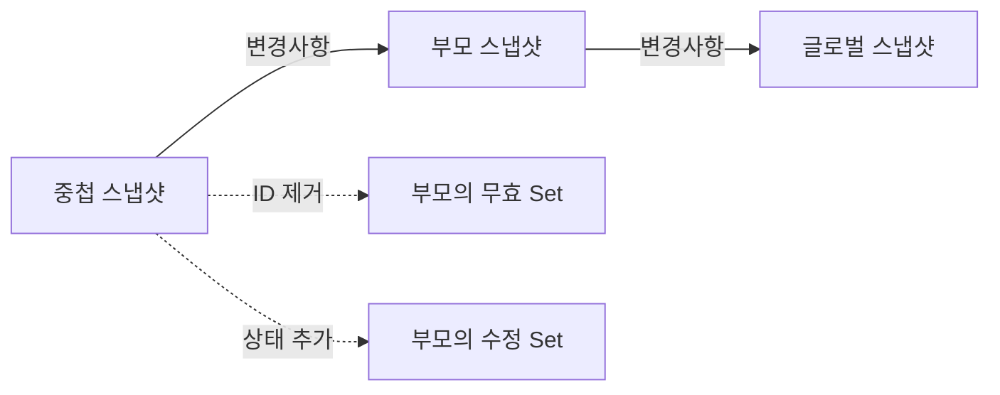

# 변경 사항 전파하기 (Change Propagation)

가변적인 스냅샷의 변경 사항이 어떻게 전파되는지 설명하기 전에, 스냅샷의 **"종료(Closing)"** 와 **"고급화(Advancing)"** 가 무엇을 의미하는지 요약하여 두 용어를 모두 이해할 수 있도록 하는 것이 좋습니다.

## 스냅샷 종료(Closing)와 고급화(Advancing)

### 스냅샷 종료 (Closing)

**스냅샷을 닫으면** 열려 있는 스냅샷 ID를 담는 `Set`에서 해당 ID가 효과적으로 제거되며, 그 결과 생성된 모든 새 스냅샷에서 모든 상태 기록(ID와 연결된 기록)을 보고 읽을 수 있게 됩니다. 

따라서 **스냅샷을 닫는 것은 상태 변경 사항을 전파하는 효과적인 방법**이 됩니다.

### 스냅샷 고급화 (Advancing)

**스냅샷을 닫을 때, 즉시 생성된 새 스냅샷으로 교체**하고 싶은 경우가 많습니다. 이를 스냅샷 **"고급화(Advancing)"** 이라고 합니다. 

생성된 새 스냅샷은 이전 스냅샷을 증가시켜 생성된 새 ID를 얻습니다. 그런 다음 이 ID는 열린 스냅샷 ID를 담는 `Set`에 추가됩니다.

> **참고**: 글로벌 스냅샷은 적용되지 않고 항상 고급화되어 생성된 새로운 글로벌 스냅샷에 모든 변경 사항이 표시됩니다. 중첩된 스냅샷이 변경 사항을 적용할 때 가변적인 스냅샷을 고급화할 수도 있습니다.

## 가변적인 스냅샷의 변경 사항 전파

이제 이를 잘 이해했으므로 가변적인 스냅샷의 변경 사항이 어떻게 전파되는지 알아볼 차례입니다.

### snapshot.apply() 호출

가변적인 스냅샷에서 `snapshot.apply()`를 호출하면 해당 범위 내의 상태 객체에 대한 **모든 로컬 변경 사항이 상위**(중첩된 가변적인 스냅샷인 경우) **또는 전역 상태로 전파**됩니다.

> ⚠️ **중요**: `apply` 또는 `dispose`를 호출하면 스냅샷의 수명이 제한됩니다. 적용된 가변적인 스냅샷은 이후에 폐기될 수도 있습니다. 그러나 `dispose` 후에 `apply`를 호출하면 해당 변경 사항이 이미 삭제되었으므로 예외가 발생합니다.

### 변경 사항 전파 메커니즘

모든 로컬 변경사항을 전파하여 (새로 생성된 스냅샷에 보이게 하려면) **단순히 활성 스냅샷을 담는 `Set` 목록에서 스냅샷을 제거**하기만 하면 충분합니다. 

스냅샷이 생성될 때, 현재 열린 스냅샷들의 복사본이 무효한 스냅샷들을 담는 `Set`으로 전달됩니다(즉, 아직 적용되지 않은 스냅샷은 새로 생성된 스냅샷에 보이지 않아야 합니다). 

단순히 스냅샷 ID를 열린 스냅샷의 `Set` 목록에서 제거하는 것만으로도, 모든 새 스냅샷은 이 스냅샷 동안 생성된 기록을 유효하게 처리하며, 따라서 해당 상태 객체가 읽힐 때 반환될 수 있습니다.

### 충돌 감지 및 병합

그러나 이 작업은 **상태 충돌**(쓰기 작업에 충돌이 발생하는 경우)이 있는 경우 이 문제를 먼저 해결해야 하기 때문에, **충돌이 없다고 판단한 후에 수행**해야만 합니다.

스냅샷이 적용되면 해당 스냅샷의 변경 사항이 다른 스냅샷의 변경 사항과 함께 추가됩니다. 상태 객체에는 모든 변경 사항이 집계되는 기록에 대한 정보를 담는 단일 `LinkedList`가 있습니다. 

여러 스냅샷이 동일한 상태 객체에 변경 사항을 적용하려고 시도할 수 있으므로, **충돌이 발생할 가능성**이 있습니다. 가변적인 스냅샷이 로컬 변경 사항을 적용(알림 및 전파)하려고 할 때 **잠재적인 쓰기 충돌을 감지하고 가능한 한 병합을 시도**합니다.

## 적용 시나리오

여기서는 두 가지 시나리오를 다루겠습니다.

### 시나리오 1: 보류 중인 로컬 변경 사항이 없음

스냅샷에 **보류 중인 로컬 변경 사항이 없는 경우** 다음 단계를 수행합니다:

1. **가변적인 스냅샷 닫기**
   - 열린 스냅샷 ID를 담는 `Set`에서 이를 제거
   - 모든 상태 기록을 자동으로 표시하고 새로 생성된 스냅샷에서 읽을 수 있게 만듦

2. **글로벌 스냅샷 고급화**
   - 닫힌 스냅샷과 동일하지만 생성된 새로운 글로벌 스냅샷으로 대체

3. **적용 관찰자(ApplyObserver)에게 알림**
   - 전역 스냅샷에도 상태 변경이 있는지 확인할 수 있는 기회가 주어짐
   - `Snapshot.registerApplyObserver` 함수와 관련된 잠재적인 적용 관찰자에게 알림

### 시나리오 2: 보류 중인 로컬 변경 사항이 있는 경우

스냅샷에 **보류 중인 로컬 변경사항이 있는 경우** 다음 단계를 수행합니다:

#### 1. 충돌 감지 및 병합

충돌을 감지하고 **낙관적 접근 방식(Optimistic Locking)** 을 사용하여 병합된 기록들을 계산합니다(동시성 제어 섹션 참조). 충돌은 자동으로 병합되거나 그렇지 않으면 버려집니다.

#### 2. 변경사항 검증

모든 보류 중인 로컬 변경사항에 대해 현재 값과 다른지 확인합니다:
- **값이 같은 경우**: 변경사항을 무시하고 현재 값을 유지
- **값이 다른 경우**: 다음 단계로 진행

#### 3. 병합 전략 결정

실제 변경사항(다른 값)인 경우, 이미 계산된 낙관적 병합법을 검토하여 **이전, 현재 또는 적용된 기록 중 어떤 것을 유지할지 결정**합니다. 실제로 전체 변경 사항들에 대한 병합을 생성할 수 있습니다.

#### 4. 기록 병합 수행

기록 병합을 수행해야 하는 경우:
- 새 기록을 생성(불변성)
- 스냅샷 ID를 할당(가변적인 스냅샷과 연결)
- 기록의 `LinkedList`의 앞부분에 선행 추가하여 리스트에서 첫 번째 인덱스가 되도록 함

#### 5. 실패 처리

변경사항 적용 시 실패가 발생한 경우, **보류 중인 로컬 변경사항이 없을 때 수행되는 동일한 과정으로 되돌립니다**:
- 가변적인 스냅샷을 닫아 새로운 스냅샷에 기록이 보이게 함
- 전역 스냅샷을 고급화(닫고 새로운 것으로 교체)
- 감지된 모든 전역 상태 변경에 대해 적용 관찰자에게 알림

## 중첩된 가변적인 스냅샷

**중첩된 가변적인 스냅샷의 경우 과정이 약간 다릅니다**:

- 스냅샷은 변경사항을 전역 스냅샷이 아니라 **부모에게 전파**
- 수정된 모든 상태 객체를 **부모의 수정된 목록을 들고 있는 `Set`에 추가**
- 모든 변경사항들은 부모에 의해 나타나야 하기 때문에, 중첩된 가변적인 스냅샷은 **부모의 무효 스냅샷을 들고 있는 `Set`에서 자신의 ID를 제거**

## 주요 개념 정리

| 개념 | 설명 |
|------|------|
| **스냅샷 종료(Closing)** | 열린 스냅샷 ID `Set`에서 ID 제거, 모든 상태 기록이 새 스냅샷에 표시됨 |
| **스냅샷 고급화(Advancing)** | 스냅샷을 닫고 즉시 새 스냅샷으로 교체하는 과정 |
| **snapshot.apply()** | 로컬 변경 사항을 상위 또는 전역 상태로 전파 |
| **충돌 감지** | 여러 스냅샷이 동일한 상태를 수정할 때 발생하는 쓰기 충돌 감지 |
| **낙관적 병합** | 충돌 발생 시 자동으로 병합을 시도하는 접근 방식 |
| **ApplyObserver** | 상태 변경을 관찰하고 알림을 받는 관찰자 |

## 요약

- **스냅샷 종료**는 열린 스냅샷 ID `Set`에서 ID를 제거하여 모든 상태 기록을 새 스냅샷에서 볼 수 있게 만드는 과정입니다
- **스냅샷 고급화**는 스냅샷을 닫고 즉시 새로운 스냅샷으로 교체하는 것을 의미합니다
- `snapshot.apply()`를 호출하면 로컬 변경 사항이 상위 또는 전역 상태로 전파됩니다
- 변경 사항 전파 시 **쓰기 충돌을 감지**하고 **낙관적 접근 방식**을 사용하여 병합을 시도합니다
- 보류 중인 로컬 변경사항이 **없는 경우**: 스냅샷 닫기 → 글로벌 스냅샷 고급화 → ApplyObserver 알림
- 보류 중인 로컬 변경사항이 **있는 경우**: 충돌 감지 및 병합 → 변경사항 검증 → 병합 전략 결정 → 기록 병합 수행
- **중첩된 스냅샷**은 변경사항을 부모 스냅샷에게 전파하며, 부모의 수정된 `Set`에 상태를 추가합니다
- 모든 과정은 상태 객체의 `LinkedList`를 통해 변경 이력을 관리하며, **불변성**을 유지합니다