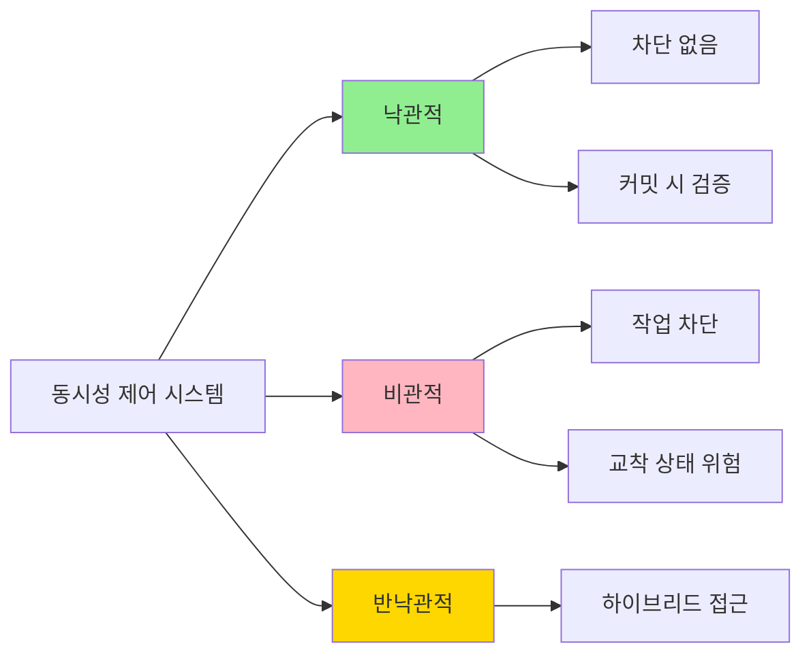
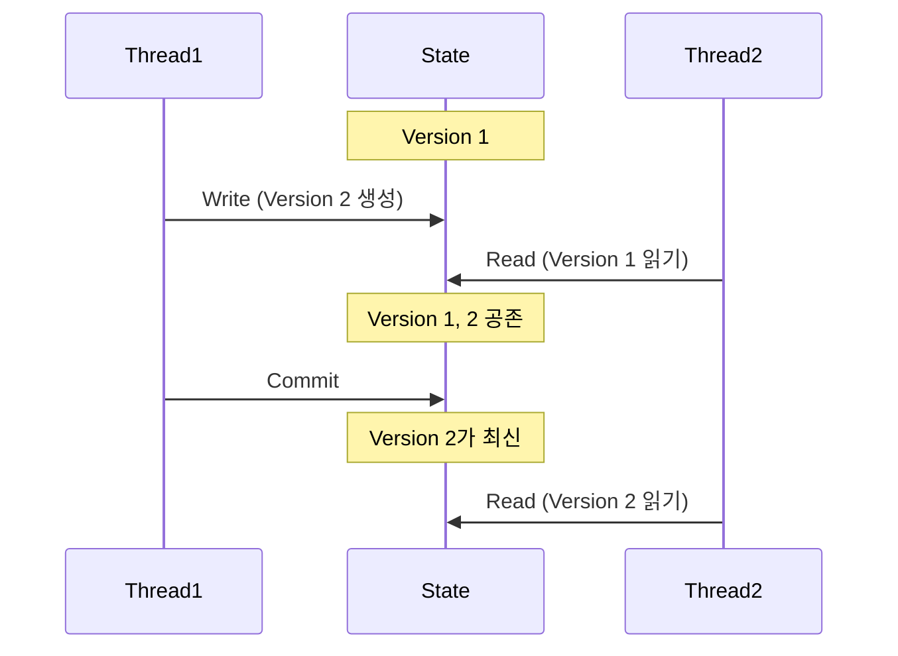

# 동시성 제어 시스템 (Concurrency Control Systems)

**상태 스냅샷 시스템**은 **동시성 제어 시스템**에 따라 구현되므로 먼저 이 개념을 살펴볼 필요가 있습니다.

## 동시성 제어란?

컴퓨터 과학에서 `동시성 제어(Concurrency Control)`는 동시 작업에 대한 올바른 결과를 보장하는 것, 즉 **조정 및 동기화**를 의미합니다. 동시성 제어는 시스템 전체의 정확성을 보장하는 일련의 규칙으로 표현됩니다. 

하지만 이러한 조정에는 항상 비용이 따릅니다. 조정은 일반적으로 성능에 영향을 미치므로 **중요한 과제는 성능을 크게 떨어뜨리지 않고 최대한 효율적인 접근 방식을 설계하는 것**입니다.

## 동시성 제어의 사례

### DBMS의 트랜잭션 시스템

동시성 제어에 대한 한 가지 사례는 오늘날 대부분의 **데이터베이스 관리 시스템(DBMS)** 에 존재하는 트랜잭션 시스템입니다. 

이러한 맥락에서 동시성 제어는 동시 환경에서 수행되는 모든 데이터베이스 트랜잭션이 **데이터베이스의 데이터 무결성을 침해하지 않고, 안전한 방식으로 수행되도록 보장**합니다. 그 목적은 정확성을 유지하는 것입니다. 

> 여기서 "안전성"이라는 용어는 트랜잭션이 원자적인지, 안전하게 되돌릴 수 있는지, 커밋된 트랜잭션의 효과가 손실되지 않고 중단된 트랜잭션의 이펙트가 데이터베이스에 남아 있지 않음을 보장하는지와 같은 것을 포함합니다.

### 트랜잭션 메모리

동시성 제어는 DBMS뿐만 아니라, **트랜잭션 메모리**를 구현하는 데 사용되는 프로그래밍 언어와 같은 다른 시나리오에서도 자주 사용됩니다. 이것이 바로 **상태 스냅샷 시스템의 사용 사례**입니다.

트랜잭션 메모리는 로드 및 저장 작업 그룹이 **원자적인 방식**으로 실행되도록 하여 동시성 프로그래밍을 단순화하려고 합니다.

### Compose 상태 스냅샷 시스템

실제로 Compose 상태 스냅샷 시스템에서는 스냅샷의 상태 변경 사항이 다른 스냅샷에 전파될 때, **상태 쓰기 작업이 원자적인 단일 작업으로 작용**합니다. 

이와 같은 그룹화 작업은 병렬 시스템/프로세스에서 **공유 데이터의 동시 읽기 및 쓰기 간의 조정을 단순화**합니다.

#### 원자적인 변경의 장점

- 쉽게 중단 가능
- 되돌리기(rollback) 가능
- 재현 가능
- 프로그램 상태의 어떤 버전이든 잠재적으로 재현할 수 있는 **재현 가능한 변경의 히스토리**를 보유

## 동시성 제어 시스템의 범주

동시성 제어 시스템에는 다양한 범주가 있으며, 각각 특징과 적용 시나리오가 다릅니다.

| 범주 | 설명 | 특징 |
|------|------|------|
| **낙관적(Optimistic)** | 읽기 또는 쓰기를 차단하지 않고 안전하다고 낙관적으로 가정한 다음, 커밋할 때 요구되는 규칙을 위반할 경우 트랜잭션을 중단하여 위반을 방지 | • 중단된 트랜잭션은 즉시 재실행 • 오버헤드 발생 • 중단 빈도가 낮을 때 효과적 |
| **비관적(Pessimistic)** | 트랜잭션의 작업이 규칙을 위반할 경우, 위반 가능성이 사라질 때까지 그 작업을 차단 | • 교착 상태(Deadlock)에 더 취약 • 정지된 트랜잭션을 중단하여 해결 |
| **반낙관적(Semi-optimistic)** | 낙관적 + 비관적의 하이브리드 솔루션 | • 일부 상황에서만 작업 차단 • 다른 상황에서는 낙관적 접근 |

### 성능 고려사항

각 범주의 성능은 다음 요소에 따라 달라질 수 있습니다:

- 평균 트랜잭션 완료율(처리량)
- 필요한 병렬 처리 수준
- 교착 상태 가능성

## Jetpack Compose의 동시성 제어 방식

### 낙관적 접근

**Jetpack Compose는 낙관적 동시성 제어를 사용합니다.**

- 상태 업데이트 충돌은 **변경 사항을 전파할 때만** 보고
- 충돌이 없으면 자동으로 병합
- 충돌이 있으면 변경 사항이 중단(abort)됨

### Compose vs DBMS

동시성 제어 시스템에 대한 Jetpack Compose 접근 방식은 DBMS에서 찾을 수 있는 접근 방식보다 더 간단합니다.

#### Compose의 특징

| 구현 여부 | 기능 |
|----------|------|
| ✅ 구현 | • 원자성(Atomic) • 일관성(Consistent) • 격리성(Isolated) • 메모리 내 처리 • 프로세스 내 처리 |
| ❌ 미구현 | • 지속성(Durability) - ACID의 D • 복구 가능 • 분산 • 복제 |

> Compose 스냅샷은 **정확성을 유지하는 데에만 사용**되며, 메모리 내, 프로세스 내에서만 작동합니다.

## 다중 버전 동시성 제어 (MVCC)

**다중 버전 동시성 제어(Multi-Version Concurrency Control, MVCC)** 는 Jetpack Compose가 상태 스냅샷 시스템을 구현하는 데 사용하는 핵심 메커니즘입니다.

### MVCC의 특징

- 데이터베이스 객체가 쓰여질 때마다 **새로운 버전을 생성**
- **동시성과 성능을 향상**
- 객체의 여러 최신 관련 버전을 읽을 수 있음
- 낙관적, 비관적, 반낙관적 방식과 함께 사용 가능

## 요약

- **동시성 제어**는 동시 작업에 대한 올바른 결과를 보장하는 조정 및 동기화 메커니즘입니다
- 동시성 제어 시스템은 **낙관적**, **비관적**, **반낙관적** 세 가지 범주로 분류됩니다
- **Jetpack Compose는 낙관적 접근 방식**을 채택하여 읽기/쓰기를 차단하지 않고, 커밋 시점에 충돌을 검증합니다
- Compose는 **MVCC(다중 버전 동시성 제어)** 를 사용하여 상태 스냅샷 시스템을 구현합니다
- Compose의 동시성 제어는 DBMS보다 단순하며, **정확성 유지**에 초점을 맞추고 메모리 내/프로세스 내에서만 동작합니다
- 상태 쓰기 작업은 **원자적인 단일 작업**으로 처리되어 공유 데이터의 동시 읽기/쓰기 조정을 단순화합니다
- MVCC는 객체가 쓰여질 때마다 새로운 버전을 생성하여 **여러 버전의 동시 읽기**를 가능하게 합니다