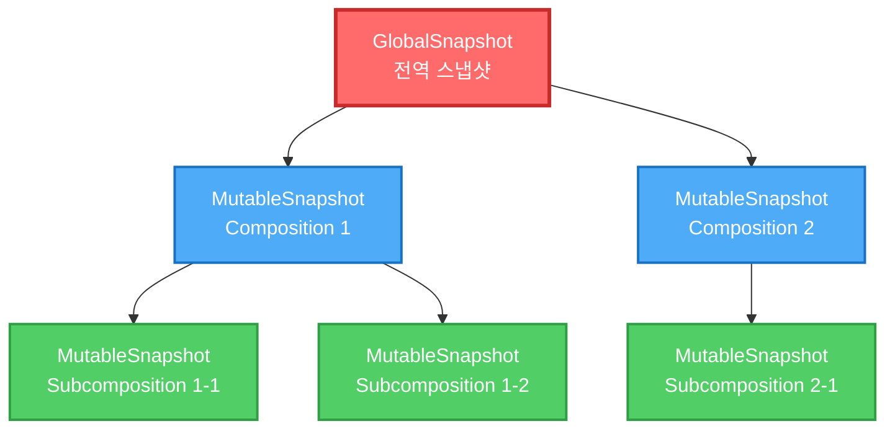
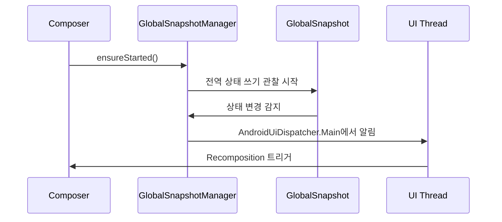

# 글로벌 스냅샷과 중첩된 스냅샷 (GlobalSnapshot and nested snapshots)

## 개요

**GlobalSnapshot**은 전역 상태를 유지하는 가변적인 스냅샷 타입 중 하나입니다. 이전 섹션에서 설명한대로 아래쪽에서 위쪽 순서에 따라 다른 스냅샷으로부터 업데이트 내역을 전달받습니다.

## GlobalSnapshot의 특징

### 중첩 불가능성

`GlobalSnapshot`은 **중첩될 수 없습니다**. 단 하나의 `GlobalSnapshot`이 있으며, 이는 사실상 **모든 스냅샷의 궁극적인 루트**입니다. 현재 전역(공유) 상태를 유지합니다. 

이러한 이유로 전역 스냅샷에는 다음과 같은 제약이 있습니다:
- `apply()` 함수를 호출할 수 없습니다 (함수 자체가 존재하지 않음)
- `dispose()` 함수를 호출할 수 없습니다

### 글로벌 스냅샷 고급화 (Advancing)

글로벌 스냅샷에 변경 사항을 적용하려면 **"고급화된(advanced)"** 글로벌 스냅샷이어야 합니다. 

```kotlin
Snapshot.advanceGlobalSnapshot()
```

이 함수는 다음과 같은 작업을 수행합니다:

1. 이전 전역 스냅샷을 삭제
2. 이전의 전역 스냅샷의 유효한 상태를 모두 받아들이는 새 전역 스냅샷 생성
3. `apply` 관찰자에게 알림 전달 (변경 사항이 효과적으로 "적용"됨)

> **참고**: 글로벌 스냅샷의 폐기(dispose)도 고급 글로벌 스냅샷을 통해 수행 가능합니다.

## Jetpack Compose에서의 사용

### 초기화

Jetpack Compose에서는 **스냅샷 시스템을 초기화하는 동안** 전역 스냅샷이 생성됩니다. 

- **JVM**: `SnapshotKt.class`가 Java나 Android 런타임에 의해 초기화될 때 전역 스냅샷 생성
- **Composer 생성**: 전역 스냅샷 관리자가 시작됨

### Composition과 스냅샷

각 composition(초기 composition 및 추가적인 recomposition 포함)은:

1. 자체적으로 **중첩된 가변적인 스냅샷**을 생성
2. 이를 트리에 연결하여 composition의 모든 상태를 저장하고 격리
3. **읽기 및 쓰기 관찰자**를 등록하여 composition에 대한 읽기 및 쓰기를 추적

```kotlin
// Called for the initial composition and also for every recomposition.
private inline fun <T> composing(
  composition: ControlledComposition,
  modifiedValues: IdentityArraySet<Any>?,
  block: () -> T
): T {
  val snapshot = Snapshot.takeMutableSnapshot(
    readObserverOf(composition),
    writeObserverOf(composition, modifiedValues)
  )
  try {
    return snapshot.enter(block)
  } finally {
    applyAndCheck(snapshot)
  }
}
```

위 `composing` 함수는 `Recomposer.kt`에 정의되어 있으며, 초기 composition과 모든 recomposition에서 호출됩니다.

### Subcomposition

모든 **subcomposition**은:

1. 자체적으로 중첩된 스냅샷을 생성
2. 이를 트리에 연결
3. 상위 항목을 활성 상태로 유지하면서 무효화(invalidation)를 지원

이렇게 하면 완전한 **스냅샷 트리 구조**를 얻을 수 있습니다.

## 스냅샷 트리 구조



## GlobalSnapshotManager

`Composer`가 생성될 때, 즉 `Composition`을 생성할 때 `GlobalSnapshotManager.ensureStarted()`에 대한 호출이 수행됩니다.

이는 **플랫폼(Compose UI)과 통합된 계약**의 일부이며, 다음을 수행합니다:

- 전역 상태에 대한 모든 **쓰기를 관찰**하기 시작
- `AndroidUiDispatcher.Main` 컨텍스트에서 스냅샷이 적용될 때마다 **주기적으로 알림을 전달**



## 요약

- **GlobalSnapshot**은 모든 스냅샷의 루트로, 단 하나만 존재하며 전역 상태를 유지한다
- GlobalSnapshot은 중첩될 수 없으며, `apply()`, `dispose()` 함수를 직접 호출할 수 없다
- 변경 사항은 `Snapshot.advanceGlobalSnapshot()`을 통해 적용되며, 이는 새로운 전역 스냅샷을 생성한다
- 각 composition과 subcomposition은 중첩된 가변 스냅샷을 생성하여 상태를 격리하고 관리한다
- `GlobalSnapshotManager`는 전역 상태의 변경을 관찰하고, UI 스레드에서 알림을 전달하여 recomposition을 트리거한다
- 스냅샷은 트리 구조로 구성되며, 각 레벨은 독립적인 상태 관리와 무효화를 지원한다
- `composing` 함수는 읽기/쓰기 관찰자를 등록하여 composition의 상태 변경을 추적한다

