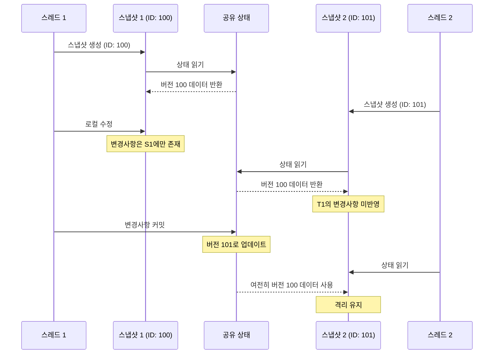

# 다중 버전 동시성 제어 (Multiversion concurrency control (MCC or MVCC))

**Multiversion Concurrency Control (MCC or MVCC)**

## 개요

Compose 전역 상태는 composition 전체에서 공유되며, 이는 **여러 스레드**를 의미하기도 합니다. **Recomposition**은 언제든지 병렬로 실행될 수 있습니다. 따라서 Composable 함수는 동시에 실행될 수 있어야 합니다. 병렬로 실행되는 경우 **스냅샷 상태**를 동시에 읽거나 수정할 수 있는데, 이를 위해 **상태 격리**가 필요합니다.

## 격리(Isolation)의 중요성

**동시성 제어**의 주요 속성 중 하나는 **격리(Isolation)** 입니다. 이 속성은 데이터에 대한 동시 액세스 시나리오에서 정확성을 보장합니다.

### 전통적인 접근 방식의 한계

격리를 수행하는 가장 간단한 방법은 작성자가 작업을 완료할 때까지 모든 구독자를 **차단(blocking)** 하는 것이지만, 이는 성능 측면에서 매우 나쁠 수 있습니다.

### MVCC의 우월한 성능

**MVCC**(따라서 Compose)는 차단 방식보다 훨씬 더 나은 성능을 발휘합니다.

## MVCC의 작동 원리

### 1. 다중 스냅샷 유지

격리를 달성하기 위해 MVCC는 **데이터의 다중 복사본(스냅샷)** 을 유지하여 각 스레드가 주어진 순간에 상태의 격리된 스냅샷으로 작업할 수 있게 합니다. 우리는 이러한 것들을 상태의 **다른 버전("다중 버전")** 으로 이해할 수 있습니다.

한 스레드에 의한 수정 사항은 모든 로컬 변경 사항이 완료되고 전파될 때까지 다른 스레드에게 보여지지 않습니다.

> **스냅샷 격리(Snapshot Isolation)**
> 
> 동시성 제어 시스템에서 이 기술은 "스냅샷 격리"라고 하며, 각 "트랜잭션"(Compose의 경우 스냅샷)이 어떤 버전을 보는지 결정하는 격리 수준으로 정의됩니다.

### 2. 불변성 활용

MVCC는 **불변성(Immutability)** 도 활용하여 데이터를 쓸 때 원본을 수정하는 대신 **데이터의 새로운 복사본**을 생성합니다. 이로 인해 메모리에 동일한 데이터의 다중 버전이 저장되어 객체에 대한 모든 변경 히스토리를 갖습니다.

Compose에서 이러한 것들을 **"상태 기록(State Records)"** 이라고 부르며, 나중 섹션에서 자세히 다룰 예정입니다.

### 3. 일관성 있는 시점 뷰

MVCC의 또 다른 특성은 **일관성 있는 특정 시점의 뷰**를 생성한다는 것입니다. 이는 보통 백업 파일의 속성이며, 주어진 백업에서 객체에 대한 모든 참조가 일관되게 유지된다는 것을 의미합니다.

#### 스냅샷 ID를 통한 격리

MVCC에서는 이것이 종종 **트랜잭션 ID**를 통해 보장되므로, 어떤 읽기든 해당 ID를 참조하여 사용할 상태 버전을 결정할 수 있습니다.

이것이 실제로 **Jetpack Compose**에서 작동하는 방식입니다:
- 각 스냅샷에는 **고유한 ID**가 할당됩니다
- 스냅샷 ID는 **단조롭게 증가하는 값**이므로 스냅샷이 자연스럽게 순서대로 배열됩니다
- 스냅샷이 ID로 구분되기 때문에, **읽기와 쓰기는 잠금장치 없이 서로 격리**됩니다

## MVCC 동작 흐름

## MVCC 특성 비교

| 특성 | 전통적 잠금 방식 | MVCC |
|------|-----------------|------|
| **성능** | 낮음 (차단 발생) | 높음 (병렬 처리) |
| **격리 방법** | 뮤텍스/세마포어 | 다중 버전 유지 |
| **읽기 차단** | 쓰기 중 차단됨 | 차단 없음 |
| **메모리 사용** | 적음 | 많음 (다중 버전 저장) |
| **일관성** | 강력함 | 스냅샷 격리 수준 |

## 다음 단계

이제 동시성 제어 시스템이 왜 필요한지, 그리고 **다중 버전 동시성 제어**가 어떻게 작동하는지에 대한 아이디어를 얻었으니, 상태 스냅샷 시스템의 내부를 깊이 파고들기에 좋은 시기입니다.

> **더 알아보기**
> 
> 동시성 제어 시스템이나 MVCC에 대해 더 깊이 파고들고 싶다면, 다음 자료를 적극 권장합니다:
> - [동시성 제어 (Concurrency Control)](https://en.wikipedia.org/wiki/Concurrency_control)
> - [다중 버전 동시성 제어 (Multiversion Concurrency Control)](https://en.wikipedia.org/wiki/Multiversion_concurrency_control)

## 요약

- **MVCC**는 Jetpack Compose에서 병렬 Recomposition을 안전하게 처리하기 위해 사용되는 동시성 제어 메커니즘입니다
- **격리(Isolation)** 는 동시성 제어의 핵심 속성으로, 동시 액세스 시나리오에서 데이터 정확성을 보장합니다
- MVCC는 전통적인 **잠금(locking) 방식**과 달리 **데이터의 다중 복사본(스냅샷)** 을 유지하여 성능을 향상시킵니다
- 각 스레드는 **격리된 스냅샷**으로 작업하며, 변경사항은 커밋되기 전까지 다른 스레드에게 보이지 않습니다
- **불변성(Immutability)** 을 활용하여 원본 수정 대신 새로운 복사본을 생성하며, 이를 Compose에서는 **"상태 기록(State Records)"** 이라고 합니다
- 각 스냅샷에는 **고유한 ID**가 할당되며, 이는 단조 증가하므로 **잠금 없이도 읽기와 쓰기를 격리**할 수 있습니다
- MVCC는 **일관성 있는 특정 시점의 뷰**를 제공하여 트랜잭션 중 데이터 일관성을 보장합니다
