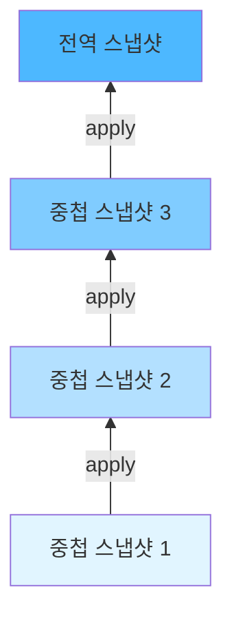

# 가변적인 스냅샷 (MutableSnapshots)

상태 업데이트(쓰기)에 대해 많이 이야기했지만 아직 **가변적인 스냅샷**에 대해서는 자세히 다루지 않았습니다. 이제 더 미루지 말고 이에 대하여 다루어봅시다.

## MutableSnapshot이란?

`MutableSnapshot`은 **recomposition을 자동으로 트리거**하기 위해 값 업데이트를 추적해야 하는 가변적인 스냅샷 상태로 작업할 때 사용되는 유형의 스냅샷입니다.

가변적인 스냅샷에서 모든 상태 객체는 스냅샷에서 내부적으로 변경되지 않는 한 스냅샷을 생성했을 때와 동일한 값을 갖습니다. `MutableSnapshot`에서 발생한 모든 변경 사항은 **다른 스냅샷에서 발생한 변경 사항과 격리**됩니다.

## 변경 사항의 전파 방식

변경 사항은 **트리의 아래쪽에서 위쪽으로 전파**됩니다. 중첩된 하위의 가변적인 스냅샷은 변경 사항을 먼저 적용한 다음 해당 변경 사항을 상위 스냅샷이나, 트리의 루트인 경우는 전역 스냅샷에 전파해야 합니다. 이는 `NestedMutableSnapshot#apply`(만약 중첩되지 않은 경우는 `MutableSnapshot#apply`)를 호출하여 수행됩니다.



아래에서 위로 전파하면 **루트 스냅샷이 적용될 때만 변경 사항이 전역 상태에 도달**하게 됩니다. 이는 모든 중첩된 스냅샷이 이미 적용된 후에만 발생할 수 있습니다.

## Composition과 MutableSnapshot

> 아래 단락은 Jetpack Compose Runtime 라이브러리의 Kdocs에서 직접 발췌하였습니다.

**Composition**은 가변적인 스냅샷을 사용하여 Composable 함수의 변경 사항을 일시적으로 전역 상태로부터 격리하고 나중에 composition이 적용될 때 전역 상태에 적용되도록 합니다. `MutableSnapshot.apply`가 이 스냅샷을 적용하지 못하면 composition 중에 계산된 스냅샷과 변경 사항이 삭제되고 새 composition이 다시 계산되도록 예약됩니다.

따라서 composition을 적용할 때(빠르게 되짚어보자면, composition의 마지막 단계에서는 `Applier`를 통해 변경 사항을 적용함) 가변적인 스냅샷의 모든 변경 사항이 적용되고, 상위 항목 또는 궁극적으로 **글로벌 스냅샷(프로그램 상태)** 에 통보됩니다. 이러한 변경 사항을 적용할 때 오류가 발생하면 새 composition이 예약됩니다.

## 스냅샷의 수명 주기

가변적인 스냅샷에도 수명 주기가 있습니다. 수명주기는 항상 `apply` 및 `dispose`를 호출하여 종료됩니다. 이는 상태의 수정 사항을 다른 스냅샷에 전파하고 **누출을 방지**하기 위해 필요합니다.

| 메서드 | 설명 |
|--------|------|
| `apply` | 변경 사항을 상위 스냅샷 또는 전역 상태에 전파 |
| `dispose` | 스냅샷 리소스를 정리하고 메모리 누출 방지 |

## 원자적 변경 사항 적용

`apply`를 통해 전파된 변경 사항은 **원자적으로(atomically) 적용**됩니다. 즉, 전역 상태 또는 상위 스냅샷(중첩된 경우)은 모든 변경 사항을 **단일 원자성 변경으로 표기**해 놓습니다. 그러면 상태 변경에 대한 기록이 어느 정도 깔끔해지고 식별, 재현, 중단 또는 되돌리기 등의 동작 수행이 더 쉬워집니다. 동시성 제어 시스템에 대해 배울 때 설명했듯이, 이러한 동작 수행은 **트랜잭션 메모리**에 관한 것임을 기억하시면 좋겠습니다.

> 가변적인 스냅샷이 삭제되었지만 적용되지 않은 경우 보류 중인 모든 상태의 변경 사항이 삭제됩니다.

## apply 함수 사용 예시

아래는 클라이언트 코드에서 `apply` 함수가 작동하는 방식에 대한 실제 예시입니다.

### 예시 1: snapshot.enter와 apply 사용

```kotlin
class Address {
  var streetname: MutableState<String> = mutableStateOf("")
}

fun main() {
  val address = Address()
  address.streetname.value = "Some street"

  val snapshot = Snapshot.takeMutableSnapshot()
  println(address.streetname.value)  // 출력: Some street
  
  snapshot.enter {
    address.streetname.value = "Another street"
    println(address.streetname.value)  // 출력: Another street
  }
  
  println(address.streetname.value)  // 출력: Some street
  snapshot.apply()
  println(address.streetname.value)  // 출력: Another street
}
```

**코드 실행 결과:**
```
Some street
Another street
Some street
Another street
```

### 동작 분석

1. `snapshot.enter` 함수의 호출 범위 **내에서** address 값을 출력할 때는 "Another street"이므로 변경 사항이 적용되어 나타납니다. 이는 **스냅샷의 컨텍스트에서 실행** 중이기 때문입니다.

2. `snapshot.enter` 함수의 호출(외부 범위) **직후에** 값을 출력하면 값이 원래의 값으로 되돌아간 것처럼 보입니다. 이는 `MutableSnapshot`의 변경 사항이 **다른 스냅샷과 독립적**이기 때문입니다.

3. `apply`를 호출한 후 변경 사항이 전파되면 streetname을 다시 출력하여 최종적으로 변경된 값이 어떻게 출력되는지 확인할 수 있습니다.

> `enter` 함수의 호출 범위 내에서 수행된 상태 업데이트만 추적되고 전파됩니다.

### 예시 2: withMutableSnapshot 사용

이 패턴을 단축하기 위한 대체 문법인 `Snapshot.withMutableSnapshot`도 있습니다. 이는 결국 `apply`가 호출되도록 보장합니다.

```kotlin
fun main() {
  val address = Address()
  address.streetname.value = "Some street"
  
  Snapshot.withMutableSnapshot {
    println(address.streetname.value)  // 출력: Some street
    address.streetname.value = "Another street"
    println(address.streetname.value)  // 출력: Another street
  }
  
  println(address.streetname.value)  // 출력: Another street
}
```

## Composer와의 연관성

> 마지막에 `apply`가 호출되는 방식은 변경 사항 목록이 추후에 `Composer`에 의해 어떻게 기록되고 적용되는 방법을 떠올리는데 도움이 될 수 있습니다. 해당 내용은 3장을 참조하시길 바랍니다. 이번에도 같은 개념입니다. 트리의 변경 사항 목록을 모두 함께 이해해야 할 때마다 이를 기록 및 연기해야 하므로 올바른 순서로 적용(트리거)하고 그 순간 일관성을 적용할 수 있습니다. 그때가 프로그램이 모든 변경 사항을 알 수 있는 유일한 순간입니다. 즉, 큰 그림을 볼 수 있는 시간입니다.

## 변경 사항 관찰

최종적인 변경 사항을 관찰하기 위해, `apply` 동작에 대한 관찰자를 등록하는 것도 가능합니다. 이는 `Snapshot.registerApplyObserver`를 통해 수행됩니다.

---

## 요약

- `MutableSnapshot`은 recomposition을 자동으로 트리거하기 위해 상태 변경을 추적하는 스냅샷 유형입니다.
- 가변적인 스냅샷의 변경 사항은 다른 스냅샷과 격리되며, **아래에서 위로 전파**됩니다.
- 변경 사항은 `apply` 메서드를 통해 상위 스냅샷 또는 전역 상태에 **원자적으로(atomically)** 전파됩니다.
- 스냅샷의 수명 주기는 `apply`와 `dispose` 호출로 종료되며, 메모리 누출을 방지합니다.
- `snapshot.enter`를 사용하면 특정 범위 내에서만 변경 사항이 적용되며, 외부에서는 원래 값이 유지됩니다.
- `Snapshot.withMutableSnapshot`은 자동으로 `apply`를 호출하여 변경 사항을 전파하는 편의 함수입니다.
- Composition은 가변적인 스냅샷을 통해 변경 사항을 일시적으로 격리하고, composition 적용 시 전역 상태에 반영합니다.
- `Snapshot.registerApplyObserver`를 통해 변경 사항 적용을 관찰할 수 있습니다.